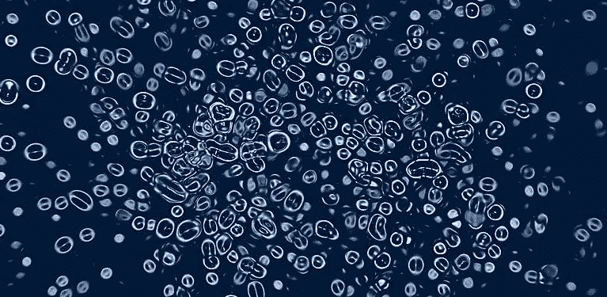
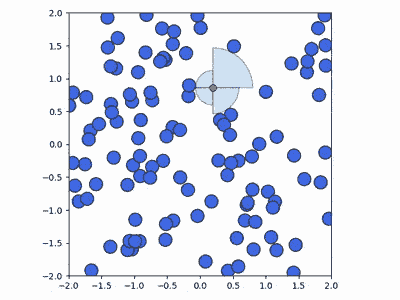
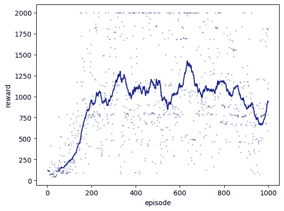
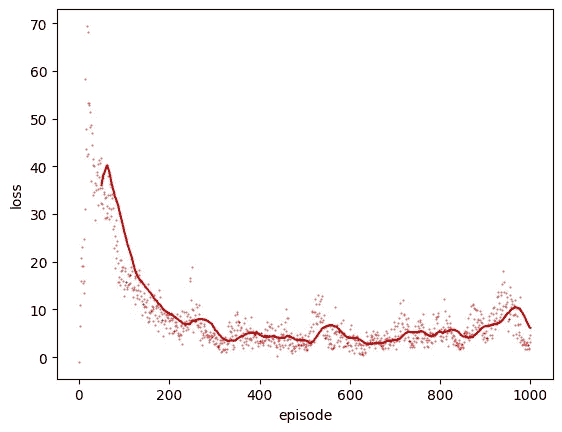

# XY 宇宙:深度强化学习的 2D 粒子生存环境

> 原文：<https://towardsdatascience.com/xy-universe-a-2d-particle-survival-environment-for-deep-reinforcement-learning-3e97b1068493?source=collection_archive---------28----------------------->

我们在这里提供 XY 宇宙:一个 2D 粒子生存环境，通过避免与“坏”粒子碰撞来训练你的深度强化学习代理尽可能长时间地存活。媒介和“坏”粒子被限制在一个 2D 盒中，以固定的恒定速度运动，并与盒壁发生弹性碰撞。提供了深度 Q-网络代理 Python 实现，以便立即使用和演示该环境。代理奖励方案是:每个时间步长+1，每个“坏”粒子碰撞-100。插曲结束条件是:代理与任何“坏”粒子碰撞。这个生存环境的灵感来自[卡帕西的水世界环境](http://cs.stanford.edu/people/karpathy/reinforcejs/waterworld.html)。

DQN agent surviving in the XY Universe particle environment

DQN 的阶段性奖励和损失:

Fig 1: Epsilon-greedy agent rewards vs episodes

Fig 2: Epsilon-greedy agent loss vs episodes

XY 宇宙生存粒子环境和 DQN 实现可以在这里找到:

> https://github.com/ankonzoid/XY_universe

更多我关于机器学习、深度学习、强化学习的博客、教程、项目，请查看我的 [**中**](https://medium.com/@ankonzoid) 和我的 [**Github**](https://github.com/ankonzoid) **。**