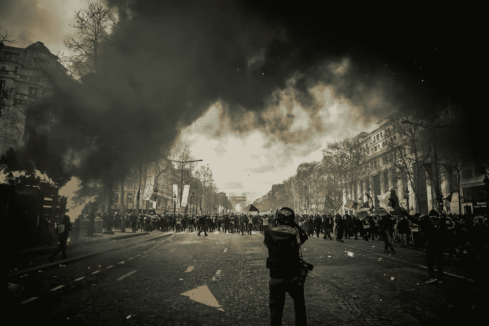
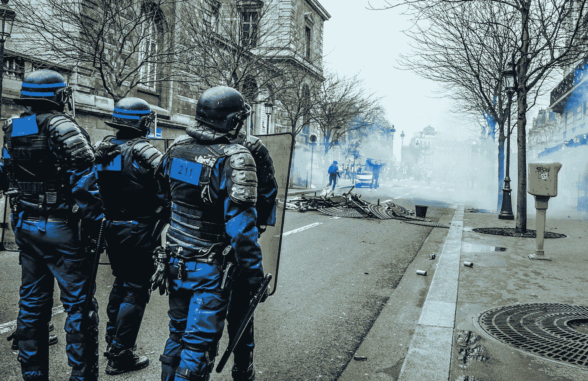
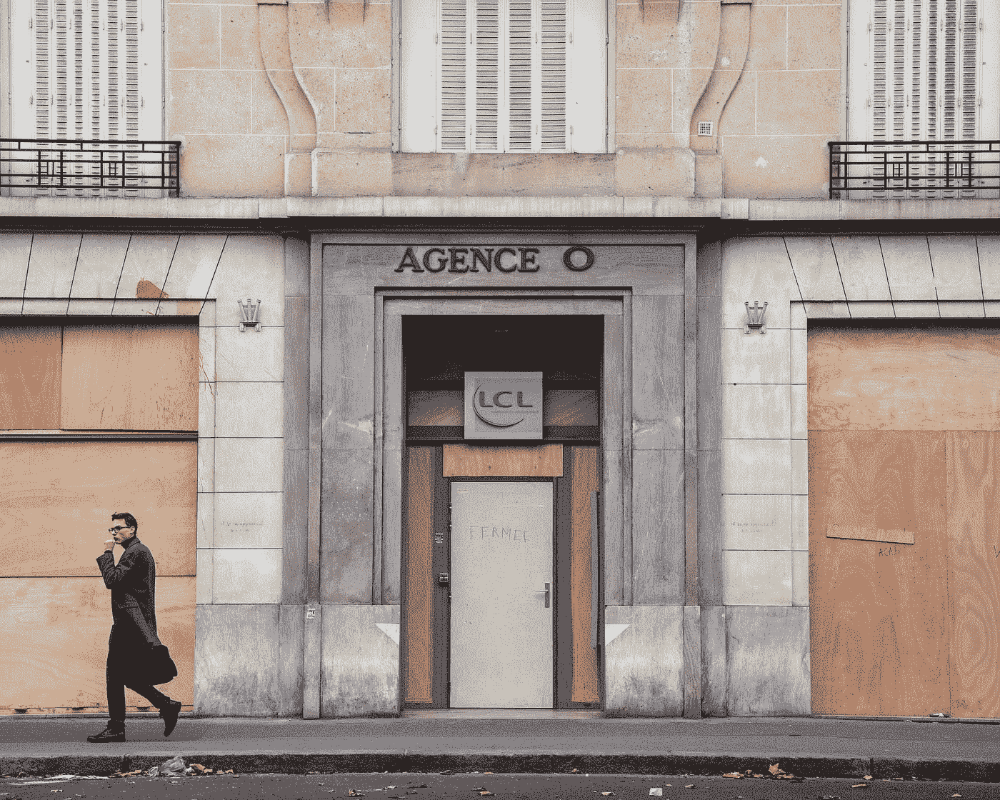
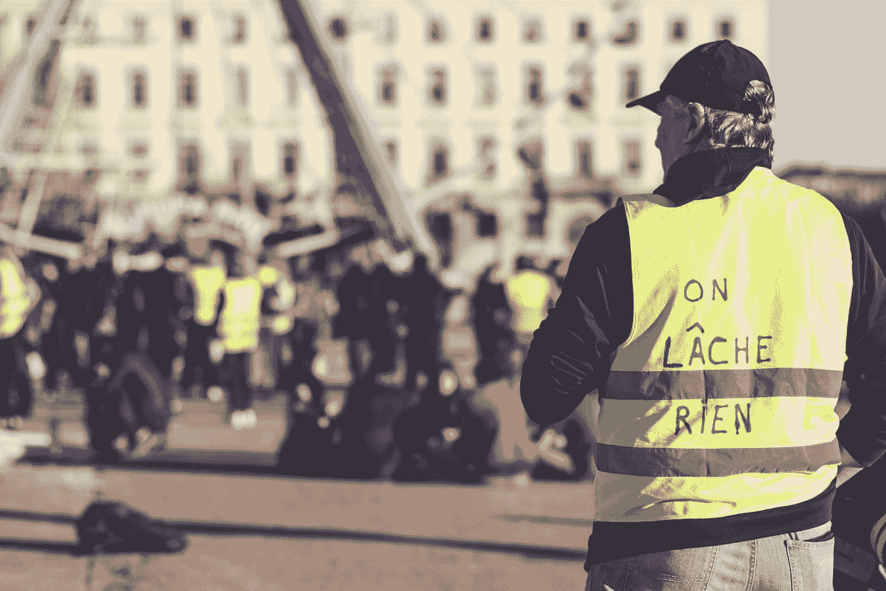
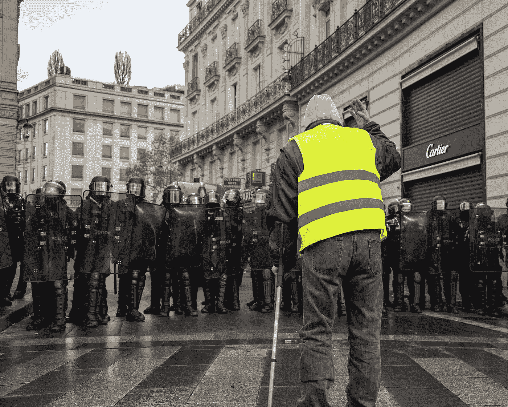
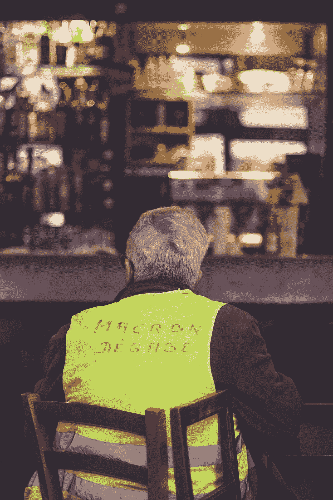
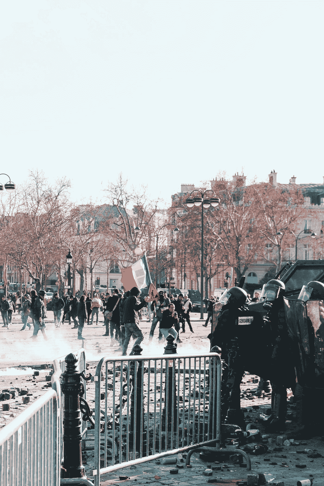
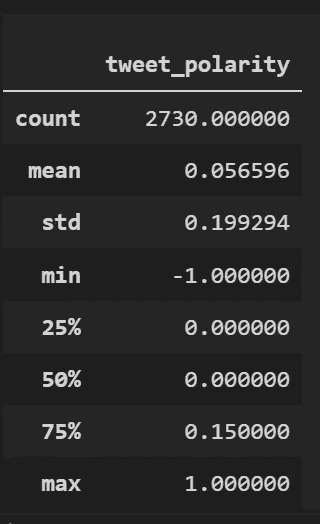

# # yellow vests:Twitter NLP 分析

> 原文：<https://towardsdatascience.com/yellowvests-a-twitter-nlp-analysis-21f34c4773e2?source=collection_archive---------26----------------------->

## 关于法国最大的社会运动，目前的观点是什么？

Photo by [Randy Colas](https://unsplash.com/@randycolasbe?utm_source=unsplash&utm_medium=referral&utm_content=creditCopyText) on [Unsplash](https://unsplash.com/@randycolasbe?utm_source=unsplash&utm_medium=referral&utm_content=creditCopyText)

# 内容:

*   介绍
*   社会运动的起源、兴衰
*   词类分析:数据科学过程
*   词类分析:结论
*   情感分析
*   奖金部分:热门推文！

# 介绍

Photo by [Norbu Gyachung](https://unsplash.com/@norbuw?utm_source=medium&utm_medium=referral) on [Unsplash](https://unsplash.com?utm_source=medium&utm_medium=referral)

如果你不是法国居民，你可能在推特上或通过去年的新闻听说过这一趋势。这场所谓的**“黄背心运动”在 2019 年 11 月 16 日**庆祝了一周年，但与这些**社会抗议**相关的法国舆论已经不能像一年前那样描述了。

然而，随着即将到来的养老金制度改革，法国铁路工人、空中交通管制员、教师和公共部门工作人员再次走上街头抗议…

*穿着这些黄色背心的法国人还觉得有希望吗？他们是通过还是反对这场运动来表达愤怒？他们厌倦了吗？*

发现下面的 NLP 分析！**(文末奖金！)**

# 起源

Photo by [ev](https://unsplash.com/@ev?utm_source=medium&utm_medium=referral) on [Unsplash](https://unsplash.com?utm_source=medium&utm_medium=referral)

这一切**始于 2018 年 10 月，**当时法国政府突然提高燃料价格，引发大规模抗议，因此创造了社会、财政、民主和经济诉求的理想民粹主义运动。

社交媒体上的一切都像病毒一样传播开来，暴徒们开始在每个周六走上街头。该运动于 2018 年 11 月 17 日达到最高参与率**，超过 130 万黄背心**。

# 秋天

Photo by [Koshu Kunii](https://unsplash.com/@koshuuu?utm_source=medium&utm_medium=referral) showing a bank forced to close its doors on a Saturday due to violent protestations

然而**人们开始被这股黄色浪潮**惹恼了。宣言变得过于暴力，黄背心活动家无法就他们的宣言达成共识，最终法国政府采取了一些(非常轻微的)行动将这场运动陷入僵局。**2019 年 5 月只有 4 万只**。

# 新崛起？

每周六参与率暴跌，新闻掉了这个话题…直到 2019 年 12 月 5 日工会安排了新的全国会议。2019 年 9 月，法国政府宣布了一项针对每个社会阶层的大规模养老金改革。很快，推特上出现了#黄背心，活动人士在周六重新确定了他们的每周约会，直到 12 月 5 日的全国大罢工。

使用 Python 上的 P **lotly 库**，我们可以根据**“Le Nombre Jaune”估计**(法国脸书小组试图估计参与者数量)**与法国政府估计，可视化去年黄背心的参与率。**点击*【播放】*按钮！

# 12 月 5 日:社会运动的重生？

Photo by [ev](https://unsplash.com/@ev?utm_source=medium&utm_medium=referral) on [Unsplash](https://unsplash.com?utm_source=medium&utm_medium=referral)

为什么是这个特殊的日子？这是由所有最大的法国工会策划的，作为纪念 24 年前人们再次走上街头抗议另一项养老金改革(流产)的方式。

12 月 5 日星期四**，许多罢工计划在公共交通、教育、医院和电力服务**进行。我们将通过词类分析看到# 5 decembre(# 12 月 5 日)和# GilletsJaunes(# yellow vets)之间的**高度相关性。**

# # YellowVests 运动的词类分析:数据科学过程

Photo by [Nicole Edelbrock](https://unsplash.com/@nicole_christine_edelbrock?utm_source=medium&utm_medium=referral) on [Unsplash](https://unsplash.com?utm_source=medium&utm_medium=referral)

我们利用 **Tweepy** 库和 **Python** 上的 Twitter API，在 11 月 29 日至 12 月 2 日的关键时段(高峰活动时段)收集了 **4000 条推文(每天 1000 条推文)。**

…然后我们必须清理数据，以便通过**卷积神经网络模型**正确处理数据(删除提及，url，#..)，我们能够调用这个模型多亏了 **Spacy 库和它的法语包。**

最后，我们使用 **Plotly 库，将 3 个不同词类中最常用的 20 个词可视化，这 3 个词类是:**、【名词】、【动词】和【ADJ】。****

# #YellowVests 运动的词类分析:我们能得出什么结论？

Photo by [Koshu Kunii](https://unsplash.com/@koshuuu?utm_source=medium&utm_medium=referral) on [Unsplash](https://unsplash.com?utm_source=medium&utm_medium=referral)

鉴于我们获得的自然语言处理结果，我们决定**实现最常见采购订单**的词云可视化，这样我们可以更好地得出结论。(图形是交互式的，因此如果文字没有完全显示在屏幕上，您可以浏览文字)

**井*..那么我们能看到什么呢？***

# 表演并被倾听

出人意料的是，法国人通过“Partir”(= Leave)、“Veut”(= Want)、“Mettre”(= Set)、“Prendre”(= Take)、“Agit”(= Act)和“défendre”(= Defend)等动词来表达采取行动和实施变革的意愿。但是我们也可以注意到像“Comprendre”(=理解)、“Travailler”(=工作)、“Lire”(=阅读)甚至“Eviter”(=避免)这样的词是非常重要的，它们表明法国人民在采取行动之前需要听到政府的声音。

# 国家的呼唤

快速浏览一下最常用的形容词，就能明显看出**全国性的关注和全国性的运动号召**，感谢大写的‘Fran ais’(=法语)、‘gréviste’(=醒目)、‘générale’(=整体)、‘Public’甚至‘GRAND’(=大)！

# 12 月罢工相关性和意志，使运动持续下去

看看最热门的名词，**事情变得与 12 月**的大规模罢工非常相关(我们在上面提到过):“运动”(=运动)、“死亡”(= 12 月)、“再培训”(=养老金)和“改革”(=改革)是最常用的词之一..

**法国推特用户在撰写‘gouvernement’(=政府)、‘république’(=法兰西共和国)或‘Police’(=警察部队)时，也直接针对政府**甚至系统本身。最后但并非最不重要的是，顶级名词分析还揭示了法国民族主义的名词槽，如'人民'(=国家)，'支付'(=国家)，甚至'街'(=街道)。

最后，我们不得不通过以下词语提到当时的**词汇领域**:‘Jour’(= Day)、‘Mois’(= Month)、‘ère’(= Era)和‘vie’(= Life)，突出了追求这一运动的意愿，或许为法国社会创造一个新时代？

# 情感分析

Photo by [ev](https://unsplash.com/@ev?utm_source=medium&utm_medium=referral) on [Unsplash](https://unsplash.com?utm_source=medium&utm_medium=referral)

现在让我们深入到**推特情绪分析**中，试着解读人们对这场大规模社会运动的感受。使用 **Textblob 库**及其情感估计模型，我们可以估计熊猫数据帧中每条推文的“极性”:也就是说一个介于-1(非常负面)和 1(非常正面)之间的**数值。**

给定我们 4000 条推文的样本，我们选择**通过删除不相关的推文进行情感分析，将我们的数量减少到 2733 条推文**(例如，包含太多“停用词”的字符串，也就是不相关的词，或者字符串长度为< 4)。

下面是 tweets 长度的分布图**:取值范围很广，但是我们可以看到长度通常在 30 到 230 个字符之间**。

# 惊喜！

**如果你要求任何人对#YellowVests tweets** 进行分类或描述，那应该是“**愤怒、愤怒、仇恨、反抗”**或任何与负面评论相关的词(所以让我们说一个从-1 到-0.01 的值，前者代表高度负面评论)。

Photo by [Adrien prv](https://unsplash.com/@adri1prv?utm_source=medium&utm_medium=referral) on [Unsplash](https://unsplash.com?utm_source=medium&utm_medium=referral)

但是你猜怎么着， TextBlob 模型向我们展示了一个相反的趋势！如果你看一下**极性的意思是**，它是正的，等于+0.05，而你本可以期待一个负值！

# 积极的感觉？

在获得每条推文的极性后，我们选择**应用一个简单易行的分类器**:

*   极性在-1 和-0.0001 之间的推文被归类为“从**中性到非常负面**的”情绪。意思是非常负面或非常负面的评论。
*   极性在 0.0001 和 1 之间的推文被分类为“从中性到非常积极的评论，意味着一些善意的评论到非常积极的评论”
*   极性为 0.0000 的推文被分类为“**误分类**”(被算法遗漏。

因此，很容易绘制一个直方图来显示情绪分布并呈现主要趋势:**大多数推文被归类为“中性到积极”**，少数被链接到负面类别。

不幸的是，766 条推文没有被模型分类，因为 TextBlob 对于法语来说并不聪明。

**注意:**我们可以使用 Texblob 模型中的 naive Bayes 分类器将每条推文分类为“积极”、“消极”或“中性”，但同样，它在法语中并不那么有效

# 奖金部分

Photo by [Ray Hennessy](https://unsplash.com/@rayhennessy?utm_source=medium&utm_medium=referral) on [Unsplash](https://unsplash.com?utm_source=medium&utm_medium=referral)

**感谢你坚持到最后:)**我们希望你通过这次文本挖掘学到了一些东西或感到惊讶！为了奖励你，**下面是我们在分析过程中发现的前 3 条负面和正面评论:**

**前 3 个正向推文(极性= 1.0)**

1.  **"Les #GiletsJaunes，ce people sorti de l ' ombre pour se serrer Les coudes et dir stop aux unjustices**"(= " # yellow vests，那些走出阴影的人团结在一起，制止不公正现象")
2.  马克龙先生的使命是一个幻想，她是一个假设(=马克龙的辞职是一种幻想，现在是一种假设”)
3.  "**05 年全国大规模集会，不为 DANS 和 GES 议会服务！在 EST LÀ！！全国团结工会**！！!"(=“大规模的民族融合第五次毫无保留的游行队伍中！我们到了！！！民族团结！！！！!")

**前 3 条负面推文(极性= -1.0)**

1.  “你看，你看，你看，你看，你看，你看，你看，你看，你看，你看，你看，你看，你看，你看，你看，你看，你看，你看，你看，你看，你看，你看，你看，你看，你看，你看，你看，你看，你看，你看，你看，你看，你看，你看，你看，你看，你看，你看，你看，你看，你看，你看，你看，你看，你看，你看，你看，你看，你看，你看，你看，你看，你看，你看，你看，你看，你看，你看，你看， " (= "你会看到，他们会非常愚蠢，那些#黄背心，他们明天会封锁炼油厂")
2.  **Quand I vois Macron，j'ai envie de chier。** " (= "看到【总统】马克龙，我就想拍个 s*** ")
3.  ” **Eh le macronard！你对这个结论有什么看法？事实上，这是一个很大的问题。请相信，您的全部追求都是为了达到目标。** " (= "嘿，马克龙纳德！你是通过怎样的心理扭曲得出这个结论的？不管是谁干的，他肯定是个大混蛋(或者不是)。你的仇恨，你对马克龙的完全屈服使你失去了所有的客观性”)