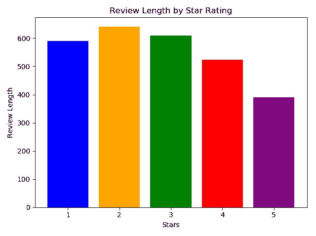
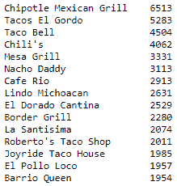
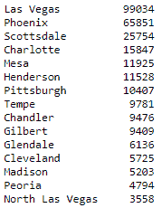
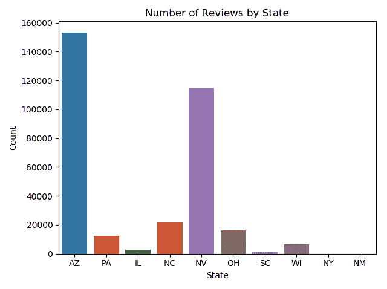

# Yelp 最好的卷饼

> 原文：<https://towardsdatascience.com/yelps-best-burritos-aafb0eba74da?source=collection_archive---------27----------------------->

## 分类和情感分析—第 1 部分

*这是一个三部分的项目，与 Yelp 的开放数据集一起工作，一个* [*“用于学习的通用数据集。*](https://www.yelp.com/dataset) *“在第 1 部分中，我们将加载一些大规模的 JSON 文件，过滤它们以减小它们的大小，探索我们的评论数据子集并讨论标记化！第二部分* [*这里的*](https://medium.com/@nhcampanelli/yelps-best-burritos-d163952918f8) *。第三部分* [*这里的*](https://medium.com/@nhcampanelli/yelps-best-burritos-dfdb0cc5a32a?sk=2222363a7910fb93d6201da55853f8dc) *。如果你对代码感兴趣，你可以在这里找到它***。**

## *数据*

*Yelp 维护并分发了一个用于学习的大规模开放数据集，专门用于 NLP 问题。该数据集包含各种信息，包括入住数据、照片和业务属性。然而，我们在这里最感兴趣的是评论的集合。这个数据集来自几个包含不同信息的 JSON 文件，包含近 30 万家企业的 700 万条评论。哇！*

*这是一个令人尴尬的大量数据，所以我们将与一个较小的评论子集一起工作，以最大限度地减少计算时间。这个子集将是所有对墨西哥和 Tex-Mex 餐馆的评论，因为我喜欢墨西哥卷饼。相当随意，但这将大大减少计算时间，并确保比我们与瑜伽馆或电影院等不同企业合作时更标准化的语料库。*

*要获得这些评论，需要做一些预处理工作。包含所有 700 万条评论的 JSON 文件没有任何关于企业名称或类别的信息，只有一个唯一的企业 ID。为了获得与 Mexican 和 Tex-Mex 餐馆相关的业务 id 列表，我们必须查阅包含所有业务属性信息的 JSON 文件。将这个 JSON 文件直接加载到 pandas 数据框架将允许我们按业务类别进行过滤。在这里，不出所料，“墨西哥”和“得克萨斯-墨西哥”。这样做将为我们提供一个超过 4000 家企业的列表，现在是所有餐馆。很简单，从我们开始的 30 万家企业中精简出来。JSON 文件包含了 700 万条评论。*

*这个文件的庞大规模需要一种不同于处理业务属性的策略。试图将所有 700 万个文件直接加载到一个数据帧甚至一个字典列表中会导致内存错误(至少对于我的 8gb ram)。另一种策略是打开文件，逐个读取对象，并检查内存中的当前对象是否符合特定标准。在这种情况下，标准是将业务 id 与上面创建的列表相匹配。如果有匹配，我们将把 JSON 对象(一个字典)追加到一个列表中。然后，可以将这个字典列表推送到数据帧中。这是一个缓慢的过程，但我不确定在处理大文件时有没有更好的解决方案(如果你有不同的想法，请在评论中告诉我)！无论如何，在处理结束时，我们会得到一个数据帧，其中包含 Yelp 开放数据集中所有墨西哥和 Tex-Mex 餐馆的所有评论。*

*这个过程的最后一步是在这个项目的第 3 部分中分离一组评论来进行情感分析。因为我们对使用情感分析来识别被低估的墨西哥卷饼感兴趣(稍后会有更多内容)，所以我们会找出所有专门提到“墨西哥卷饼”这个词的评论。使用 pandas 的矢量化字符串函数，这是微不足道的。所有这些操作的最终结果是包含独特评论集的两个数据框架。有 51，764 条评论提到了墨西哥卷饼，另有 328，932 条评论提到了墨西哥餐馆和得克萨斯-墨西哥餐馆。仍然是一个大的评论集，但比最初的 700 万更容易管理。*

## *视觉探索*

*该项目的这一部分的目标是建立一个分类器，根据评论的文本正确预测给定的 Yelp 星级。为了更好地理解我们所做的工作，让我们看一些有助于描述数据的图表。首先，我们将通过星级检查评论的数量，看看我们是否有一个均等的分布(图 1)。正如我们在下面看到的，5 星评论的数量让其余的星级相形见绌。这可能意味着该数据集将受益于对多数类的欠采样。现在我们只需要记住这些信息。*

**

*Figure 1: Number of reviews binned by stars*

*我们可能感兴趣的另一个关系是文本长度和星级之间的关系。正如 Austin McCartney and co., [分类器的性能随着文本长度的减少而降低](http://ceur-ws.org/Vol-2086/AICS2017_paper_23.pdf)。查看与上面相同的 5 个容器，我们可以看到文本长度因星级而异，但差异并不大(图 2)。无论如何，这是很难改变的。继续前进。*

**

*Figure 2: Mean length of reviews binned by stars*

*既然我们对评论长度和星级数的分布有了一些直觉，接下来让我们看看构成这近 330，000 条评论的餐馆。以下是获得评论最多的 15 家餐馆的名单。对于我们这里的目的，单个链的评论都加在一起(图 3)。不出所料，连锁餐厅占据了前 15 名的大部分，但还没有到可能会出现问题的程度。在所有的评论中，只有大约 2%的评论是针对墨西哥薄饼的。*

**

*Figure 3: Top 15 restaurants garnering reviews (here, all Chipotles and all Taco Bells)*

*上面的列表也很有趣，因为它似乎偏向于美国西部的餐馆。具体来说，我知道“Barrio Queen”是亚利桑那州一家受人尊敬的传统墨西哥餐厅，“Tacos el Gordo”是加利福尼亚州一家备受推崇的主流餐厅，“Nacho Daddy”是内华达州一家玉米片冠军餐厅。我们之前可能认为 Yelp 的这个数据集包括了这个国家的很大一部分，但是我们最好仔细看看城市和州的分布，看看我们在做什么(图 4，图 5)。正如我们所见，拉斯维加斯和亚利桑那州的一些城市有很好的代表性，亚利桑那州餐馆的评论数量让其他州相形见绌。在这个项目的扩展中将我们的评论绑定到这些位置可能会很有趣，但是现在没有必要担心这个奇怪的餐馆样本。*

**

*Figure 4: Top 15 cities represented*

**

*Figure 5: Reviews binned by state*

*鉴于我们所拥有的数据，以及项目第一部分的简单最终目标，让我们将 5 星评级系统分为两类。这将是好评论(5 和 4 星)和坏/中性(1，2 或 3 星)评论。这将使分类更简单。执行这个操作很简单，然后我们得到了 115，787 个差评和 213，145 个好评。这种不平衡可能意味着我们的分类器在对好评进行分类时会表现得更好，但没有必要进行纠正。*

## *清理一些文本*

*分析文本的第一步是清理文本。这可能涉及各种不同的步骤，但这里会很简单。我们将利用内置函数的自然语言工具包(NLTK)。所有的评论都包含在一个数据框架中，这个过程很容易用 pandas apply 方法实现。为了了解这个过程的输入和输出，我们可以看看下面的图 6。我们从最初的评论开始，将所有大写字母转换为小写字母，将文本转换为字符串列表，然后最终删除停用词(常见的单词)和标点符号(注意评论末尾的感叹号和笑脸已经消失)。*

**

*Figure 6: Steps in the cleaning and tokenizing process.*

## *N-grams*

*一旦矢量化，上面生成的单词列表可用于机器学习模型中进行分类。然而，简单地使用单词作为特征必然会消除伴随单词排序而来的所有信息。这就是 n-grams 发挥作用的地方。N-gram 是从给定的文本序列构造的 N 个项目的连续序列。这些可以是二元模型(2 个单词)、三元模型(3 个单词)等。给定上面图 6 中单词标记的最终列表，二元模型表示将是下面图 7 中复制的元组列表。*

**

*Figure 7: Bigram representation of the sentence constructed in figure 6*

*使用 n-gram 表示的最大缺点是训练词汇的规模变得巨大。我们稍后会谈到它，但是通过向量化训练语料库构建的二元模型的词汇表超过 300 万个唯一术语。正如我们所料，使用三元模型或四元模型只会使这个问题更加复杂。当然，最终的终点将是训练语料库中表示的每一个独特的句子和一个完美的过度拟合模型。使用二元模型不会发生这种情况，而且我们将获得比使用单个单词更好的分类性能结果(相信我，我已经检查过了)。它还允许我们执行功能选择步骤。所有伟大的东西，让我们开始吧！跟我来第二部分[这里](https://medium.com/@nhcampanelli/yelps-best-burritos-d163952918f8)。*