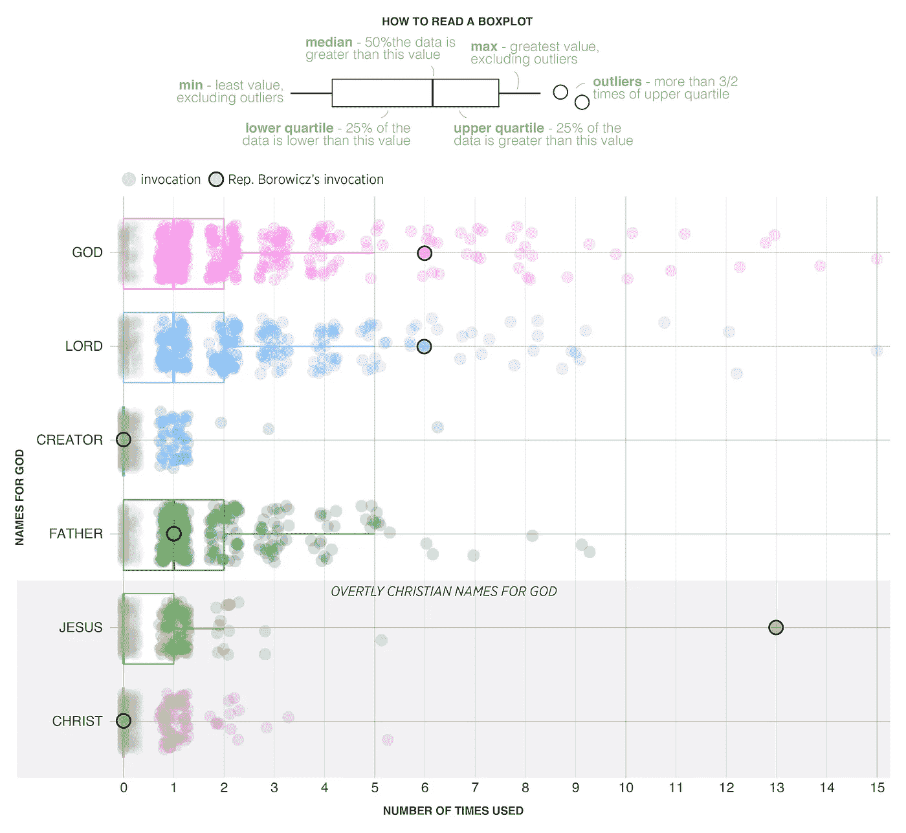
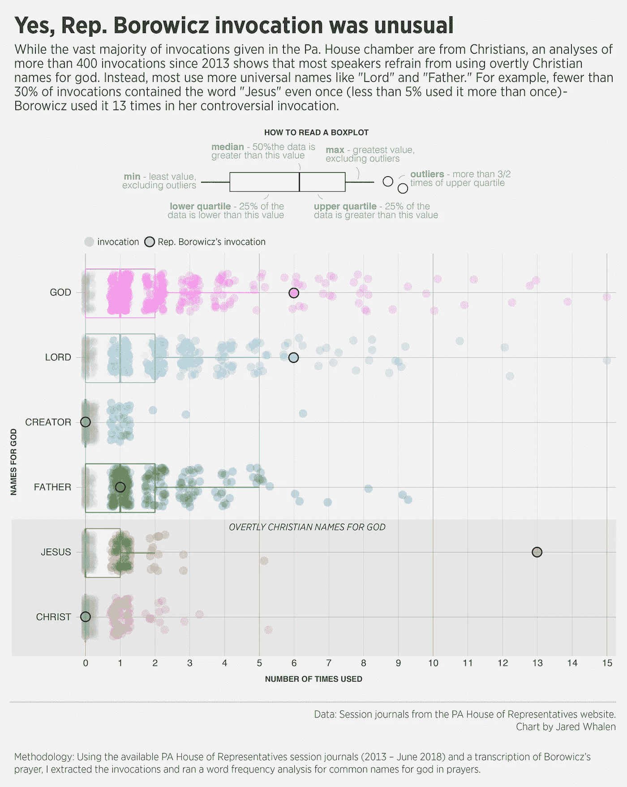

# 是的，众议员 Borowicz 调用是不寻常的

> 原文：<https://towardsdatascience.com/yes-rep-borowicz-invocation-was-unusual-c169c5dd23b4?source=collection_archive---------17----------------------->

星期一，爸。州众议员斯蒂芬妮·博罗维奇在众议院发言时做了祈祷，她甚至在说“阿门”之前就开始引起反弹这场祈祷恰逢该州首位穆斯林女性代表宣誓就职，被批评者贴上了仇视伊斯兰和排外的标签。

**是什么引起了如此大的争议？**

批评者充满了对以色列友好的特朗普政府的宽恕和赞扬，他们说，这种祈祷更像是针对民主党人的政治声明，而不是祈祷。

**但是这次祈祷和平常有什么不同吗？**

而绝大多数的调用在 Pa。众议院 chamber 来自基督徒，对 2013 年以来超过 400 次调用的分析表明，大多数发言者避免使用公开的基督教名字称呼上帝。相反，大多数人使用更通用的名字，如“主”和“父亲”例如，不到 30%的调用包含单词“Jesus”甚至一次(不到 5%的调用不止一次)——Borowicz 在她有争议的调用中使用了 13 次。

Data: Session journals from the [PA House of Representatives website](https://www.legis.state.pa.us/cfdocs/legis/home/hj/hj.cfm?spick=20180).
Chart by Jared Whalen

观看下面视频中的祈祷。

**方法论**

使用可用的 PA 众议院会议日志(2013-2018 年 6 月)和 Borowicz 的祈祷文转录，我提取了祈祷文，并对祈祷文中上帝的常见名称进行了词频分析。

**工具**

Adobe —将 pdf 转换为纯文本

R —文本分析和可视化

Illustrator —完成设计润色

**独立图表**

Data: Session journals from the [PA House of Representatives website](https://www.legis.state.pa.us/cfdocs/legis/home/hj/hj.cfm?spick=20180).
Chart by Jared Whalen