# 又一个全栈数据科学项目

> 原文：<https://towardsdatascience.com/yet-another-full-stack-data-science-project-a-crisp-dm-implementation-2943cae8da09?source=collection_archive---------11----------------------->

## 一脆-DM ***实现***

Photo by [rawpixel.com](https://www.pexels.com/@rawpixel?utm_content=attributionCopyText&utm_medium=referral&utm_source=pexels) from [Pexels](https://www.pexels.com/photo/flat-lay-photography-of-macbook-pro-beside-paper-1509428/?utm_content=attributionCopyText&utm_medium=referral&utm_source=pexels)

# **简介**

几年前，当我在华盛顿特区搜索数据科学会议时，我第一次遇到了“全栈数据科学”这个术语。

*作为一名软件开发背景的人，我非常熟悉全栈开发人员这个术语，但是全栈数据科学听起来很神秘。*

*随着越来越多的公司将数据科学&机器学习纳入其传统软件应用，术语全栈数据科学现在比历史上任何时候都更有意义。*

*软件开发方法经过多年的精心开发，以确保在较短的周转时间内实现高质量的软件应用。不幸的是，传统的软件开发方法在数据科学应用的环境中并不适用。*

*在这篇博文中，我将强调跨行业数据挖掘标准流程(CRISP-DM ),以开发一个可行的全栈数据科学产品。*

我坚信一句谚语，“布丁的好坏，在于吃的过程。”因此，我通过应用 CRISP-DM 方法实现了 Starbucks challenge，作为本文的姊妹项目，并在本文的多个地方被提及。

# Starbucks 数据集概述

星巴克使用模拟程序生成了数据集，该程序模拟了人们如何做出购买决定以及促销优惠如何影响这些决定。

模拟中的每个人都有一些影响他们购买模式的隐藏特征，并与他们的可观察特征相关联。人们执行各种事件，包括接收报价、打开报价和进行购买。

*简单来说，没有特定的产品需要跟踪。只记录每笔交易或报价的金额。*

*有三种类型的优惠可以发送:*

*   *买一送一(BOGO)*
*   *折扣，和*
*   *信息*

*在 BOGO 优惠中，用户需要花费一定的金额来获得与该阈值金额相等的奖励。*

收到折扣后，用户将获得相当于消费金额一小部分的奖励。

*在信息提供中，没有奖励，但也没有要求用户花费的金额。优惠可以通过多种渠道提供。*

*主要任务是使用数据来确定哪些人群对每种类型的优惠最敏感，以及如何最好地展示这些优惠。*

# 数据挖掘(CRISP-DM)的跨行业标准流程是什么？

*跨行业数据挖掘标准流程(CRISP-DM)方法是一个开放的标准流程，描述了数据挖掘专家使用的*传统*方法。*

*CRISP-DM 是一个循环过程，分为六个阶段。*

*   *业务理解*
*   *数据理解*
*   *数据准备*
*   *建模*
*   *评估*
*   *部署*

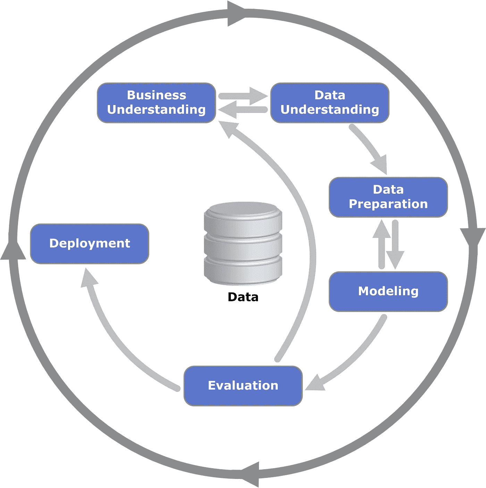

**Cross-Industry Standard Process for Data Mining (CRISP-DM) By** [**Kenneth Jensen**](https://commons.wikimedia.org/w/index.php?curid=24930610)

## ***商业理解***

*侧重于从业务角度理解项目目标和需求，然后将这些知识转化为数据挖掘问题定义和初步计划。*

*对于当前场景，我们将:*

1.  *对多变量频率分布进行探索性数据分析。*
2.  建立一个机器学习模型，预测某人是否会对某个提议做出回应。
3.  *建立一个预测个人最佳报价的机器学习模型。*
4.  *建立预测购买习惯的机器学习模型。*

## **数据理解**

*数据理解阶段有两种练习方式:*

1.  *从现有的数据收集开始，并继续进行熟悉数据的活动，以发现对数据的初步见解，或检测感兴趣的子集，以形成对隐藏信息的假设。*
2.  *识别特定的有趣问题，然后收集与这些问题相关的数据。*

*从业务到数据理解阶段的转化不是线性的；相反，它是循环的。*

*在这个项目中，我们将只利用星巴克提供的数据，因为在数据的固有限制下工作很有挑战性。因此，我们正在练习第一种方法。*

*Starbucks 在三个 json 文件中分发了数据:*

*   *portfolio . JSON——包含报价 id 和每个报价的元数据(持续时间、类型等)。)*
*   *profile.json —每个客户的人口统计数据*
*   *抄本. json —交易记录、收到的报价、查看的报价和完整的报价*

## ***数据准备***

*数据准备阶段包括从初始原始数据构建最终数据集的所有活动。数据准备是 80%的过程。*

*数据争论和数据分析是 CRISP-DM 模型的数据准备阶段的核心活动，也是第一个逻辑编程步骤。数据争论是一个循环的过程，我们经常需要一次又一次地重新审视这些步骤。*

*数据角力是独立于语言和框架的，没有一个正确的方法。对于姊妹项目，我选择 Python 作为编程语言，Pandas 作为数据操作框架。*

*根据经验，我将分两步处理数据争论:*

*   *评估数据——在这一步中，我们将对数据进行语法和语义检查，找出数据中的任何问题以及潜在的修复方法。*
*   *清理数据——在这一步中，我们实施评估阶段的数据修复。我们还运行小单元测试，以确保数据修复按预期工作。*

*我对 Starbucks 提供的所有三个数据源进行了数据辩论。*

> **数据角力— portfolio.json**

*从视觉和程序性评估来看，投资组合数据集只有十行，没有缺失数据。*

*但是，数据不是机器学习友好的结构。我们将对“channels”和“offer_type”列应用 one hot 编码方法。*

***Data Wrangling — portfolio.json***

> **数据角力— profile.json**

*根据目测评估，在轮廓数据集上:*

*   *“成为成员”列不是日期时间格式。*
*   *如果缺少年龄信息，则默认使用“118”填充年龄*

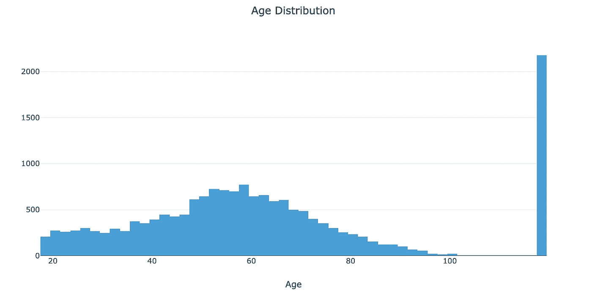

**Age frequency distribution —before data wrangling**

*根据程序性评估，在轮廓数据集上:*

*   *性别和收入列有缺失数据。*
*   *缺少性别和收入信息的相同列的年龄值为“118”*

*在清理阶段对配置文件数据集实施以下修复:*

*   *删除缺少值的行，这将隐式删除年龄为“118”的行*
*   *将成为成员转换为熊猫日期时间数据类型。*

*数据不是机器学习友好结构。我将创建一个新的 ML 友好熊猫数据框，并做如下修改:*

*   *对性别列应用一种热编码方法。*
*   *“成为成员”列拆分为年、月、日列，删除“成为成员”列*

***Data Wrangling — profile.json***

*一旦数据争论步骤完成，就没有丢失值的行(隐式删除年龄为‘118’的行))*

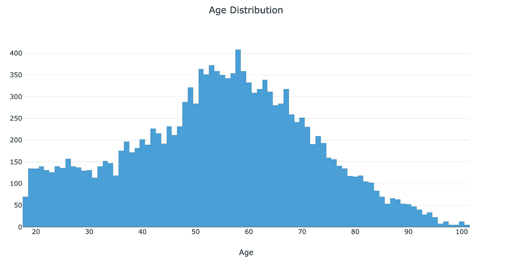

**Age frequency distribution — after data wrangling**

> **数据角力—抄本. json**

*从视觉和程序性评估来看，抄本数据集中没有数据问题。*

*然而，没有定义促销是否影响了用户的数据。只有在个人观看广告后进行交易之后，用户才被认为受到促销的影响。我们将应用多种数据转换来提取这些信息。*

***Data Wrangling — transcript.json***

*现在我们已经清理了所有三个数据帧，让我们合并成一个数据帧。*

***Data Wrangling — consolidation***

> **探索性数据分析—多变量频率分布**

*从文字记录数据中，我们识别出五种事件:*

1.  *收到报价*
2.  *报价已查看*
3.  *报价完成*
4.  *交易(购买)*
5.  *受影响(仅当在查看报价后购买时)*

*从干净数据推断的特征在相应的可视化下面提到。*

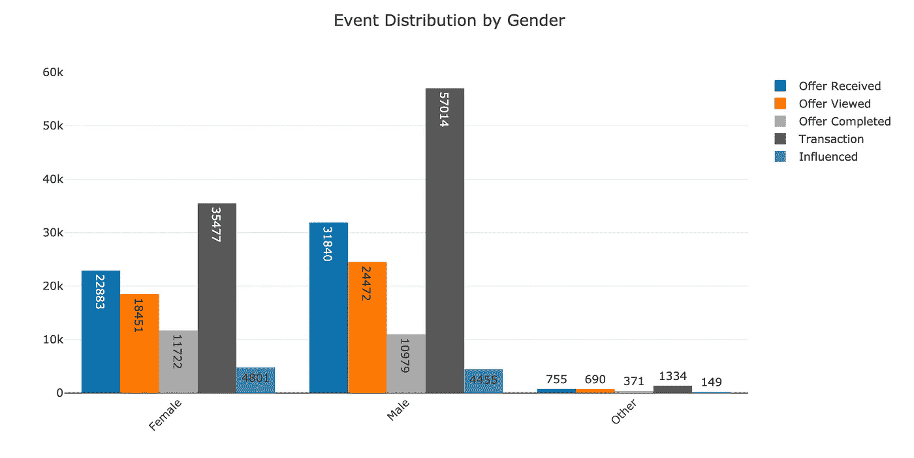

**Event Distribution by Gender**

1.  *注册为男性的个人资料交易次数最多。*
2.  注册为女性的个人资料很可能会受到晋升的影响。

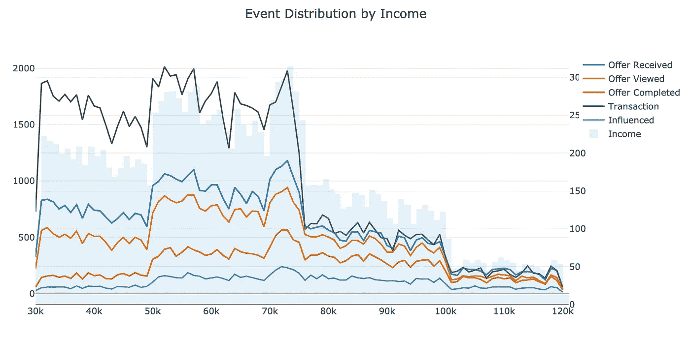

**Event Distribution by Income**

1.  *数据集中的个人在 3 万到 12 万的收入范围内。*
2.  数据集中的大多数人年收入不到 8 万英镑。
3.  大多数交易是由年收入低于 8 万英镑的个人进行的。

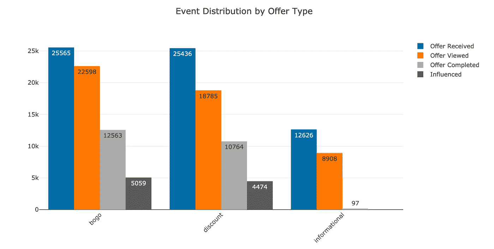

**Event Distribution by Offer Type**

1.  *BOGO 优惠有较高的影响力。*
2.  信息优惠的影响可以忽略不计。

*即使从数据探索中获得的知识并不多，但它已经产生了一个关键的洞察力—* ***目标类别不平衡*** *。主要是在处理分类模型时，这些信息对于决定应该使用什么评估度量是至关重要的。*

## 建模和评估

*建模不是必要步骤，完全取决于项目的范围。对于这个项目，我将建立一个机器学习模型:*

*   *预测某人是否会对提议做出回应。*
*   *预测个人的最佳报价。*
*   *预测购买习惯。*

*三个模型都是在集合模型上训练的。*

*对于分类模型，由于目标类别的不平衡，我们将使用精度、召回率和 F1 分值作为评估指标。*

*对于回归模型，我们将使用均方差和 R2 值作为评估指标。*

> **预测某人是否会受到要约的影响**

**Model for predicting whether or not someone will be influenced by an offer**

我采用了网格搜索来寻找产生高 F1 分数值的模型。学习率约为 1.87 的 AdaBoostClassifier 和 10 个估计器在训练和测试数据集上都产生了 0.87 的合并 F1 分数，实现了偏差(欠拟合)和方差(过拟合)之间的正确平衡。

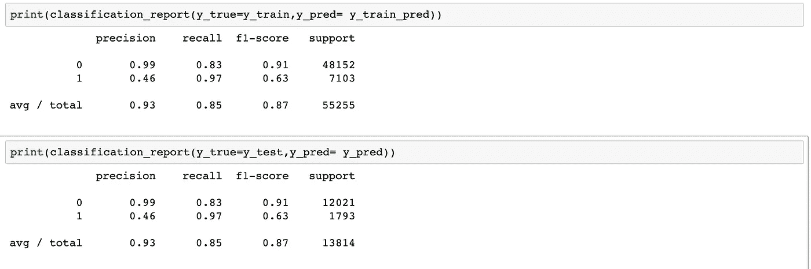

**Precision, Recall and F1-score for training and testing data sets**

并非数据集中的所有特征都被用来进行预测。我们可以从模型的角度获得每个特征的权重。权重将在 0 到 1 的范围内，并且所有特征的总权重将加起来为 1。

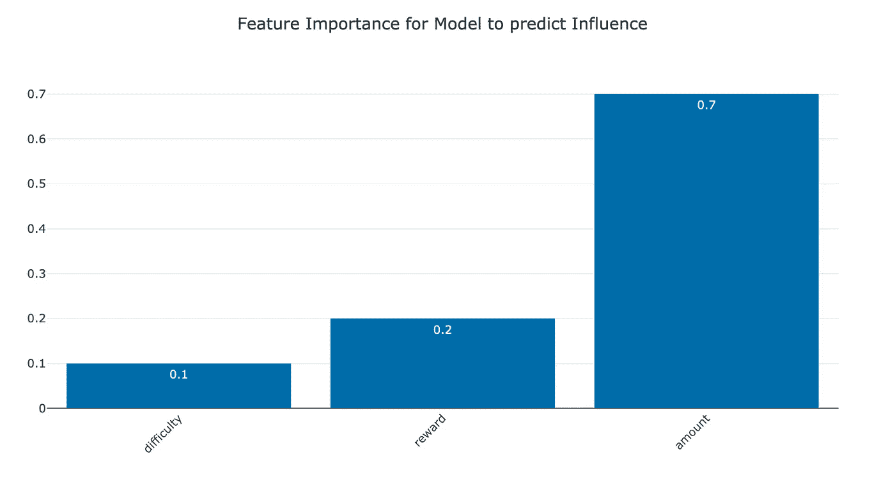

**Feature Importance for model to predict influence**

*预测一个人是否受促销影响的模型高度依赖于消费金额。这种模式高度依赖于行动(购买)之后。因此，我们不能使用这种模式。理想情况下，我们需要收集更多的数据来解决这个问题。由于我只处理星巴克提供的数据，我无法设计出想要的模型。*

> **预测个人最佳报价**

**Model for predicting the best offer for an individual**

*我采用了网格搜索来寻找产生高 F1 分数值的模型。不幸的是，F1 可以达到的最高综合分数是“0.2”。*

*收集更多数据应该有助于提高 F1 分数，但由于我只在所提供的数据范围内工作，我无法部署这一模型。*

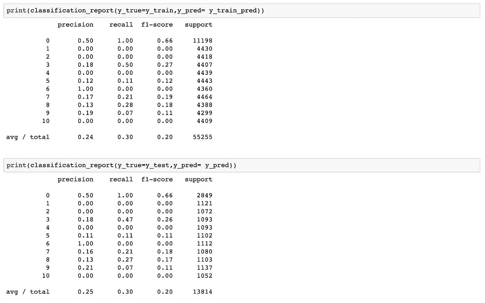

**Precision, Recall and F1-score for training and testing data sets**

> **预测购买习惯**

**Model for predicting the purchasing habits**

*我采用了网格搜索来寻找产生合适的 R2 和 MSE 值的模型。学习率为 0.1 的 GradientBoostingRegressor 使用 100 个估计量，为训练和测试数据集产生了大约 0.32 的 R2 分数和大约 2300 的 MSE，实现了偏差(欠拟合)和方差(过拟合)之间的正确平衡。*

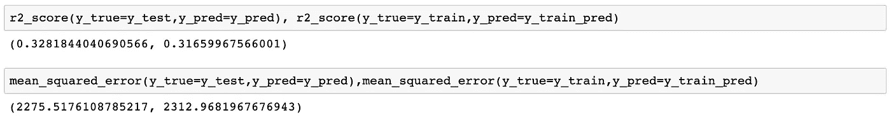

**R2 & MSE for training and testing data sets**

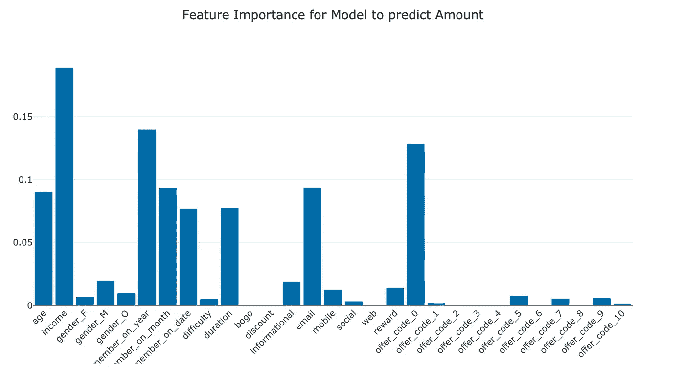

**Feature Importance for model to predict amount**

*与用于预测个人是否会受到影响的模型不同，预测购买力的模型依赖于多个特征，并且没有一个特征是事实属性。*

*我将在 Web 应用程序中使用这个模型来进行预测。*

## 部署

*通常，这意味着将模型的代码表示部署到应用程序中，以便对新出现的未知数据进行评分或分类。*

*重要的是，代码表示还必须包括建模前的所有数据准备步骤，以便模型能够以与模型开发期间相同的方式处理新的原始数据。*

*我已经创建了 web 应用程序，它将利用数据分析和预训练模型来预测个人资料和优惠代码组合的购买金额。*

*在* [*自述文件中提到了启动 web 应用程序所需遵循的步骤的完整描述。MD*](https://github.com/ramsaran-vuppuluri/Starbucks-Challenge#starbucks-challenge) *文件。*

*以下是来自网络应用的截图:*

数据集概述

路径: [http://0.0.0.0:3001/](http://0.0.0.0:3001/)

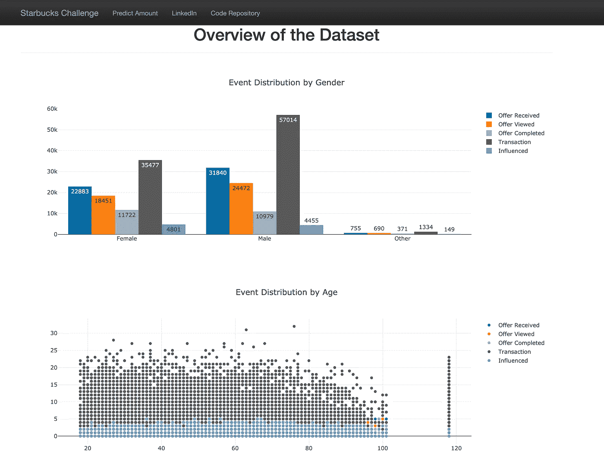

预测金额

路径:[http://0 . 0 . 0 . 0:3001/predict _ AMT](http://0.0.0.0:3001/predict_amt)

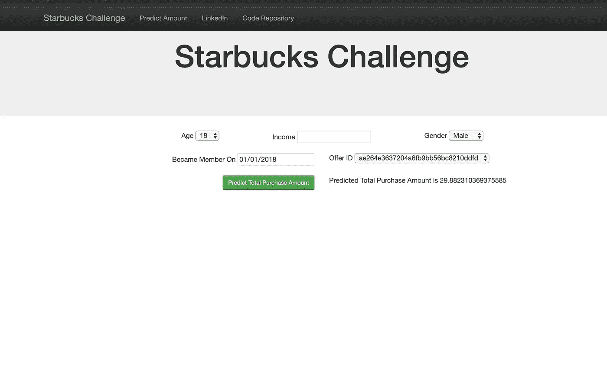

## **结论**

*   *与传统的软件开发相反，实现业务需求并不总是可行的。有时更多的数据会有所帮助，但在我们目前的情况下，我们将在所提供的数据范围内工作。*
*   测试集的评估是建模阶段的一部分；这在现实世界中并不常见。由于这个项目没有专门的测试人员，建模和评估是同时进行的。在任何时候，测试数据都不会暴露给预训练的模型。
*   *此分析的源代码托管在* [*GIT*](https://github.com/ramsaran-vuppuluri/Starbucks-Challenge) *上。*

## ***参考文献***

1.  [*CRISP-DM——确保良好结果的标准方法学*](https://www.datasciencecentral.com/profiles/blogs/crisp-dm-a-standard-methodology-to-ensure-a-good-outcome)
2.  [*全栈数据科学(附*](https://www.datacamp.com/community/podcast/full-stack-data-science)*[*)*](https://www.datacamp.com/community/podcast/full-stack-data-science)*