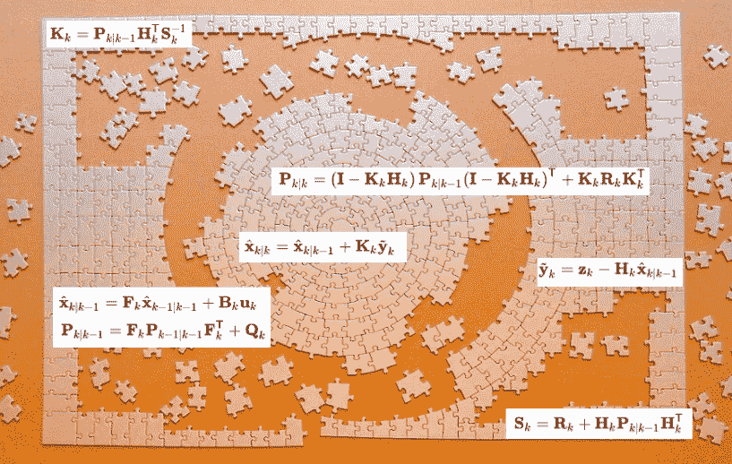
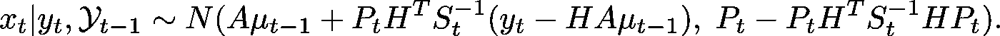

# 另一篇卡尔曼滤波解释文章

> 原文：<https://towardsdatascience.com/yet-another-kalman-filter-explanation-article-be0264d99937?source=collection_archive---------21----------------------->

## 是时候*知道*那些更新的方程式从何而来了

“[A Puzzle without a picture](http://A puzzle without a picture)” (who needs a picture when you have the [Kalman Filter updating equations](https://en.wikipedia.org/wiki/Kalman_filter#Update)?)

T 网上有很多解释卡尔曼滤波器的文章，其中很多都相当不错。他们使用自主机器人和传感器作为激励的例子，有很好的视觉效果，并以直观的方式介绍模型方程和更新。但是我看到的每一个都没有解释卡尔曼增益矩阵和它的来源。

我最喜欢的例子是数学堆栈交换上这个备受推崇的答案:

 [## 卡尔曼滤波器的解释

### begingroup$我敢贴链接到我的解释:http://david.wf/kalmanfilter/有很多不同的…

math.stackexchange.com](https://math.stackexchange.com/questions/840662/an-explanation-of-the-kalman-filter) 

它非常棒，直到作者准备解释卡尔曼增益矩阵，而不是以“*未完待续……*”(那是 2014 年)。失望的读者乞求几天才能得到其余的答案，但他们永远也得不到。

因此，欢迎阅读另一篇卡尔曼滤波解释文章，区别在于这篇文章包含了更新方程的“友好”推导，一直到最后。这是一个贝叶斯解释，但只需要粗略了解后验概率，依赖于多元高斯的两个属性，而不是特定的贝叶斯结果。作为一个奖励，这个解释将向我们展示卡尔曼滤波器是如何“最优”的，因为它的本质*就是*。

# 推导过程

由于 Medium 的排版限制，下面的嵌入式笔记本提供了推导过程。我的贡献最多是一个简洁的介绍；我迷失了，直到我找到 Simo srkk 的[幻灯片，Simo srkk](https://users.aalto.fi/~ssarkka/course_k2011/pdf/handout3.pdf)是一名研究人员，他后来写了一本关于贝叶斯过滤和平滑的更一般主题的书。

## 对推导的思考

我希望你已经完成了上面的讨论(感谢对不顺利部分的反馈)。最后，是后路:

该符号与维基百科上的[更新方程略有不同，但您可能会发现平均值与“更新(*后验*)状态估计值”相同方差看起来不像“更新的(*后验的*)估计协方差”，但是在下面的段落中注意公式如何“进一步简化”看起来相似的东西。](https://en.wikipedia.org/wiki/Kalman_filter#Update)

## 最佳性

“ [Bayes 动作](https://en.wikipedia.org/wiki/Bayes_estimator)是“最小化损失函数的后验期望值”的规则使未知参数的期望均方误差损失最小化的贝叶斯动作，即**均方误差**，就是后验分布的*均值。在本文中，后验分布的平均值*是*状态的卡尔曼滤波更新方程；这个更新方程是一个最小均方误差估计量，因为它是一个后验均值。*

## 最后的想法

在推导过程中，我假设现有的贝叶斯结果将适用，进一步简化它。测量模型看起来像一个以 x_t 为β的回归，但我找不到贝叶斯线性回归公式来拟合。我注意到“设计”矩阵 H 的行不是独立的观察值，我也想不出一种方法将它转换成一个有一个观察值的多元回归。如果有一种方法可以缩短现有共轭结果的推导过程，请在评论中分享。

对于符号，我特意选择不使用维基百科文章中的 *k* | *k-* 1 符号，因为我发现很容易混淆我实际使用的数量。然而，在完成推导之后，我可以理解它确实允许更少的符号，并且强调了在更新步骤中数量的演变。

每当我在这样的事情上分心时(我确实分心了)，总会有这样一个问题:这是否值得。在这种情况下，我认为是。我觉得我对多元高斯在卡尔曼滤波器构造中的广泛作用有了更好的理解。我有一个卡尔曼滤波先验的更好的概念，它不仅包含了到前一状态的信息，还包含了来自状态空间模型的信息，以便更进一步。我*可能*对选择卡尔曼滤波器实现中的状态向量和方差矩阵的初始值有更好的直觉(我们会看到)。我希望你也认为这是值得的，不管怎样，请在评论中告诉我！