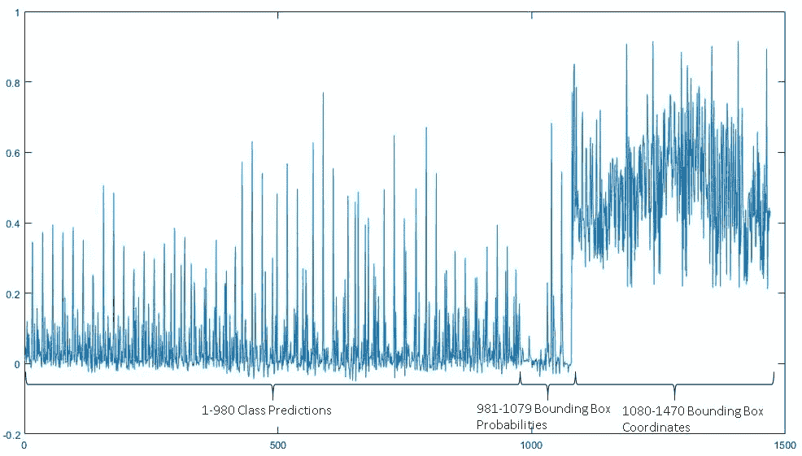
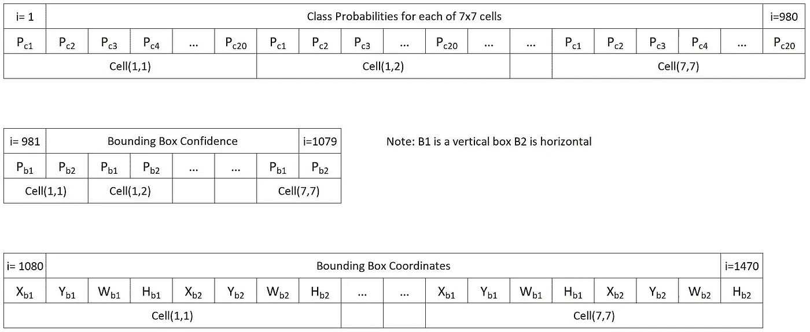
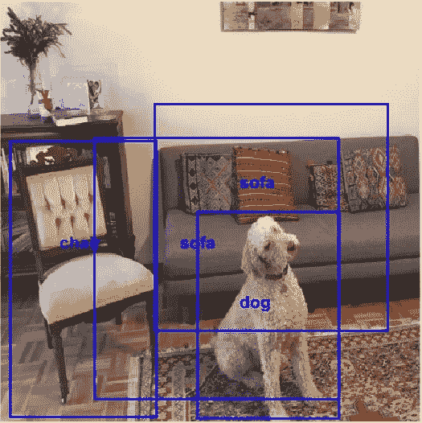
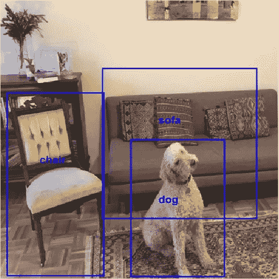

# MATLAB 中的 YOLO 物体检测，从头到尾

> 原文：<https://towardsdatascience.com/yolo-object-detection-in-matlab-start-to-finish-3f78ec80419d?source=collection_archive---------10----------------------->

## 在 MATLAB 中下载并实现 YOLO 目标检测网络

当我在寻找一种快速计算 3D 打印皮肤器官中生物细胞的方法时，约瑟夫·雷德蒙的 YOLO 算法引起了我的注意。YOLO 算法的优点是能够在单个图像中识别和定位多个(在我的实现中多达 49 个)对象，这使得它成为对显微镜图像中的细胞进行计数的理想框架。然而，在我能够训练一个类似 YOLO 的细胞检测网络之前，我需要在 MATLAB 中实现我在这个项目中使用的原始 YOLO。我原以为这是一个相当简单的任务，结果却有点像逆向工程。虽然可以从 Mathworks 下载 YOLO，但是实现的细节却很少。

如果您对 Matlab 中的对象检测感兴趣(并且有合适的工具箱)，本文提供了一个诀窍，以及对 YOLO 的行为和使用的一些见解。如果你对 YOLO 完全陌生，这里有 YOLO 的原始论文，后面是吴恩达的精彩描述，可以帮助你入门。

# 1.下载 YOLONET 并为回归进行修改

可从 Mathworks 获得的 YOLO 网络在可用于对象检测之前需要修改。您将下载的网络包含分类算法的最终图层；分类层和 softmax 层。然而，YOLO 实际上是一种 CNN 回归算法。输出应该是 0 和 1 之间的数字的数组或向量，其编码图像中检测到的对象的概率和边界框信息，而不是一系列的 1 和 0

最后两层需要用一个回归层代替。此外，为了与最初的 YOLO 论文(见上文)保持一致，最后一个泄漏的 ReLu 传递函数需要用一个标准(非泄漏？)ReLu。以下代码下载网络，修改图层，并将修改后的网络保存到 MATLAB 中的当前文件夹。

Creating the yolo network in MATLAB

# 2.通过网络运行图像并检查输出向量

为了测试我对 YOLO 的实现，我调用了我视觉艺术能力的最高水平，拍了一张快照，其中包含了 YOLO 接受过训练的四个物体——椅子、狗、盆栽植物和沙发。这是我的测试图像:

Still Life with Chair, Stella the Dog, Potted Plant, and Sofa. James Browning. 2018\. Digital Image.

因为 YOLO 是一个回归网络，我们将使用函数*预测*而不是*分类*。图像像素需要缩放到[0，1]，图像需要调整到 448x448 像素。如果您的图像是灰度的(即单通道)，它需要扩展到 3 个通道。以下代码预处理图像(您需要在 MATLAB 当前文件夹中提供您自己的图像)，对其应用回归网络，并绘制生成的 1x1470 输出向量。在这一部分代码中，我们还为包含对象的单元格定义了一个概率阈值(0.2 似乎效果很好)，并为非最大值抑制定义了一个超过联合阈值的交集，这两者我们稍后都会用到。

Running a test image through the network

值得看一看 YOLO 算法的输出向量。您可以通过注意到索引 1–980 大约每 20 个位置出现一个峰值来对输出进行反向工程，对应于 YOLO 已经被训练的 20 类对象，索引 981–1079 包含一些峰值，对应于在我的测试图像中少数可识别对象(4)的概率，而索引 1080–1470 是相当随机的，这是您从边界框坐标中所期望的。

The raw 1x470 output of our modified YOLO network when shown an image of Stella the Dog.

在通过网络运行了几十个简单的图像之后，例如在图像的一侧包含一个单独的高个子的图像，我能够如下解码 YOLO 算法的输出。我只保证它在没有生命、生计、个人财产或任何最有价值的东西受到威胁的情况下是准确的…

YOLO output key. Hard won. Wish I could figure out a way of monetizing it.

# 3.重塑输出矢量并查找包含对象的像元

现在我们有了 YOLO 算法输出的关键，我们可以开始将 1x1470 输出向量转换成覆盖在测试图像上的边界框的过程。作为第一步，我决定将 1x1470 向量转换为 7x7x30 数组，其中前两个维度对应于 YOLO 将图像划分成的 7x7 个单元，最后一个维度包含定义每个单元的概率和边界框的 30 个数字。这样做之后，我们可以画一个简单的图，显示可能包含对象的单元格。将下面的图与原始测试图像进行比较，我们看到该算法似乎正在检测椅子、狗和沙发，但似乎没有检测到盆栽植物。

Reshaping the output vector into a 7x7x30 array

Yellow cells on the left contain an object in the image of Stella the Dog on the right. So far so (kind of) good.

# 4.打印边界框和类别标签

现在我们有了一个漂亮的 7x7x30 输出数组，我们可以在原始图像上绘制边界框和类标签。我们现在将利用代码前面的 probThresh 变量。您需要调整这个值以获得最佳效果，但是我发现 0.2 似乎对各种图像都很有效。下面的代码我就不多说了，只说有点繁琐，让我头疼。

Displaying bounding boxes

Too many sofas, not enough potted plants.

# 5.非最大抑制

正如你在上面看到的，我们的测试图像有两个直接的问题:1)沙发被标记了两次，2)盆栽没有被标记。椅子和狗斯特拉被完美分类。我们将使用非最大抑制来纠正第一个问题(沙发太多),并忽略第二个问题。实际上，左上角的物体严格来说并不是盆栽植物，它是一瓶水中的几根常青树枝，我称之为曼哈顿圣诞树。我不是一个和算法争论语义的人。

如果出现以下情况，非最大抑制将移除边界框 A:

1.  它与边界框 B 的并集交集(IOU)高于定义的阈值
2.  边界框 A 和 B 包含相同类别的对象
3.  边界框 A 包含对象的概率比框 B 低

代码如下:

Voila! Viola! (is something I imagine luthiers say a lot)

就是这样！MATLAB 中的实时统一目标检测。对羊有效吗？当然啦！它对人、狗和羊有效吗？不…

这里有一个关于迷人的、及时的、不断发展的 YOLO/人工智能羊难题的简短讨论:

 [## YOLO 迷上了绵羊:统一目标探测中的环境背景

### 我最近在 MATLAB 上改编了约瑟夫·雷德蒙的 YOLO 算法(到目前为止没有非最大值抑制),度过了一个有趣的小时…

towardsdatascience.com](/yolo-is-sheep-obsessed-environmental-context-in-unified-object-detection-91160dafa618)