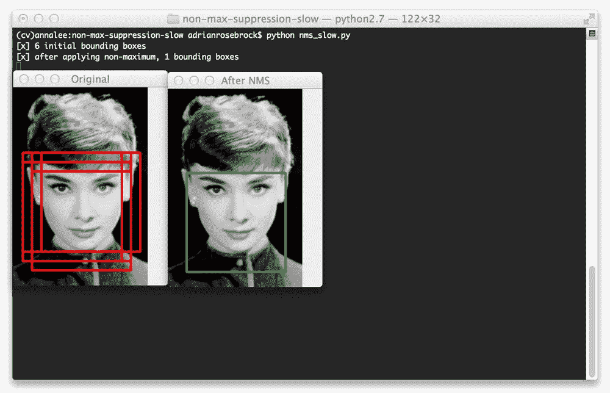
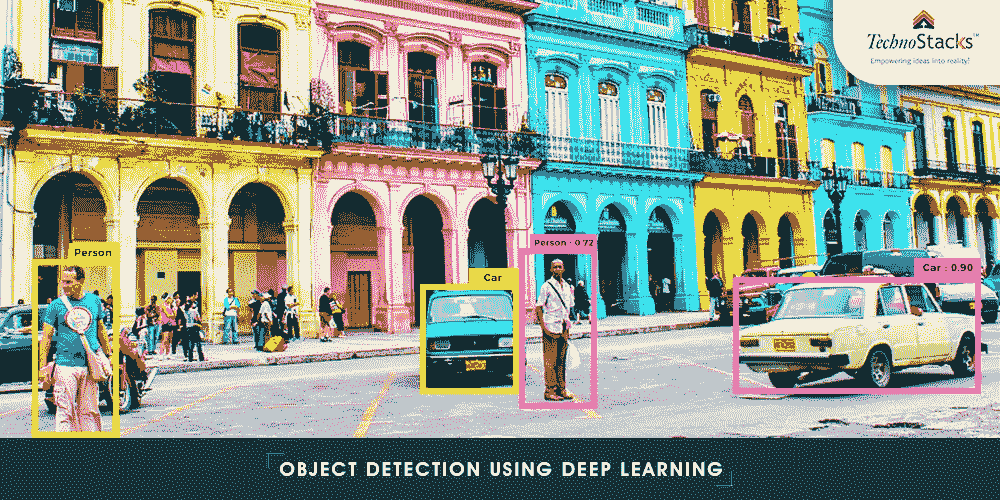

# YOLO(你只看一眼)

> 原文：<https://towardsdatascience.com/yolo-you-only-look-once-17f9280a47b0?source=collection_archive---------5----------------------->

## 一个实时物体检测算法的简单说明！

King Aragorn before a charge against the Orcs of Mordor

西雅图人，想象一下这个场景:

这是一个温暖的夏日午后，在绿湖公园。公园里到处都是其他人，他们试图在我们相对短暂的夏天吸收所有他们能得到的阳光。你躺在草地上，努力抚平前一周长途跋涉后晒黑的皮肤。当你在读你最喜欢的书时，你听到了集体的叫喊声。！！！“来自你附近的一个群。在你的眼角，你看到一个小球向你走来，随着每一毫秒的流逝，它突然变得越来越大。本能地，你放下书，并能够找到球，并在它击中你之前接住它！太棒了！

教一台机器如何“看”这个世界不是一件容易的事情。这可不是把相机连上电脑那么简单。我们只需要几分之一秒的时间来观察、识别、分析、分类，并最终根据我们的视觉采取行动(在这种情况下，举起你的手来预测流氓球的路径)。但是对于一台机器来说，重建人类视觉不仅仅是一个动作，它实际上是一系列动作。计算机视觉(CV)是一个不断发展和不断变化的跨学科计算机科学领域，它专注于如何使计算机能够像地球上的生命体一样感知世界。

在过去的几年里，硬件和软件都取得了进步。图像分割、面部识别和模式检测是计算机视觉的一些例子。在这篇博文中，我希望简单概述一下 YOLO(You Only looking Once)，这是一种快速实时多目标检测算法，它是由来自华盛顿大学的 Redmon 等人在这篇 [2015 年的论文](https://arxiv.org/abs/1506.02640)中首次概述的(go DAWGS！)自其最初出现以来已经提出了许多改进。

首先，下面是 YOLO v2 的 youtube 视频。

来自 YOLO [git hub](https://github.com/pjreddie/darknet/wiki/YOLO:-Real-Time-Object-Detection) 的自述:

> 你只看一次(YOLO)是一个用于检测 Pascal VOC 2012 数据集上的对象的系统。它可以检测 20 个帕斯卡对象类别:
> 
> 人
> 
> 鸟、猫、牛、狗、马、羊
> 
> 飞机、自行车、船、公共汽车、汽车、摩托车、火车
> 
> 瓶子、椅子、餐桌、盆栽、沙发、电视/显示器

很酷，对吧？但是什么？怎么会？

“你只看一次”是一种利用单个卷积网络进行对象检测的算法。与其他逐位扫描图像的对象检测算法不同，该算法获取整个图像并

> …将对象检测重新构建为单个回归问题，直接从图像像素到边界框坐标和类别概率。

简而言之，无需深入细节，您可以获取一个图像输入，在 SxS 网格上将其分割，通过神经网络来创建边界框和类预测，以确定最终的检测输出。它首先在整个数据集上训练多个实例，然后在现实生活的图像和视频上进行测试。

为了计算边界框，YOLO 实现了两个关键的后处理步骤:IoU(在并集上相交)和 NMS(非最大值抑制)。

IoU 是机器预测的边界框与实际对象的边界框匹配的程度。以下面的汽车图片为例:

car

紫色的框是计算机认为的汽车，而红色是汽车的实际边界框。两个盒子的重叠给了我们借据。

The shaded yellow is our IoU

下面是 NMS 如何运作的一个简单例子。对象检测算法经常会有过度识别某个对象的问题，在这种情况下，奥黛丽·赫本的脸。 [*非最大抑制(NMS)已经广泛应用于计算机视觉的几个关键方面，并且是许多检测方法中不可或缺的一部分，可能是边缘、拐角或物体检测[1–6]。它的必要性源于检测算法定位感兴趣的概念的不完善的能力，导致在真实位置附近的几个检测的组。*](https://www.vision.ee.ethz.ch/publications/papers/proceedings/eth_biwi_01126.pdf)*【NMS】确保我们在人脸所属的所有候选细胞中识别出最佳细胞。NMS 没有确定图像中她的脸部有多种情况，而是选择确定同一物体的概率最高的方框。*

**

*An example of NMS*

*利用 IoU 和 NMS，它可以极快地预测图像中的各种物体。通过在训练和测试期间查看整个图像，它隐式地编码了关于类的上下文信息以及它们在它所看到的图像中的外观。然而，YOLO 的一个缺点是无法检测太靠近或太小的多个对象，就像下面的例子中，建筑结构下的人群没有被 YOLO 分类。*

**

*via TechnoStacks*

*这项技术在现实生活中如何实施的一个很好的例子就是汽车视觉！当一辆汽车在街上行驶时，它“看到的”是不断变化的，通过快速 YOLO 算法，汽车将能够快速识别下面的骑车人。通过其他传感器来检测骑自行车的人有多远，汽车就能够采取必要的行动来阻止或避开骑自行车的人或其他汽车或物体，以避免碰撞！*

**

*我希望这个对 YOLO 算法的高水平概述已经激发了你对计算机视觉技术现状的兴趣。如果你有兴趣了解更多进一步的研究，请查看约瑟夫雷德蒙和他在 YOLO 和其他计算机视觉项目上的持续工作！*