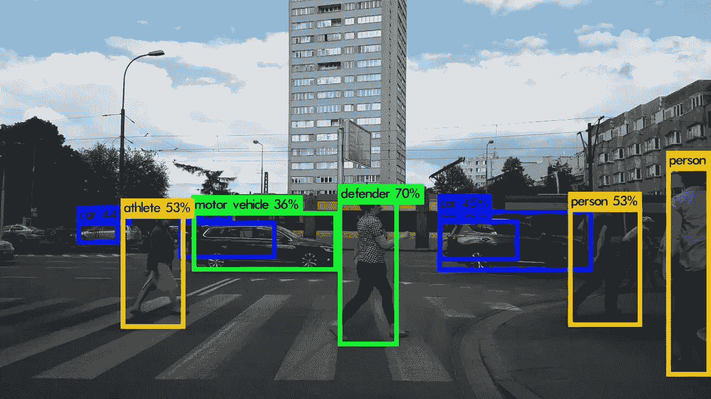
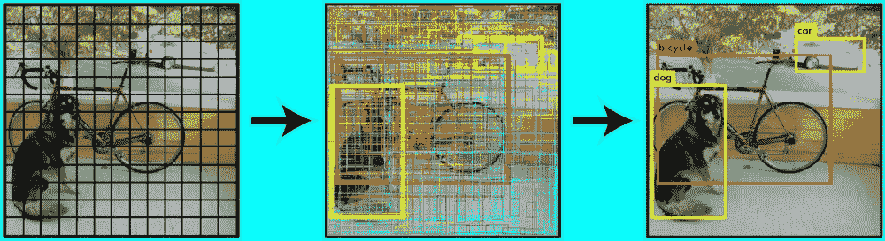
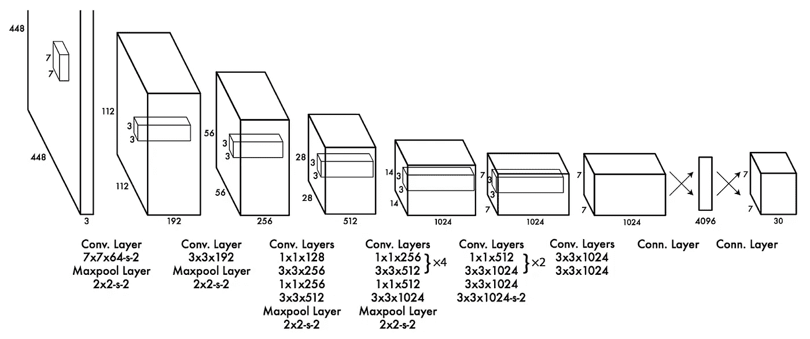

# YOLO——你只能看一次

> 原文：<https://towardsdatascience.com/yolo-you-only-look-once-c63247e59d66?source=collection_archive---------28----------------------->

## YOLO！！！那么我们只活一次吗？我确实不知道。我知道的是我们只需要看一次。等等什么？

没错。如果您想要检测和定位图像中的对象，则不需要经历提出感兴趣区域、对它们进行分类和校正它们的边界框的整个过程。如果你还记得我以前的[文章](https://sergioskar.github.io/Localization_and_Object_Detection/)，这正是 RCNN 和更快的 RCNN 这样的模型所做的。

我们真的需要所有的复杂性和计算吗？如果我们想要一流的精度，我们当然会这么做。幸运的是，有另一种更简单的方法来完成这项任务，只需处理图像一次，并立即输出预测。这些类型的模型被称为单触发探测器。

[https://www.youtube.com/watch?v=yQwfDxBMtXg](https://www.youtube.com/watch?v=yQwfDxBMtXg)

# 单发探测器

我们没有一个专门的系统来提出感兴趣的区域，而是有一组预定义的框来寻找对象，这些对象被转发到一堆卷积层来预测类得分和边界框偏移。**然后，对于每个框，我们预测多个边界框，并为每个边界框分配一个置信度得分，我们检测位于该框中心的一个对象，并输出每个可能类别的一组概率**。一旦我们有了所有这些，我们简单地，也许是天真地，只保留具有高置信度得分的盒子。这很有效。实际上取得了令人印象深刻的成果。为了更好地阐述整个流程，让我们使用一个最流行的单次检测器，称为 YOLO。

# 你只看一次(YOLO)

到目前为止，这个模型已经有了 3 个版本，每个新版本都在速度和准确性方面有所提高。基于输入大小和类别定义预定义像元的数量和每个像元的预测边界框的数量。在我们的例子中，我们将使用用于评估 [PASCAL VOC](http://host.robots.ox.ac.uk/pascal/VOC/) 数据集的实际数字。

首先，我们将图像划分为 13x13 的网格，总共得到 169 个单元。

对于每一个单元，它预测 5 个具有置信度得分的边界框(x，y，w，h ),它检测一个对象，而不管框的数量和 20 个类别的 20 个概率。

总共，我们有 169*5=845 个边界框，并且该模式的输出张量的形状将是(13，13，5*5+20)= (13，13，45)。YOLO 模型的全部本质就是建立这个(13，13，45)张量。为此，它使用一个 CNN 网络和两个完全连接的层来执行实际的回归。

在仅保留具有高置信度得分(高于诸如 0.3 的阈值)的边界框之后，提取最终预测

[*https://pjreddie.com/darknet/yolo/*](https://pjreddie.com/darknet/yolo/)

因为模型可能会输出相同对象的重复检测，所以我们使用一种称为**非最大抑制**的技术来消除重复。在一个简单的实现中，我们通过置信度对预测进行排序，当我们迭代它们时，我们只保留每个类的第一次出现。

就实际模型而言，该架构非常简单，因为它只包含卷积层和池层，没有任何花哨的技巧。我们使用多重损失函数来训练该模型，该函数包括分类损失、定位损失和置信度损失。

最新版本的 YOLO 引入了一些特殊的技巧来提高准确性，减少训练和推理时间。一些例子是批量标准化、锚盒、维度集群等等。如果你想了解更多的细节，你绝对应该查看一下最初的[论文](https://pjreddie.com/publications/)。

此外，为了深入研究代码并在实践中尝试 YOLO 模型，请查看 Github 中这两个令人敬畏的存储库( [repo1](https://github.com/qqwweee/keras-yolo3) 和 [repo2](https://github.com/experiencor/keras-yolo2) )。

YOLO 的强大之处不在于其惊人的准确性或其背后非常巧妙的想法，而在于其高超的速度，这使其成为嵌入式系统和低功耗应用的理想选择。这就是为什么自动驾驶汽车和监控摄像头是它最常见的真实世界用例。

随着深度学习继续与计算机视觉一起发挥作用(它肯定会这样)，我们可以期待更多的模型为低功耗系统量身定制，即使它们有时会牺牲准确性。别忘了整个物联网之类的东西。这才是这些车型真正出彩的地方。

> **如果你有任何想法、评论、问题或者你只是想了解我的最新内容，请随时在**[***Linkedin***](https://www.linkedin.com/in/sergios-karagiannakos/)***，***[***Twitter***](https://twitter.com/KarSergios)***，***[***insta gram***](https://www.instagram.com/sergios_krg/)***，*******

***原载于 2019 年 5 月 13 日*[*https://sergioskar . github . io*](https://sergioskar.github.io/YOLO/)*。***