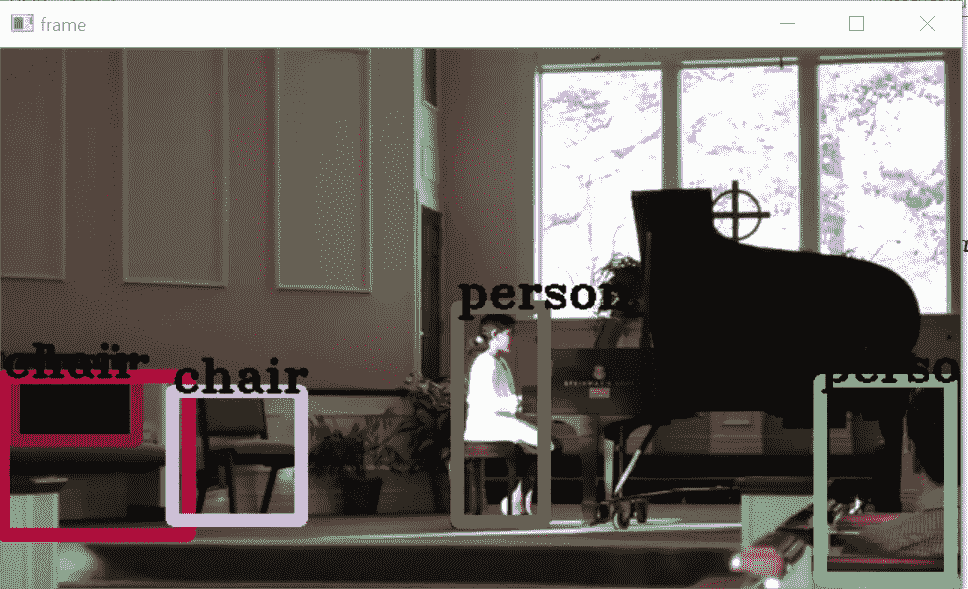
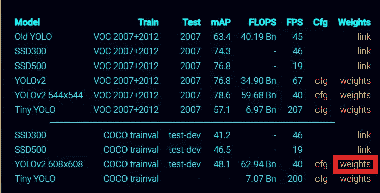
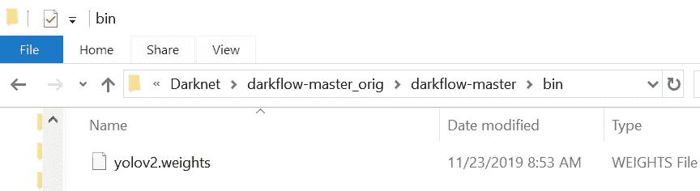

# Yolov2 用于从视频中检测物体

> 原文：<https://towardsdatascience.com/yolov2-for-object-detection-from-a-video-cd4574354d8e?source=collection_archive---------8----------------------->

## ***在本文中，我们将探讨如何使用 yolov2、darkflow*** 从网络摄像头、视频文件和 youtube 视频中检测物体



下面的阅读将有助于你对**Yolo——你只看一次**

[从 CNN 到面具 R-CNN 和 Yolo](https://medium.com/@arshren/computer-vision-a-journey-from-cnn-to-mask-r-cnn-and-yolo-1d141eba6e04) 第 1 部分

[从 CNN 到 Mask R-CNN 和 Yolo Part 2](https://medium.com/@arshren/computer-vision-a-journey-from-cnn-to-mask-r-cnn-and-yolo-part-2-b0b9e67762b1)

[使用 Yo](https://medium.com/@arshren/object-detection-using-yolov3-using-keras-80bf35e61ce1)lov v3 进行物体检测

[关于 Yolo 的原始文件](https://pjreddie.com/darknet/yolov2/)

[在自定义数据集上实现 yolo](/implementing-yolo-on-a-custom-dataset-20101473ce53)

# 必需的库

*   Python 3.5 或更高版本
*   Tensorflow:我用过 CPU 版本
*   OpenCV
*   VC++ build 14

# 下载使用 keras 实现的 Yolo 代码

我们将使用暗流回购，可以从这里下载:[**https://github.com/thtrieu/darkflow**](https://github.com/thtrieu/darkflow)

# 放下预先训练好的重量

重量可以从[https://pjreddie.com/darknet/yolov2/](https://pjreddie.com/darknet/yolov2/)下载



[https://pjreddie.com/darknet/yolov2/](https://pjreddie.com/darknet/yolov2/)

我创建了一个名为 bin 的新文件夹，并将下载的权重放在那里，如下所示



# 构建代码

构建代码有三种选择。

**选项 1:**

```
python setup.py build_ext --inplace
```

**选项 2:** pip 在开发模式下全局安装暗流

```
pip install -e .
```

选项 3:全球安装 pip

```
pip install .
```

对我来说，选项 2 和 3 效果不错。

我们现在准备处理图像或视频文件。

# 使用 Yolo 处理视频文件

我们将使用 COCO 数据集上预先训练的权重在 80 个类上处理视频。

我们将使用以下工具探索视频中的对象检测

*   网络摄像机
*   可见文件
*   传输 Youtube 视频

## 网络摄像机

**所需库**

```
import numpy as np
import time
import cv2
from darkflow.net.build import TFNet
import matplotlib.pyplot as plt
```

**创建使用选项**定义的暗流模型实例

```
options = {
 'model': 'cfg/yolo.cfg',
 'load': 'bin/yolov2.weights',
 'threshold': 0.3

}
tfnet = TFNet(options)
```

# **从网络摄像头检测物体**

创建一个 **VideoCapture** 的实例，参数为设备索引或视频文件的名称。将 0 作为摄像机的设备索引

```
cap = cv2.VideoCapture(0)
```

一旦创建了 VideoCapture 实例，您就可以逐帧捕获视频。最后不要忘记释放捕获并销毁所有窗口。

我们为框架创建一个随机颜色列表

```
colors=[tuple(255 * np.random.rand(3)) for i in range(5)]
```

我们将首先使用 **cap.isOpened()** 检查 VideoCapture 是否已初始化。如果 cap.isOpened()不为真，则使用 **cap.open()** 打开它。

我们设置了一个无限循环，并使用 cap.read()逐帧读取视频。cap.read()返回布尔值。如果帧读取正确，cap.read(0 返回 True。

对于每一帧，我们使用暗流实例 tfnet 来预测对象。我们提取左上、右下和标签来绘制边界框，标签显示在边界框的顶部。

我们使用 cv2.imshow()在窗口中显示该帧。

我们还设置当用户点击“q”时中断循环。

最后，我们通过释放摄像机并销毁所有窗口来清理视频捕获

```
**while(cap.isOpened()):**
    stime= time.time()
    **ret, frame = cap.read()**
    **results = tfnet.return_predict(frame)**
    if ret:
        for color, result in zip(colors, results):
            **tl = (result['topleft']['x'], result['topleft']['y'])
            br = (result['bottomright']['x'], result['bottomright']['y'])
            label = result['label']**
            **frame= cv2.rectangle(frame, tl, br, color, 7)
            frame= cv2.putText(frame, label, tl, cv2.FONT_HERSHEY_TRIPLEX, 1, (0,0,0), 2)**
       ** cv2.imshow('frame', frame)**
        print('FPS {:1f}'.format(1/(time.time() -stime)))
        **if cv2.waitKey(1)  & 0xFF == ord('q'):
            break**
    else:
        break

**cap.release()
cv2.destroyAllWindows()**
```

# **从视频文件中检测目标**

从视频文件中检测对象的代码基本相同，唯一的变化是我们向 VideoCapture 提供了一个视频文件名。

要退出并释放捕获，请按 q

```
import cv2
from darkflow.net.build import TFNet
import matplotlib.pyplot as plt
import numpy as np
import timeoptions = {
 'model': 'cfg/yolo.cfg',
 'load': 'bin/yolov2.weights',
 'threshold': 0.3

}
tfnet = TFNet(options)**cap = cv2.VideoCapture('video.mp4')**
colors=[tuple(255 * np.random.rand(3)) for i in range(5)]while(cap.isOpened()):
    stime= time.time()
    ret, frame = cap.read()
    results = tfnet.return_predict(frame)
    if ret:
        for color, result in zip(colors, results):
            tl = (result['topleft']['x'], result['topleft']['y'])
            br = (result['bottomright']['x'], result['bottomright']['y'])
            label = result['label']
            frame= cv2.rectangle(frame, tl, br, color, 7)
            frame= cv2.putText(frame, label, tl, cv2.FONT_HERSHEY_TRIPLEX, 1, (0,0,0), 2)
        cv2.imshow('frame', frame)
        print('FPS {:1f}'.format(1/(time.time() -stime)))
        if cv2.waitKey(1)  & 0xFF == ord('q'):
            break
    else:
        break
cap.release()
cv2.destroyAllWindows()
```

# **从 youtube 视频中检测物体**

要阅读 youtube 视频，我们需要安装两个库

*   **Pafy :** Python 库，用于下载 YouTube 内容和检索元数据**。**
*   **youtube_dl :** 允许从 YouTube.com 和其他视频网站下载视频

在 Anaconda 提示符下安装库

```
pip install pafy
pip install --upgrade youtube_dl
```

## 导入所需的库

```
import pafy
import cv2
from darkflow.net.build import TFNet
import matplotlib.pyplot as plt
import numpy as np
import time
```

使用 pafy 下载带有元数据的 youtube 视频

```
**url = '**[**https://www.youtube.com/watch?v=_iiOEQOtBlQ**](https://www.youtube.com/watch?v=eWZscjTlZKg)**'
vPafy = pafy.new(url)
play = vPafy.getbest(preftype="webm")**
print(play.url)
```

最后，我们进行视频捕获，并将 youtube 视频的元数据作为参数传递给视频捕获。其余的代码保持不变

```
 **options = {
 'model': 'cfg/yolo.cfg',
 'load': 'bin/yolov2.weights',
 'threshold': 0.3

}**
**tfnet = TFNet(options)**
**cap = cv2.VideoCapture(play.url)**
colors=[tuple(255 * np.random.rand(3)) for i in range(5)]
while(cap.isOpened()):
    stime= time.time()
    ret, frame = cap.read()
    results = tfnet.return_predict(frame)
    if ret:
        for color, result in zip(colors, results):
            tl = (result['topleft']['x'], result['topleft']['y'])
            br = (result['bottomright']['x'], result['bottomright']['y'])
            label = result['label']
            frame= cv2.rectangle(frame, tl, br, color, 7)
            frame= cv2.putText(frame, label, tl, cv2.FONT_HERSHEY_TRIPLEX, 1, (0,0,0), 2)
        cv2.imshow('frame', frame)
        print('FPS {:1f}'.format(1/(time.time() -stime)))
        if cv2.waitKey(1)  & 0xFF == ord('q'):
            break
    else:
        break
cap.release()
cv2.destroyAllWindows()
```

## 参考资料:

 [## Pafy 文档- pafy 0.3.70 文档

### 这是 Pafy 的文档——一个 Python 库，用于下载 YouTube 内容和检索元数据快速入门…

pythonhosted.org](https://pythonhosted.org/Pafy/) [](https://opencv-python-tutroals.readthedocs.io/en/latest/py_tutorials/py_gui/py_video_display/py_video_display.html) [## 视频入门- OpenCV-Python 教程 1 文档

### 学会看视频，显示视频，保存视频。学会从相机捕捉并显示它。你会学到这些…

opencv-python-tutro als . readthedocs . io](https://opencv-python-tutroals.readthedocs.io/en/latest/py_tutorials/py_gui/py_video_display/py_video_display.html)