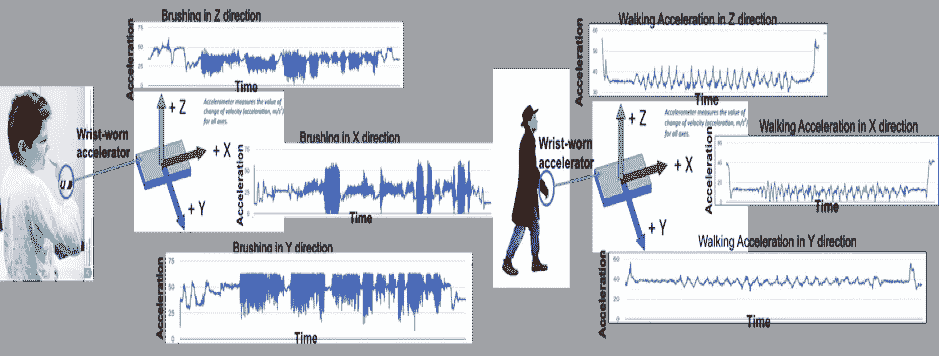
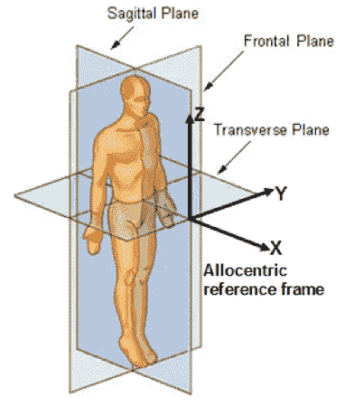
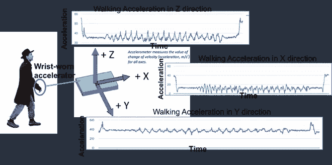
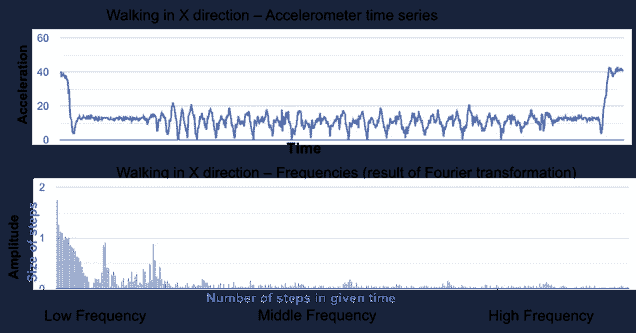
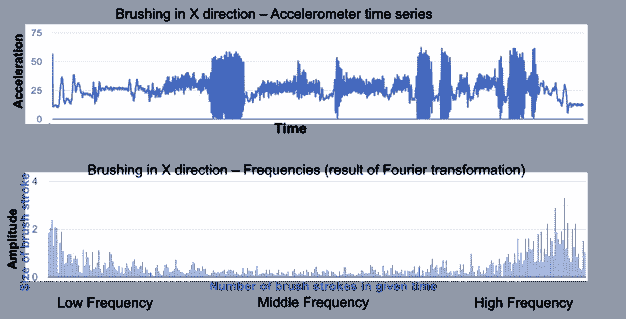
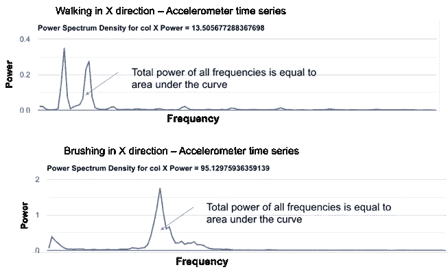

# 刷牙可能比你想象的更“忙”

> 原文：<https://towardsdatascience.com/you-are-more-busy-while-brushing-teeth-than-walking-at-least-thats-what-data-science-concludes-34542ad87465?source=collection_archive---------21----------------------->

## 利用数据科学的力量实现日常生活活动(ADL)的价值

你醒了。你刷牙。听起来很平凡。但是像刷牙这样的活动会产生大量的数据。有了这些数据，我们可以看到，即使是像刷牙这样平凡的活动也可能是“忙碌”或“忙乱”的活动。在这篇文章中，我们将使用数据科学来看看刷牙和走路相比有多忙

在数据科学世界中，诸如刷牙、爬楼梯、梳头、下楼、喝水、躺下、走路等日常活动被称为日常生活活动(ADL)。利用诸如腕戴式加速度计之类技术，可以非常精确地测量这些活动

在本文中，我们将分析这样一个加速度计数据集，看看数据科学如何帮助我们**回答一些关于日常活动的有趣问题**。

# 要说明的数据集

此处使用的数据集来自 UCI 数据集(Dua，d .和 Graff，C. (2019))。UCI 机器学习知识库[http://archive . ics . UCI . edu/ml]。加州欧文:加州大学信息与计算机科学学院)

数据集包含从腕戴式加速度计收集的数据。加速度计是一种用于测量加速力的机电设备。加速度是速度变化的度量，或速度除以时间。加速度计可以测量三个方向的加速度。对于一个人来说，X 方向是沿前后方向的加速度。Y 方向是侧向加速度，Z 方向是上下方向的加速度

Accelerometer direction from human perspective

# 问题:日常活动数据是什么样的

我们知道自己所有的活动，比如刷牙或走路。但是加速度计的数据是什么样的呢？为了直观显示这些数据，我们可以用线图来绘制。在下图中，我们看到行走和刷牙活动在 X，Y，Z 方向上的加速度。

Accelerometer data while walking

我们观察到 X 方向的图形比 Y 方向有更多的变化。这是因为当我们走路时，我们不怎么侧向移动

刷牙的加速度图如下所示。

Accelerometer data while brushing teeth

我们看到，与走路相比，刷牙的图形在某些部分非常密集。这是因为与行走相比，刷牙活动具有更大的加速度

# 问题:数据能证明刷牙是比走路更快的活动吗

为了回答这个问题，我们需要了解如何衡量“快”。当数据是一个时间序列时,“牢度”可以用频率来衡量。频率是单位时间内重复事件发生的次数。

从步行的角度来看，频率意味着在给定时间内行走的步数。从刷牙的角度来看，频率意味着在给定时间内刷的次数。

将时间序列数据转换成频率可以通过称为**傅立叶变换的算法。**

为简单起见，我们只考虑 X 方向的加速度计数据。让我们获取 X 方向的行走加速度计数据，并使用傅立叶变换算法将其转换为频率。结果看起来像这样

Fourier transformation of walking data

对于行走时间序列数据，傅立叶变换表明，出现的频率大部分是低频。这意味着在行走过程中，在给定时间内走的步数相对较少。

傅立叶变换也给出了频率的振幅。振幅是频率的大小。对于行走来说，这可能与步伐的大小有关。例如，你可以在给定的时间内走 5 大步或 5 小步。频率相同(5 步)，但小步走的幅度小于大步走的幅度

对刷牙的类似分析表明，存在低频和高频。

Fourier Transformation of brushing data

正如我们看到刷牙涉及高频率，我们可以得出结论，刷牙比走路快

# 问题:与走路相比，刷牙有多“忙”

数据证明刷牙比走路更快。但是与走路相比，刷牙有多“忙”或“忙乱”

为了回答这个问题，我们需要一个表示活动“繁忙”程度的数字。一种可能的方法是既看到频率的振幅，也看到频率的长度。从行走的角度来看，这意味着一个人走得有多快，走多长时间以及步子的长度。从刷牙的角度来看，这意味着一次刷牙的速度有多快，每次刷牙的时间有多长。从数据科学的角度来看，这被称为频率的**次方。还需要计算所有频率的功率。计算频率功率的算法叫做**韦尔奇算法****

频率与功率的关系曲线被称为**频谱图**

Power Spectrogram of Walking and Brushing

频谱曲线下的总面积也是所有频率的总功率。曲线下的面积可以用**辛普森法则计算。**

我们看到行走的总动力是 13.5，刷牙的总动力是 95.1。所以刷牙是 95.1 / 13.5 = 7 倍“忙”然后走路

所以下一次当你刷牙的时候，即使你仍然很困，你仍然比在花园里散步还要“忙”7 倍

# 额外资源

# 网站(全球资讯网的主机站)

你可以访问我的网站进行零编码分析。[https://experiencedatascience.com](https://experiencedatascience.com)

请**订阅**每当我发布一个新的故事时，请保持通知。

 [## 每当 Pranay Dave 发表文章时，您都会收到电子邮件。

### 每当 Pranay Dave 发表文章时，您都会收到电子邮件。通过注册，您将创建一个中型帐户，如果您还没有…

pranay-dave9.medium.com](https://pranay-dave9.medium.com/subscribe) 

你也可以通过我的推荐链接加入 Medium。

 [## 通过我的推荐链接加入 Medium—Pranay Dave

### 作为一个媒体会员，你的会员费的一部分会给你阅读的作家，你可以完全接触到每一个故事…

pranay-dave9.medium.com](https://pranay-dave9.medium.com/membership) 

**Youtube 频道**
这里是我的 Youtube 频道的链接
【https://www.youtube.com/c/DataScienceDemonstrated 