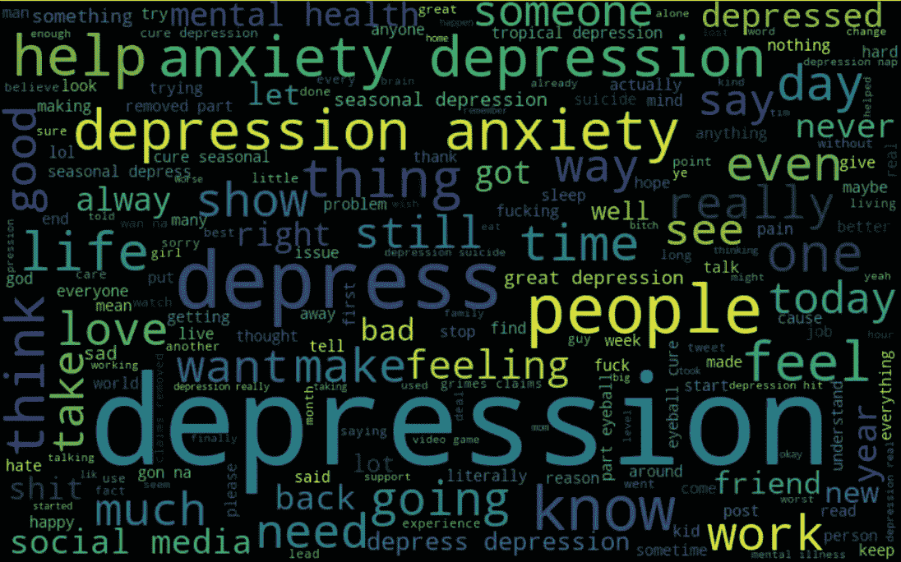
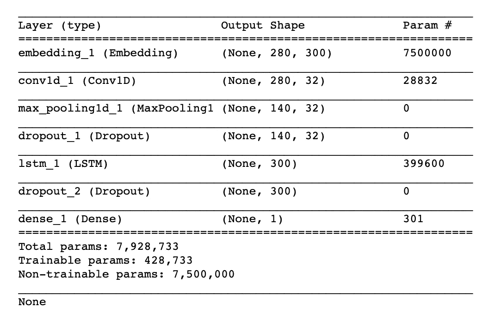
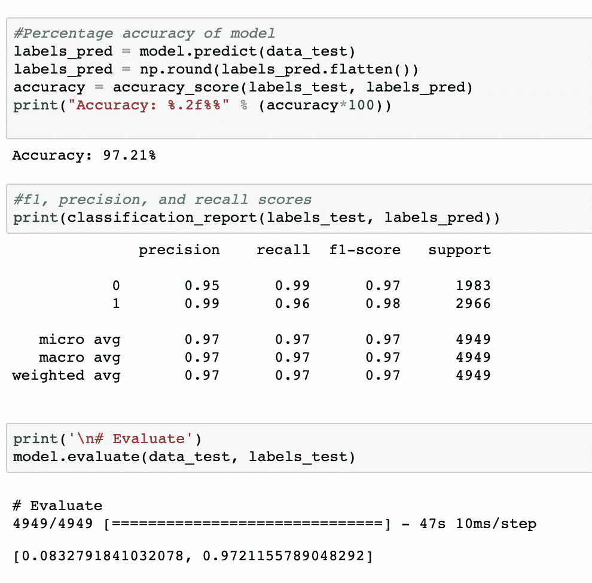
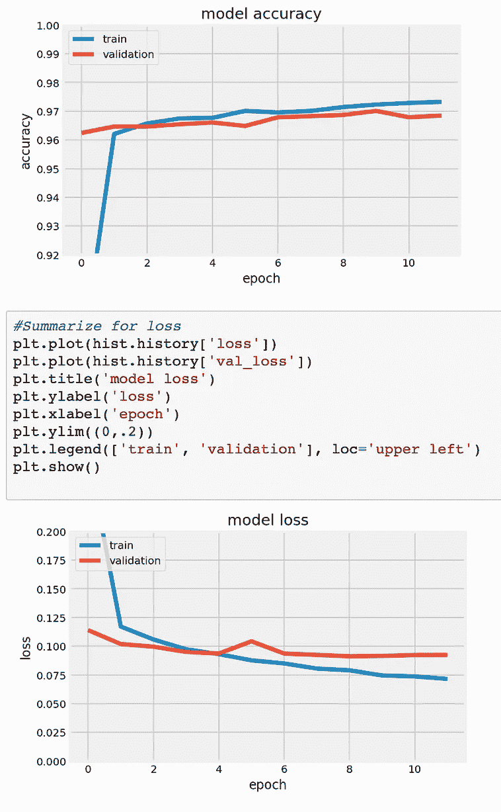
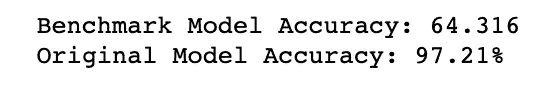

# 你在推特上说什么就是什么

> 原文：<https://towardsdatascience.com/you-are-what-you-tweet-7e23fb84f4ed?source=collection_archive---------9----------------------->

## 通过 Twitter 使用检测社交媒体中的抑郁症

Photo by [Aa Dil](https://www.pexels.com/@aadil?utm_content=attributionCopyText&utm_medium=referral&utm_source=pexels) from [Pexels](https://www.pexels.com/photo/grayscale-photography-of-owl-on-man-s-arm-2560477/?utm_content=attributionCopyText&utm_medium=referral&utm_source=pexels)

> 通过分析社交媒体帖子中的语言标记，有可能创建一个深度学习模型，该模型可以比传统方法更早地让个人了解他或她的心理健康。

超过 3 亿人患有抑郁症，其中只有一小部分人接受了适当的治疗。抑郁症是全球残疾的主要原因，每年有近 80 万人死于自杀。自杀是 15-29 岁人群的第二大死因。抑郁症的诊断(和随后的治疗)经常被延迟、不精确和/或完全错过。

**事情不一定是这样的。**

社交媒体为转变早期抑郁症干预服务提供了前所未有的机会，特别是在年轻人中。

每秒钟，Twitter 上大约有 6000 条推文，相当于每分钟发送 35 万条推文，每天 5 亿条推文，每年约 2000 亿条推文。

皮尤研究中心指出，目前，72%的公众使用某种类型的社交媒体。

Photo by [rawpixel.com](https://www.pexels.com/@rawpixel?utm_content=attributionCopyText&utm_medium=referral&utm_source=pexels) from [Pexels](https://www.pexels.com/photo/three-women-standing-near-man-holding-smartphones-1262971/?utm_content=attributionCopyText&utm_medium=referral&utm_source=pexels)

因为抑郁症是一种经常需要自我报告症状的疾病，社交媒体帖子提供了丰富的数据和信息来源，可用于训练有效的模型。

## 抑郁检测

这个想法是创建一个项目，旨在捕捉和分析与抑郁症状的发作和持续相关的语言标记，以便建立一个可以有效预测抑郁的算法。推进推文中的语言标记可以用来构建统计模型的想法，这些模型可以检测甚至预测抑郁症，可以补充和扩展传统的诊断方法。

建立一种可以分析表现出自我评估抑郁特征的推文的算法，可以让个人、父母、护理人员和医疗专业人员分析社交媒体帖子，以寻找语言线索，这些线索标志着精神健康状况恶化，远远早于传统方法。分析社交媒体帖子中的语言标记可以进行低调的评估，这种评估可以补充传统服务，并允许更早地意识到抑郁迹象。

Photo by [Úrsula Madariaga](https://www.pexels.com/@ursula-madariaga-212978?utm_content=attributionCopyText&utm_medium=referral&utm_source=pexels) from [Pexels](https://www.pexels.com/photo/monochrome-photography-of-woman-standing-at-the-subway-681990/?utm_content=attributionCopyText&utm_medium=referral&utm_source=pexels)

虽然之前许多关于抑郁症相关社交媒体帖子的研究都依赖于脸书，但很少有人关注 Twitter 内容。然而，这两个平台之间的关键差异导致了独特的不同内容，而 Twitter 内容具有独特的价值。

虽然脸书用户经常用真名向朋友和家人发帖，但 Twitter 用户经常使用假名，更有可能与他们从未见过面的用户联系。这允许一种更匿名的交流方式，它可以提供一种对个人思想和经历的更少偏见的描述。

Twitter 还提供了通常不太可能参与心理健康相关研究的广大用户群体，以及广泛的公共可用信息，提供了克服传统数据收集方法的一些限制的方法。

语言和活动的变化一直与社交媒体上的活动变化相关。社交媒体帖子中使用的情感语言和语言特征已被证明可以表明重度抑郁症的情感特征。人们一贯使用 Twitter 等社交媒体平台，以书面形式分享他们的想法和观点。

Twitter 上的帖子对分析特别有用，因为它们最常见于日常活动和事件中。这为捕捉与个人的思维、情绪、社交、交流和活动相关的行为属性提供了丰富和一致的方法。

Photo by [Adrien Olichon](https://www.pexels.com/@adrien-olichon-1257089?utm_content=attributionCopyText&utm_medium=referral&utm_source=pexels) from [Pexels](https://www.pexels.com/photo/man-sitting-in-front-of-turned-on-screen-2736135/?utm_content=attributionCopyText&utm_medium=referral&utm_source=pexels)

在过去的几年里，人们对使用社交媒体作为公共卫生工具的兴趣越来越大，从识别流感症状的传播到基于 Twitter 帖子建立对疾病的见解。然而，使用社交媒体分析行为健康障碍的研究仍处于起步阶段。

Park 等人*(见下文参考文献)*，发现了人们在社交媒体上发布自己抑郁甚至治疗的证据。Eichstaedt 等人在病历中发现脸书语可以预测抑郁症。De Choudhury 等人研究了新妈妈产后变化的语言和情绪相关因素，并建立了一个统计模型，仅使用产前观察来预测极端的产后行为变化。Reece 等人开发了计算模型来预测 Twitter 用户中创伤后应激障碍的出现。这突出了社交媒体作为关于当前或未来抑郁症发作可能性的信号来源的潜力。

该项目旨在扩大基于社交媒体的心理健康措施的范围，并使用已证明抑郁症和特定语言特征之间相关性的现有研究，以建立一种可以预测基于文本的抑郁症迹象的算法。

使用语言标记作为分析和诊断抑郁症的工具具有巨大的潜力。即使不使用复杂的模型，抑郁症也能很快在文本中显现出来。仅仅通过收集、清理和处理可用数据，视觉分析就可以阐明随机推文和具有抑郁特征的推文之间的差异。

一旦这个项目的推文被清理，通过用清理过的推文创建一个单词云，就很容易看出两个数据集之间的差异。这两个数据集之间的差异显而易见:

**随机推文**

**有抑郁特征的推特**

语言分析在精神健康领域的潜力不能被夸大。通过分析一个人的话语，你可以清楚而有价值地了解他或她的精神状态。

即使是对社交媒体最简单的分析，也能让我们前所未有地了解个人的想法和感受，并导致对心理健康更深入的理解和治疗。

## 构建模型

在决定研究心理健康和社交媒体之间的联系后，开始这一过程的最有效方式显然是专门关注心理健康的一个领域和一个社交媒体平台。因为抑郁症是一个如此广泛的问题，所以关注抑郁症及其相关研究是最有意义的。

虽然脸书已经被反复研究过，也有大量关于使用脸书帖子来检测和分析心理健康的信息，但 Twitter 似乎是一个更有趣的使用平台。推特和脸书的帖子有着本质的不同。他们更匿名，更短，更快，更有可能在整个白天和晚上快速制作。此外，Twitter 数据很容易作为现有数据集获得，如果需要的话，很容易抓取甚至流式传输。

Photo by [Kat Jayne](https://www.pexels.com/@katlovessteve?utm_content=attributionCopyText&utm_medium=referral&utm_source=pexels) from [Pexels](https://www.pexels.com/photo/animal-blur-canine-close-up-551628/?utm_content=attributionCopyText&utm_medium=referral&utm_source=pexels)

一旦决定使用 Twitter，找到(或创建)最佳数据就是下一个需要解决的问题。现有的数据集包含随机推文和针对情绪分析的推文，但情绪分析本身与抑郁症分析不是一回事。

因为没有公开可用的包含“抑郁”推文的数据集，很明显我必须创建自己的数据集。我想到的第一个方法是使用 [Tweepy](https://www.tweepy.org) ，但是 Tweepy 需要一个开发者账户，这意味着用户需要申请一个 Twitter 开发者账户。我想确保这个模型可以被任何有兴趣的人轻易复制。

经过进一步研究， [TWINT](https://github.com/twintproject/twint) 竟然是最优解。TWINT 允许任何用户以各种方式搜索和抓取推文，并收集和存储它们。

当时的问题变成了，**是什么让** **发了一条表示抑郁的推文**？一些研究论文着眼于抑郁症的词汇标记，它们都同意一些观点。患有抑郁症的人经常下意识地使用非常特定的语言标记来表示抑郁。建立一个包含这些术语的字典并给它们单独的权重是可能的，但在阅读了一些与抑郁症、心理健康和语言学相关的论文后，很明显抑郁症是最常自我报告的，至少在最初是自我评估的。因此，**如果一个人说她抑郁，那她极有可能就是抑郁**。

Photo by [Alexander Krivitskiy](https://www.pexels.com/@krivitskiy?utm_content=attributionCopyText&utm_medium=referral&utm_source=pexels) from [Pexels](https://www.pexels.com/photo/grayscale-photography-of-woman-1018425/?utm_content=attributionCopyText&utm_medium=referral&utm_source=pexels)

此外，像“绝望”、“孤独”和“自杀”这样的词总是与患有抑郁症的人联系在一起，就像人们提到特定的药物治疗一样，甚至一般是“抗抑郁药物”。虽然有可能建立包含抑郁症特有的所有词汇特征的字典，包括特定术语、人称代词使用的增加、宗教参考的增加、一天中的时间分析等等，但似乎通过抓取按非常特定的术语搜索的推文，这些推文可能包含一个好的模型需要学习的所有词汇特征，并变得既健壮又准确。

在使用 TWINT 随机收集了 24 小时的推文后，这些数据被合并成一个数据集。这些推文被手动清理(例如，删除提及经济和环境而不是情绪抑郁的内容)，然后被清理和处理。

下一个问题涉及分类器的选择。有很多方法可以分析这些信息，但现实是心理健康，特别是抑郁症，是一个主观而复杂的话题。虽然有可能根据一条推文来量化一个人的抑郁程度，但对于这个项目来说，唯一真正重要的问题是，**一个人是否表现出抑郁的语言标记？知道了这个问题和精神疾病的主观本质，二元分类模型对这个项目来说是最有意义的。**

虽然逻辑回归模型作为基准模型是有意义的，但长期短期记忆网络(LSTM)模型最终成为手头项目最稳健的模型。递归神经网络允许信息从网络的一个步骤传递到另一个步骤，是序列、列表和其他语言处理问题的理想选择。LSTM 能够学习长期的依赖关系，并且在各种各样的问题上工作得非常出色。虽然 rnn 在长期依赖性方面有困难，但是 LSTMs 被明确地设计来避免长期依赖性问题。

增加一个卷积层也是有意义的。卷积神经网络(CNN)非常适合从数据中学习空间结构，并从传递到 LSTM 层的顺序数据中学习结构。

利用 Word2vec 也使得模型更加健壮。Word2vec 是一个处理文本的双层神经网络。它的输入是一个文本语料库，输出是一组向量。它把文本变成深度网可以理解的数字形式。Word2vec 在 vectorspace 中将相似单词的向量组合在一起。它能够从数学上发现相似之处。给定足够的数据、用法和上下文，它可以根据过去的表现高度准确地猜测单词的意思。这些猜测可以用来建立一个单词与其他单词的联系。Word2vec 神经网络的输出是一个词汇，其中每个项目都有一个向量，可以输入到深度学习网络中。

LSTM + CNN 模型接受一个输入，然后输出一个数字，代表该推文表明抑郁症的概率。该模型接受每个输入句子，用其嵌入内容替换它，然后通过卷积层运行新的嵌入向量。卷积层将它从顺序数据中学习到的结构传递到 LSTM 层。然后，LSTM 层的输出被输入到密集模型中进行预测。

一旦设计并构建了模型，问题就变成了优化模型以获得最佳结果。最初，该模型遭受过拟合，如图所示。然而，通过降低模型的复杂性和增加漏失，实现了更稳健的模型，并且消除了过度拟合的证据。

该模型的数据分为 60%的训练集、20%的验证集和 20%的测试集。测试集一直保持独立，直到最后，以确保模型的准确性。通过查看准确性和分类报告来分析最终结果。

选择最终的架构、参数和超参数是因为它们在所有尝试的组合中表现最佳。LSTM 模型接受标记化的推文，并将它们送入嵌入层，以获得嵌入向量。该模型接受一个输入，然后输出一个数字，代表该推文表明抑郁症的概率。该模型接受每个输入推文，用其嵌入内容替换它，然后通过卷积层运行新的嵌入向量，这非常适合从数据中学习空间结构。卷积层利用这一点，从顺序数据中学习结构，然后将其传递到标准 LSTM 层。LSTM 层的输出被输入到用于预测的密集模型中。该模型具有嵌入层、卷积层和密集层，并且在第一层中使用最大池、0.5 的下降、二进制交叉熵损失、Nadam 优化器和 ReLu 激活函数，在密集层中使用 sigmoid 激活函数。准确性和损失被记录和可视化，并与基准逻辑回归模型进行比较。

## 成功！

该模型具有 97%的准确性，证明是一个准确且稳健的模型，对于进一步的开发和使用应该是有效的*。*

Photo by [Marcin Dampc](https://www.pexels.com/@marcin-dampc-807808?utm_content=attributionCopyText&utm_medium=referral&utm_source=pexels) from [Pexels](https://www.pexels.com/photo/group-of-people-having-neon-party-1684187/?utm_content=attributionCopyText&utm_medium=referral&utm_source=pexels)

感谢阅读！和往常一样，如果你用这些信息做了什么酷的事情，请在下面的评论中让每个人都知道，或者联系 [LinkedIn](https://www.linkedin.com/in/contentsimplicity/) ！

寻找更多的想法？

 [## 数据搜集、清理和可视化初学者终极指南

### 通过清理和预处理您的数据，让您的模型从不起眼到令人惊叹

towardsdatascience.com](/ultimate-beginners-guide-to-scraping-and-cleaning-twitter-data-a64e4aaa9343)  [## 数据科学入门终极指南

### 我是如何在不到 6 个月的时间里获得数据科学工作机会的

towardsdatascience.com](/the-ultimate-guide-to-getting-started-in-data-science-234149684ef7)  [## 现在如何开始数据科学:10 篇顶级文章和一个想法

### 今年对于网络来说是艰难的一年。

towardsdatascience.com](/how-to-get-started-in-data-science-now-10-top-articles-and-one-idea-d9d28ee34cca) 

## 参考

在此了解更多信息！

 [## 抑郁

### 抑郁症是一种世界范围内的常见疾病，有超过 3 亿人受到影响。抑郁症不同于…

www.who.int](https://www.who.int/news-room/fact-sheets/detail/depression)  [## Twitter 使用统计

### 平均每秒钟，大约有 6000 条推文在 Twitter 上发布(在这里可视化它们)，这相当于超过…

www.internetlivestats.com](https://www.internetlivestats.com/twitter-statistics/)  [## 美国社交媒体用户的人口统计和采用情况

### 更多信息:互联网/宽带|移动技术今天，大约 70%的美国人使用社交媒体…

www.pewinternet.org](https://www.pewinternet.org/fact-sheet/social-media/)  [## 用推特数据预测精神疾病的发病和病程

### 我们开发了计算模型来预测推特上抑郁症和创伤后应激障碍的出现…

www.nature.com](https://www.nature.com/articles/s41598-017-12961-9)  [## 用于传染病爆发早期检测的社交网络传感器

### 目前检测传染病爆发的方法提供了关于传染病过程的同期信息。

journals.plos.org](https://journals.plos.org/plosone/article?id=10.1371/journal.pone.0012948)  [## 脸书语在医疗记录中预测抑郁症

### 抑郁症是致残和可治疗的，但诊断不足。在这项研究中，我们表明，同意分享的内容…

www.pnas.org](https://www.pnas.org/content/115/44/11203)  [## 通过社交媒体预测产后情绪和行为的变化——微软研究

### 我们认为社交媒体是一个很有前途的公共卫生工具，重点是使用 Twitter 帖子来建立…

www.microsoft.com](https://www.microsoft.com/en-us/research/publication/predicting-postpartum-changes-emotion-behavior-via-social-media/)  [## 用推特数据预测精神疾病的发病和病程

### 我们开发了计算模型来预测推特上抑郁症和创伤后应激障碍的出现…

www.nature.com](https://www.nature.com/articles/s41598-017-12961-9)  [## 利用神经网络和语言学元数据早期检测抑郁症的迹象…

### 抑郁症被列为全球残疾的最大原因，也是自杀的主要原因。还是…

www.groundai.com](https://www.groundai.com/project/utilizing-neural-networks-and-linguistic-metadata-for-early-detection-of-depression-indications-in-text-sequences/)