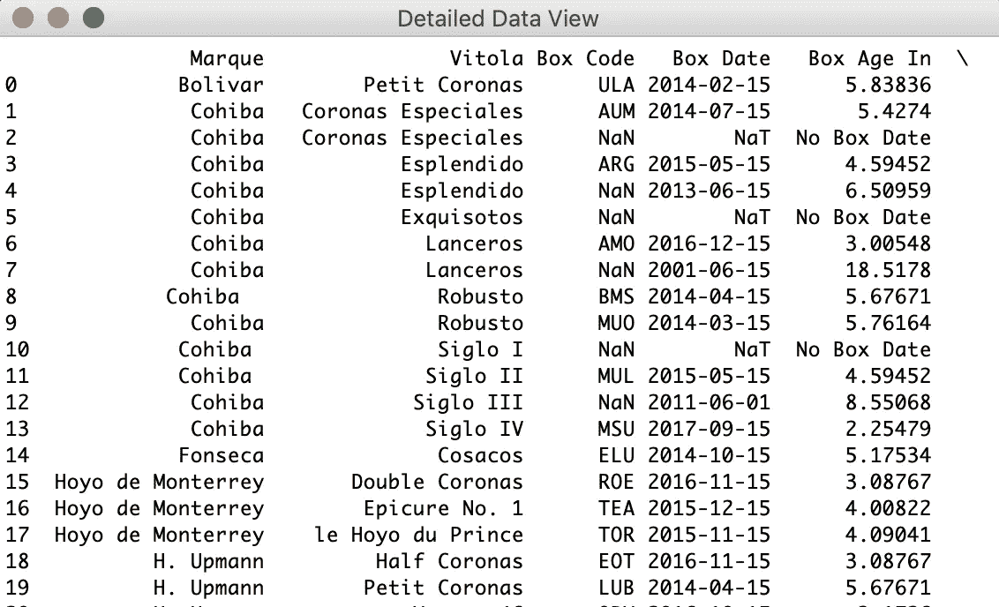

# 你可以用 tkinter 管理雪茄

> 原文：<https://towardsdatascience.com/you-can-manage-cigars-with-tkinter-a2c39990e1b2?source=collection_archive---------26----------------------->

## 用例

## 下面是如何使用 Python 最流行的 GUI 包 tkinter 创建数据管理系统

Photo by [Joris Visser](https://unsplash.com/@jorisv?utm_source=unsplash&utm_medium=referral&utm_content=creditCopyText) on [Unsplash](https://unsplash.com/s/photos/cigar?utm_source=unsplash&utm_medium=referral&utm_content=creditCopyText)

> 愿你长命百岁。

我的一个好朋友是雪茄爱好者。他有一个 excel 电子表格来管理他的雪茄(顺便说一句，这个电子表格太棒了——方块会改变颜色，让他知道某个盒子已经准备好让他抽了)。但也有一些问题，比如输入不标准，现在他的收藏越来越多，不方便了解他的收藏，等等。所以我决定用 Python 为他创建一个雪茄管理系统，以便更好地组织和分析他壮观的收藏。

在我们开始之前，这里有一些基本的环境信息:
IDE:*Jupyter Lab* 包: *tkinter，pandas* Python 版本: *3.7* 硬件:*Macbook Pro 13”(2018)*

在设计方面，原型 1.0 系统主要分为两个部分:记录维护和总结概述。我们有用于记录维护的导入数据和插入数据选项；查看数据、摘要图表和准备吸烟选项以进行摘要概述。

# 主要的

首先，让我们导入`tkinter`和`pandas`包并设置`main`函数。在`main`功能中，将根据用户从菜单中的选择调用其他功能。

main function

# 菜单

下一步是使用`tkinter`在`menu`功能中设置菜单。`for`循环用于从菜单选项列表中提供文本参数。我选择了`Radiobutton`而不是常规的`Button`，因为`Radiobutton`一次只允许用户选择一个`Radiobutton`。`indicatoron`(代表“指示器开启”)选项设置为 0(默认为 1)，这意味着没有单独的单选按钮指示器。因此，我们可以让`Radiobutton`看起来像一个普通的按钮，而不是让`Radiobutton`有包含空白的圆孔。

menu function

Radiobutton with *indicatoron set to 0*

对于`tkinter`中的配色方案，这个图表是一个很好的参考。

tkinter color chart

# 输入数据

因为我们的用户已经有了很好的数据集合，所以让用户导入他的原始数据集。在`import_cigar`功能中，用户可以从计算机中选择一个文件并完成导入。如果*雪茄 _ 文件. xlsx* 已经存在，这个新文件将与它串接；如果*雪茄 _ 文件. xlsx* 不存在，它将被创建，来自用户选择文件的数据将被添加到其中。

import_cigar function

Select a file

cigar folder

# 插入数据

用户也可以通过选择“1”来插入新的雪茄记录。从菜单中插入“。该功能通过`tkinter`中的`Label`和`Entry`模块实现。一旦用户填写完该表格并点击“OK”按钮，记录将自动保存到*雪茄 _ 文件. xlsx* 中作为新的一行。

insert_cigar function

# 图像数据

如果用户想查看完整的数据，他们可以选择“2。查看”选项，并快速查看数据。

view_cigar function

# 简单图表

charts_cigar function

我在这里只创建了两个简单的图表，但重点是我们手中有`plt`或其他软件包的能力来创建可视化并使用`tkinter`显示它们。

Simple Cigar Charts

# 准备好抽烟了吗

最后，我们来找准备抽的雪茄吧！真正的规则比这更复杂，但是现在，我们只能说如果雪茄在雪茄盒里超过 3 年，它就可以抽了。

Ready to Smoke Cigars

所以，这是目前的原型 1.0！这个系统远非完美，有许多功能在未来会很好。但是我在大多数 GUI 应用程序中体验了`tkinter`的乐趣，我的重点更多的是尝试不同类型的模块，而不是让它们变得漂亮。总的来说，我对这个强大的软件包很满意。它提供了许多可以玩的模块，而且非常容易使用。但是也有令人失望的地方，比如缺乏稳定性和可扩展性。

最后，这似乎是老生常谈，但是—

> 在`*tkinter*` *中使用循环来精简你的代码。*

cigar.py

感谢阅读。如果你想试试看，请看完整代码`cigar.py`。如果你有任何意见或反馈，我期待着听到他们。

# 资源

1.  [tkinter — wiki.python](https://wiki.python.org/moin/TkInter)
2.  [Tkinter 单选按钮小工具](http://effbot.org/tkinterbook/radiobutton.htm)
3.  [Widget 类引用](http://effbot.org/tkinterbook/tkinter-index.htm#class-reference)
4.  [如何将 Matplotlib 图表放置在 Tkinter GUI 上](https://datatofish.com/matplotlib-charts-tkinter-gui/)
5.  [入口小部件](https://www.python-course.eu/tkinter_entry_widgets.php)