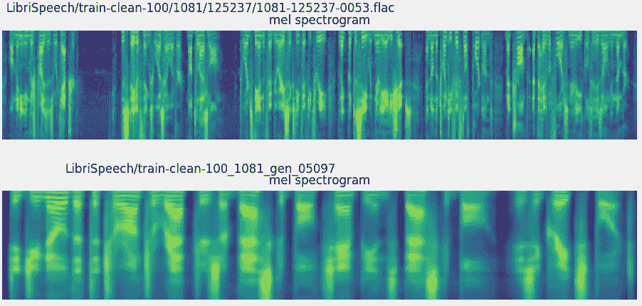
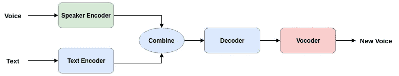
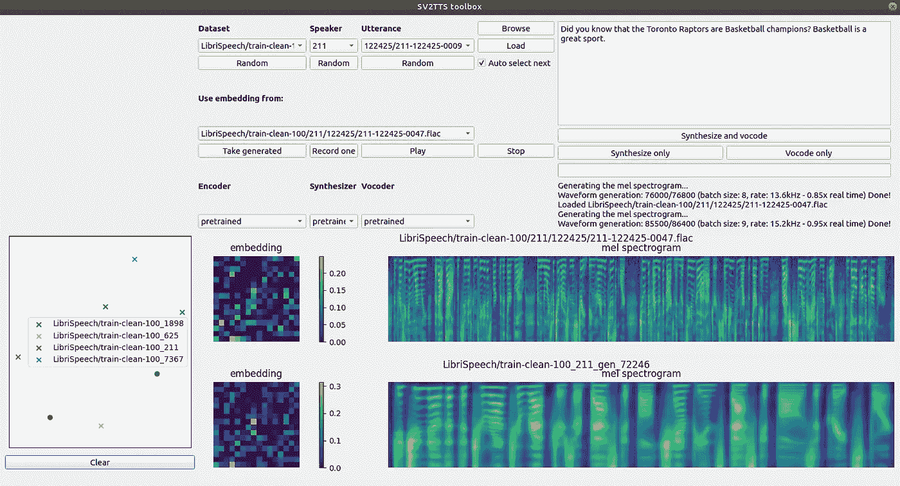

# 通过深度学习，你现在可以用别人的声音说话了

> 原文：<https://towardsdatascience.com/you-can-now-speak-using-someone-elses-voice-with-deep-learning-8be24368fa2b?source=collection_archive---------3----------------------->



> 想获得灵感？快来加入我的 [**超级行情快讯**](https://www.superquotes.co/?utm_source=mediumtech&utm_medium=web&utm_campaign=sharing) 。😎

文本到语音(TTS)合成指的是文本到音频的人工转换。人类仅仅通过阅读来完成这项任务。一个好的 TTS 系统的目标是让计算机自动完成这项工作。

当创建这样一个系统时，一个非常有趣的选择是选择哪个*声音*用于生成的音频。应该是男的还是女的？声音大还是声音小？

这在使用深度学习进行 TTS 时曾经是一个限制。你必须收集文本-语音对的数据集。录制该讲话的扬声器组是固定的——您不能拥有无限个扬声器！

所以，如果你想创造你的声音，或者其他人的声音，唯一的方法就是收集一个全新的数据集。

来自[谷歌](https://ai.google/)的人工智能研究昵称 [*声音克隆*](https://github.com/CorentinJ/Real-Time-Voice-Cloning) 使得计算机使用*任何*声音大声朗读成为可能。

# 声音克隆是如何工作的

很明显，为了让计算机能够用任何声音大声朗读，它需要以某种方式理解两件事:它在读什么和它如何读。

因此，谷歌的研究人员设计的声音克隆系统有两个输入:我们想要阅读的文本和我们想要阅读文本的声音样本。

例如，如果我们想让蝙蝠侠念出“我爱披萨”这句话，那么我们会给系统两个东西:写着“我爱披萨”的文本和蝙蝠侠声音的简短样本，这样它就知道蝙蝠侠应该是什么声音了。输出应该是蝙蝠侠说“我爱披萨”的声音！

从技术角度来看，该系统被分解为 3 个连续的组件:

(1)给定我们希望使用的语音的小音频样本，将语音波形编码成固定维度的向量表示

(2)给定一段文字，也将其编码成矢量表示。将语音和文本的两个向量合并，解码成一个[声谱图](https://en.wikipedia.org/wiki/Spectrogram)

(3)使用声码器将声谱图转换成我们可以听到的音频波形。



Simplified version of the system. [Original source](https://arxiv.org/pdf/1806.04558.pdf)

在本文中，这三个部分是独立训练的。

在过去的几年里，文本到语音系统在深度学习社区中得到了很多研究关注。事实上，有许多基于深度学习的文本到语音转换的解决方案都非常有效。

这里的关键是，系统能够从语音中获取扬声器编码器学习的“知识”，并将其应用到文本中。

语音和文本分别编码后，在**公共嵌入空间**中**组合**，然后**一起解码**生成最终的输出波形。

# 克隆声音的代码

感谢人工智能社区中开放源代码思想的美丽，在这里有一个公开的语音克隆实现[！这是你如何使用它。](https://github.com/CorentinJ/Real-Time-Voice-Cloning)

首先克隆存储库。

```
git clone [https://github.com/CorentinJ/Real-Time-Voice-Cloning.git](https://github.com/CorentinJ/Real-Time-Voice-Cloning.git)
```

安装所需的库。确保使用 Python 3:

```
pip3 install -r requirements.txt
```

在自述文件中，您还可以找到下载[预训练模型](https://github.com/CorentinJ/Real-Time-Voice-Cloning#pretrained-models)和[数据集](https://github.com/CorentinJ/Real-Time-Voice-Cloning#datasets)的链接，以试用一些样本。

最后，您可以通过运行以下命令打开 GUI:

```
python demo_toolbox.py -d <datasets_root>
```

下面有一张我的照片。



正如你所看到的，我已经把我想让电脑在右边读的文本设置为:“你知道多伦多猛龙队是篮球冠军吗？篮球是一项伟大的运动。”

您可以单击每个部分下的“随机”按钮，随机选择语音输入，然后单击“加载”将语音输入加载到系统中。

*数据集*选择您将从中选择语音样本的数据集，*说话者*选择正在说话的人，*话语*选择由输入语音说出的短语。要听听输入的声音，只需点击“播放”。

一旦你按下“合成和语音编码”按钮，算法就会运行。一旦完成，你会听到输入扬声器大声朗读你的文本。

你甚至可以录下自己的声音作为输入，但点击“录制一个”按钮，这是一个非常有趣的游戏！

# 进一步阅读

如果你想了解更多关于算法如何工作的信息，你可以阅读谷歌的官方 NIPS 论文。在这里有一些更进一步的音频样本结果。我会高度克隆存储库，并尝试这个可怕的系统！

# 喜欢学习？

在 twitter 上关注我，我会在这里发布所有最新最棒的人工智能、技术和科学！也在 [LinkedIn](https://www.linkedin.com/in/georgeseif/) 上和我联系吧！