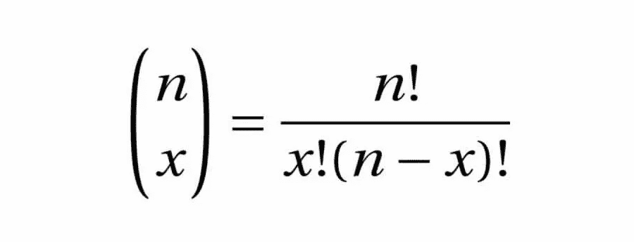
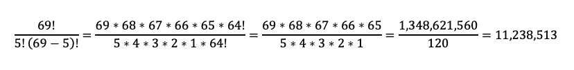
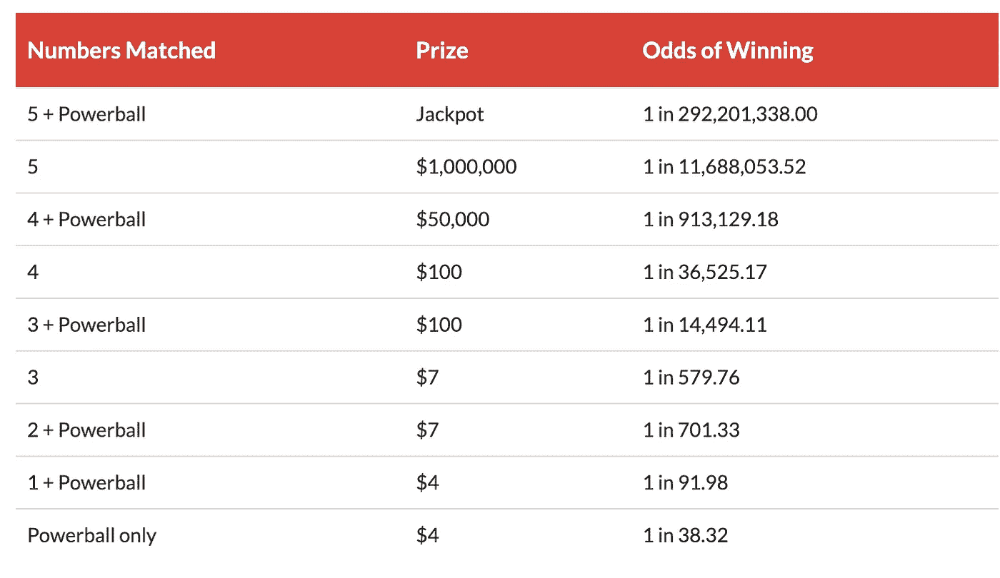
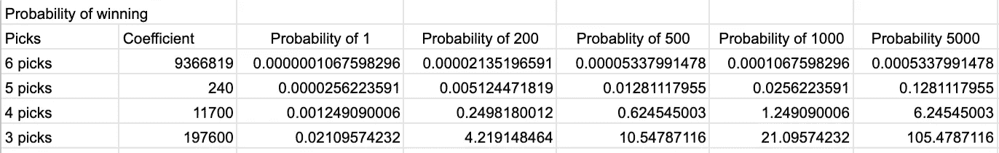
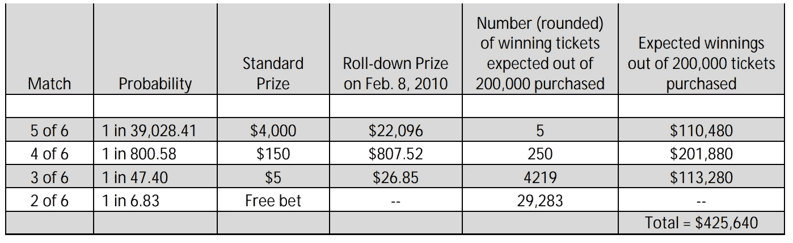

# 你不一定要被闪电击中才能赢得彩票

> 原文：<https://towardsdatascience.com/you-dont-have-to-be-struck-by-lightning-to-win-the-lottery-d9cb25aa867a?source=collection_archive---------14----------------------->

Photo by [Michael D](https://unsplash.com/@alienaperture?utm_source=unsplash&utm_medium=referral&utm_content=creditCopyText) on [Unsplash](https://unsplash.com/s/photos/lightning-las-vegas?utm_source=unsplash&utm_medium=referral&utm_content=creditCopyText)

几周前，在一次演讲中，有人问了我以下问题:

“靠玩彩票谋生的可能性有多大？”

你觉得不是很高？

在 2005 年，一群麻省理工学院的学生聚在一起，成立了一个赌博集团。他们找到了他们想赌的游戏，计算了赔率，并以自己的方式赢得了数百万美元的利润。对我们的问题说“是”的有力证据，他们是怎么做到的？

# 我们来谈谈几率吧

每当强力球的巨大体积跨越 5 亿美元大关时，文章就像雨后的毒菌一样冒出来，大声宣布彩票中奖的几率，嘲笑每个争相购买彩票的人。为了好玩，它们还包括你更有可能获胜的事情的概率，比如被闪电击中，被鲨鱼咬，或者被自动售货机压死。它们是有趣的读物，当你拿出一小部分辛苦赚来的钱去买彩票时，你会暗自发笑，因为“嘿，你永远不知道。”

但是如果你知道呢？更重要的是，你怎么知道？这些几率从何而来？嗯，如果你知道一点概率的话，计算中彩票的几率实际上是非常容易的。让我们来一次概率之旅，好吗？

我们用来计算彩票赔率的公式非常简单。它叫做二项式系数，看起来像这样:

The ! stands for factorial, not “Shout N really loud” — Pat Colburn, my 7th grade math teacher

忽略左边的大括号，关注右边实际的数学部分。二项式系数允许从更大的一组数字中计算出所有可能的数字组合。 *n* 代表较大的一组数字， *x* 代表我们希望从较大的一组数字中选出的较小的一组数字的大小。例如，如果我们要玩强力球，你必须先从 69 个可用号码中选择 5 个，然后从 26 个可能的强力球号码中选择 1 个。计算正确选择前 5 个数字的概率的公式是这样开始的:

If you’re wondering what happened, the 64!s cancel out.

这告诉我们，你有 11，238，513 个 5 个数字的可能组合，其中只有一个组合是正确的，因此我们得到正确的 5 个数字的概率是 11，238，513 中的 1。对于剩下的最后一个强力球，赔率的计算更简单，26 个号码中你只需要 1 个，所以我们的赔率是 26 个中的 1 个。要计算得到所有 5 个数字加上正确的强力球的总几率，我们只需将这些几率相乘，如下所示:

Or, 0.00000034223% for those that prefer seeing percentages

因此，为了赢得巨额头奖，你需要从 292，201，338 个可能的数字组合中选择幸运的 1，然后你就可以开始生活了！看起来有点渺茫，不是吗？有好消息和坏消息！多买彩票可以增加胜算！*(注:多打不会增加赔率，但是多买某个抽奖的票* ***会增加那些赔率*** *！)*

Powerball odds and prizes

例如，如果您购买了 **2 张**门票，那么您的赔率将是 292，201，338 张中的 *2 张，或 146，100，669 张*中的 *1 张。你已经成功地把你的机会减半了！如果你买了 10 张彩票，那么你的赔率就会变成 29，220，134* 中的 1！坏消息是，即使有十张票，赔率仍然不会给你带来任何好处。在玩强力球时，增加你在现实世界中的胜算的唯一方法是购买更多的门票。如果你买了 100，000 张票，你将成功地把你的赔率降低到 2，922 中的 *1。然而，坏消息是，你已经支付了 20 万美元的门票，并花了几个小时填写这些表格，以确保你不会重复数字，并意外破坏了辛苦赢得的机会！你可能会因为匹配 4 和 5 而赢得一些较小的奖励，但对于较低的匹配，这些奖励会急剧下降，如果你只匹配了其中的 4 个数字，你最终会净损失。*

那么这一切有什么意义呢？我们已经计算了几率，看起来他们真的很差劲。这个博客的重点不就是用概率来玩彩票吗？如果我给你看的只是你可能会输的方式，那还有什么意义呢？每个彩票都是不同的，基于组织的目标和游戏的受欢迎程度。如果你找到了正确的游戏规则和赔率，你可以让这为你工作。

# 玩正确的游戏

2005 年，一群麻省理工学院的学生发现了他们的游戏。这个游戏的名字是马萨诸塞州现金彩票，其特色是一个被称为“滚下来”的规则。在滚下型游戏中，累积奖金通常以固定金额为上限。在马萨诸塞州，上限设定为 200 万美元。如果累积奖金增长到 200 万美元或以上，并且没有人赢，整个累积奖金将“滚下”到较低等级的比赛，通常以奖金的形式支付给每一个连续等级的比赛。因此，举例来说，如果在没有头奖得主的情况下触发了 200 万美元的滚动，彩票将分解这 200 万美元，并将其支付给在他们已经有权获得的奖金基础上匹配 3、4 或 5 个号码的玩家。这使得这个游戏非常有吸引力，因为在滚下来的过程中，你可能会增加 550%的回报，而仍然不必击败更长的累积奖金赔率。

让我们看看那些赔率，好吗？Winfall 游戏要求你从 46 个可能的数字中选择 6 个。由于我们方便的二项式系数公式告诉我们，你有***【1】*******9，366，819*** 的几率赢得头奖**。**然而，对于 6 个中的 5 个，你的胜算更大，*1370754 个中的 1 个*。如果你得到了 6 分中的 4 分？*163185 人中的 1 人*。让我们不要忘记通过购买更多的票来增加我们成功机会的策略。如果我们买了 500 张票，我们会增加成功的机会，比如说， ***中的***1****18，734**** 换 6 张票， ***1*** *中的****2742****换 5 张票， ***1* 让我们来看看这可能会如何发展:****

****

**Special thanks to Brian, Rob and Yish for helping me figure out the math.**

**如你所见，即使我们买了 5000 张彩票，我们中头奖的几率仍然很低，但是 2、3、4 和 5 张彩票看起来相当不错！在普通彩票中，这并不意味着什么，安慰奖通常很低，不值得额外购买彩票。然而，随着滚动下降，每张票承载着更多的潜在利润！从 2，000，000 美元的累积奖金按比例分配到较低的层级，将导致 13，000 到 11，000 倍于您的门票初始成本的支出，具体取决于您匹配了多少张彩票！知道了这一点，学生们相应地加倍努力，以确保他们能够承受的赔率。他们不是为了头奖而射击，而是为了更容易的低挂水果，仍然疯狂盈利的 3，4 和 5 匹配。这些提供了更好的赔率，学生们只在滚降期玩，这时他们可以最大化他们赌注的利润。**

**下面是马萨诸塞州监察长办公室对这个麻省理工学院团体的博彩策略进行的统计:**

****

**Total profit of $25,640 less expenses, for the week of Feb 8th.**

**看那个！中奖的 5 张彩票将返回 22，096 美元，其中 1 张不仅可以支付中奖彩票的费用，还可以支付超过 11，000 张其他未中奖彩票的费用。一个中奖的 4 选将覆盖超过 400 个失败者，一个中奖的 3 选将覆盖 13 个失败者。赢家的潜在交易量加在一起，将超过潜在输家，在下跌触发的那一周，他们的净收益估计为 25，640 美元！**

**使用这种策略，据估计麻省理工学院集团在 6 年的运营中赚了大约 800 万美元，产生了大约 15-20%的投资回报。然而，这并不全是娱乐和游戏。大量的时间和精力不仅花费在购买这些成千上万的彩票上，还花费在费力地手工填写算法生成的号码，然后手工检查每张彩票以找出中奖者。**

**最终，这种特殊的肥缺结束了，它必须结束。当时的彩票官员满足于对他们的游戏不同寻常的受欢迎程度睁一只眼闭一只眼，因为彩票受益于门票销售。无论支付多少，持有彩票的组织仍然通过设计赚钱。然而，一旦关于这些辛迪加的消息传出，大量的宣传就来了，随着这些宣传的增加，他们的大下注习惯降低了单个玩家获胜的几率(事实并非如此)的看法降低了其他玩家的受欢迎程度。普通玩家只是觉得他们的门票购买只对少数有组织的玩家有利，他们有时间和资源来提高他们的赔率。**

**此外，宣传还吸引了其他志同道合的辛迪加的注意，减少回报带来了潜在支出的减少，因为它们以更多的方式分享。到 2011 年，官员们开始通过减少大量购票的规则，最终在 2012 年完全关闭了这项运动。**

# **那么我们学到了什么？**

**有了正确的赔率和正确的游戏，我们知道你可以在彩票中获利。一旦数学问题解决了，只要你愿意投入时间和工作，而且大部分工作只是关于人力，你靠买彩票谋生的几率实际上是相当可观的。**

**这背后实际上有更多的数学计算，计算每张票的期望值，找到正确的数字组合来进一步增加你的胜算。但是，通过在一场比正常支付更好的游戏中控制赔率为 2、3、4 或 5，麻省理工学院的学生能够确保他们赢的赔率超过 45 分之一，即使它不是头奖。这远远好于比方说，在一手扑克的开局中拿到一张皇家同花顺(*649，739* 中的 1)，与超级模特约会(*88 万*中的 1)，被闪电击中(*100 万*中的 1)，或者被鲨鱼攻击(*1150 万*中的 1)。**

## **来源:**

** [## 如何根据数学赢得彩票并更快赢得

### 我知道。彩票中奖开启了全新生活的大门。一种你永远不用担心债务的生活…

lotterycodex.com](https://lotterycodex.com/how-to-win-the-lottery-mathematically/) 

[https://www . mass . gov/files/documents/2016/08/vv/lottery-cash-winfall-letter-July-2012 . pdf](https://www.mass.gov/files/documents/2016/08/vv/lottery-cash-winfall-letter-july-2012.pdf)
[http://www . Fla lottery . com/expt kt/PWR ball-odds . pdf # target text = power ball % 20 error % 20 by % 20 multiplying % 20 these，或%201%20chance%20in%20579.76。&target text = Step %201% 3A %20 计算% 20 数字，从% 2069% 20 唯一% 20 数字中提取% 20。
https://www.lotteryusa.com/powerball/](http://www.flalottery.com/exptkt/pwrball-odds.pdf#targetText=Powerball%20incorrect%20by%20multiplying%20these,or%201%20chance%20in%20579.76.&targetText=Step%201%3A%20Calculate%20the%20number,drawn%20from%2069%20unique%20numbers.)

在 LinkedIn 上与我联系！

 [## 汉密尔顿·张，CRPC·CSPO-熨斗学校-纽约，纽约| LinkedIn

### 具有财务规划背景的数据科学家和机器学习工程师。我有专家级的知识…

www.linkedin.com](https://www.linkedin.com/in/hamilton-chang-crpc%C2%AE/)**