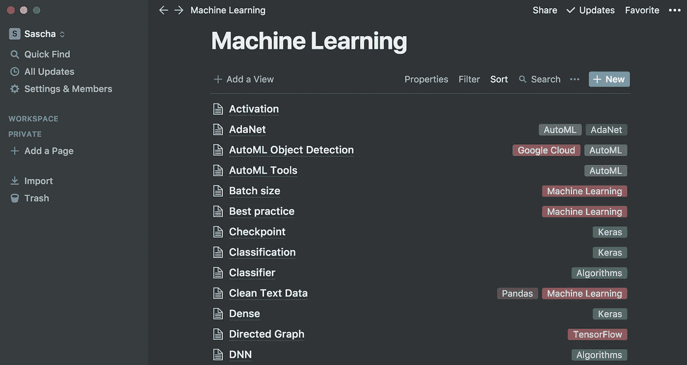
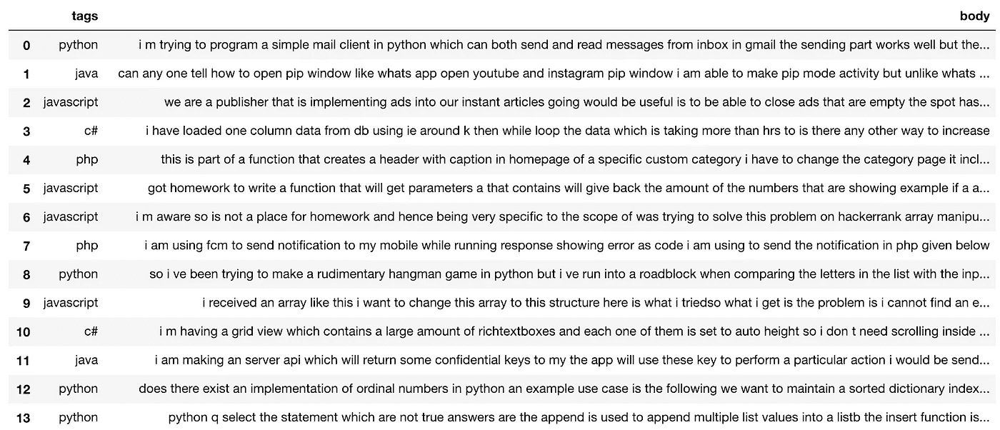

# 你不需要很多机器学习的专业知识就可以开始

> 原文：<https://towardsdatascience.com/you-dont-need-a-lot-of-machine-learning-expertise-to-get-started-5f330ad4ee5a?source=collection_archive---------8----------------------->

## 机器学习的个人方法👩🏻‍🚀 👨🏻‍🚀 🚀

Photo by Tim Mossholder on Unsplash

不要害怕从机器学习(ML)开始，不需要几年的理论学习就能入门。但是你必须学习很多年才能始终保持在当前技术的顶端。

我知道你和每个人可能有不同的学习方式。这篇文章应该揭开你如何开始机器学习的过程，没有太多压倒性的技术术语。我建议你遵循我的文章，自己实现所有的事情。

当你开始学习机器学习时，会有大量的信息冲击着你。

Photo by [Michael D Beckwith](https://unsplash.com/photos/lBbif55IMKw?utm_source=unsplash&utm_medium=referral&utm_content=creditCopyText) on [Unsplash](https://unsplash.com/search/photos/bookshelf?utm_source=unsplash&utm_medium=referral&utm_content=creditCopyText)

人工智能、准确性、激活函数、反向传播、批量、偏差、聚类、混淆矩阵、卷积层、数据分析、决策树、深度学习、密集、维度、估计器、假阴性、假阳性、假阳性率、特征、特征列、特征交叉、特征工程、特征提取、特征集、特征规格、特征向量、前馈神经网络、少击学习、全 softmax、全连接层、生成式对抗网络(GAN)、泛化、泛化曲线、广义线性模型、生成模型、生成器、梯度、梯度裁剪、梯度下降、图形、地面实况、组 隐藏层、分层聚类、铰链损失、超参数、超平面、图像识别、不平衡数据集、推理、输入函数、输入层、可解释性、Keras、核支持向量机(KSVMs)、k 均值、k 中值、标签、带标签的示例、层、学习率、线性回归、逻辑回归、损失、损失曲线、机器学习、矩阵分解、均方误差(MSE)、小批量、MNIST、模型、模型函数、模型训练、多类分类、NaN 陷阱、自然语言理解、欠采样负类、神经网络、神经元、N 优化器、离群值、输出层、过拟合、过采样、熊猫、参数、参数更新、感知器、性能、困惑、管道、池化、正类、精度、预测、预测偏差、预制估计器、预训练模型、分位数存储、随机森林、等级、召回、推荐系统、递归神经网络、回归模型、强化学习、缩放、scikit-learn、半监督学习、sigmoid 函数、softmax、稀疏表示、平方损失、步长、步长、监督机器学习、张量、张量板、张量流、张量流服务、张量处理 示例，训练，迁移学习，三元模型，真阴性(TN)，真阳性(TP)，真阳性率(TPR)，欠拟合，无标签示例，无监督机器学习，上加权，验证集，权重，宽度

# 构建您自己的文档

如果你不能马上知道所有的答案，那完全没问题🤯像编程一样，你总是可以使用文档来获得你所需要的信息。

> 技巧 1:建立自己的文档来解决这个机器学习术语列表，并在学习时添加您的个人笔记。
> 
> 如果你对一个题目不理解，或者你觉得不够自信，就记笔记。
> 
> 看看我的机器学习笔记，了解一下我在说什么。每当你纠结于一个术语或者你有一个问题的时候，添加一页。你的未来你会感谢你的。

My machine learning notebook [notion.so](http://notion.so)

我知道对于你应该如何开始仍然没有明确的答案，但是我们将很快改变它。

# 学习 Python

你可能知道，如果你想做机器学习，开发专业知识是必须的。Python 总是一个好的选择，如果你想在云中训练你的模型，有一个大的社区，大量的工具和例子以及广泛的支持。

> 技巧 2:熟悉 Python，使用 TensorFlow 创建机器学习模型。

# 获取您自己的数据

到目前为止，你知道如何管理学习过程，以及你想使用哪种语言。下一步是什么？没错，数据我们需要数据，而且我们需要大量的数据。

在网上几乎所有的入门示例中，你都会用到一个常见的 MNIST 数据集，要么是时尚数据集(由 [**Zalando Research**](https://research.zalando.com) 的研究人员制作)，要么是数字数据集。如果你在其中一个上训练一个模型，你可能会达到相当好的结果，但是你错过了很多练习。

相反，创建您自己的数据集，您将学习如何收集、存储和处理大型数据集。

Data example

> 技巧 3:学习如何处理自己的数据是一项重要的技能，在现实世界的应用程序中是必需的。从一个简单的例子开始，收集带有相应标签的文本，并将其保存在 csv 中。这可能是来自 StackOverflow 的带有相应标签的文本。基于给定的文本，你想要预测编程语言。有这么多可能性，选一个吧。

# 学会理解你的数据

从数据集中提取洞察有助于理解数据。这是在 [Jupyter 笔记本](https://jupyter.org/)上熟悉[熊猫](https://pandas.pydata.org/)和[剧情](https://matplotlib.org/api/pyplot_api.html)的绝佳时机。

问问你自己你想知道的关于数据集的任何事情。

*   我的数据集中有什么样的数据？
*   有多少节课？
*   数据是如何平衡的？
*   以及更多的问题，要有创意

# 环境

一切从你的机器学习环境开始。这可以在您的本地机器上，也可以在云中。你的机器学习环境是那种你安装所有你需要的工具的地方。

其中一个本地环境是用于数据科学和机器学习的 Anaconda。或者，如果您喜欢免费使用且无需设置的基于云的环境，请使用[联合实验室](https://colab.research.google.com/)。

# 使用现有技术

我希望你在开始在 TensorFlow 中构建定制的机器学习模型之前使用 AutoML。你可能会问*“为什么是 AutoML 或者什么是 AutoML”，这是很好的问题。*

使用 AutoML，您可以在几个小时内归档好的机器学习结果，而不是几周或几个月。AutoML 去掉了一堆需要时间和知识的步骤。

例如数据分割(训练和测试)、编码、嵌入、评估不同架构、超参数调整等等，所有这些都是自动完成的。有不同类型的 AutoML 产品，为了简单起见，我们保持简单，继续使用 [Google AutoML](https://cloud.google.com/automl/) 。

这听起来很简单，上传你的训练数据，开始训练，抓住一个☕，直到训练结束。

如果完成了，您可以评估结果，这是一个很好的学习不同评估指标的机会，如精确度和召回率，或者如何解释混淆矩阵。更好的是，你已经有了一个生产就绪的机器学习模型。谷歌为你提供了一个直接的端点来进行预测。

谷歌提供不同类型的 AutoML 产品 **AutoML 自然语言、AutoML 视觉、AutoML 翻译、AutoML 表格**更多即将推出
ヽ(•‿•)ノ.

 [## 云自动|自动|谷歌云

### 谷歌云提供安全、开放、智能和变革性的工具，帮助企业实现现代化，以适应当今的…

cloud.google.com](https://cloud.google.com/automl/docs/) 

有一件事你也要考虑。真的需要训练一个机器学习模型吗？或者，您可以使用现有的 API 和预先训练的模型来解决您的问题吗？有很多现成的[API](https://cloud.google.com/products/ai/building-blocks/)可以使用。

> 技巧 4:如果你想解决一个问题，AutoML 或预先训练的 API 应该是首选产品。

# 预处理

如果 Google AutoML 或预先训练的 API 不符合您的需求，您仍然可以使用 [TensorFlow](https://www.tensorflow.org/) 或 [Keras](https://keras.io) 中的自定义机器学习模型。

不幸的是，你不能简单地使用你收集的数据，并开始训练一个机器学习模型。**在数据准备好使用之前，需要预处理**步骤。预处理取决于您使用的数据。对于文本，您需要与图像不同的预处理。

*   清理数据应该是第一个预处理步骤，回到我们的 StackOverflow.csv 示例，也许有些行没有文本？没有标签、不需要的特殊字符或其他类型的文本。清理这些数据可能会提高模型的性能。
*   打乱你的数据有各种各样的原因，通常我们的数据是像 StackOverflow.csv 一样排序的，它可能是基于编程语言排序的。我们希望进行洗牌，以确保我们的训练和测试数据集代表数据的总体分布。还有更多原因，正如第一条建议中提到的，我相信随着时间的推移，你会了解所有的原因。
*   将数据分成两组，训练和测试。根据经验，80%是训练数据，20%是测试数据。
*   嵌入和编码是另一个重要的部分，如果你谷歌一下，听起来可能会很混乱。为了让您对嵌入和编码有一个简单的理解，可以把它想象成一种以或多或少智能的方式将文本转换成数字的方法。

> 技巧五:数据预处理是必要的步骤，本身就是一个完整的章节。在继续之前熟悉数据预处理，并使用 TensorFlow 训练您的自定义模型。你猜怎么着..你可以利用你在挖掘数据时获得的洞察力。

# 构建您的张量流模型

我们已经到了可以用 TensorFlow 训练自定义模型的地步。这是迄今为止最复杂和耗时的部分，我说的是几天到一个月的范围。

第一步是消费数据，这取决于你使用的框架。TensorFlow、TensorFlow Hub 模块或 Keras。不要太担心路上会学到的不同类型。

在这之后，你必须选择一种算法，这是了解不同类型的算法的时候，如何以及何时使用它们，它们有什么不同。

下一步是训练我们的模型，虽然对小数据集和简单模型的训练可能在您的笔记本电脑上表现良好，但其他人需要大量的处理能力。为此，您可以利用在云中训练您的模型。

> 技巧六:使用 TensorFlow 的前几步是最难的，不要放弃，继续。构建自己的项目可以让你从中获得最大收益。当您构建项目时，请阅读 TensorFlow 文档并熟悉该框架。

# 评估你的机器学习模型

还缺少最后也是最重要的一步。模型评估，您的模型解决问题的效果如何？该模型是否也适用于以前未见过的数据，也称为泛化？理解你的结果是很重要的，仅仅有分类的准确性是不足以评估一个模型的。

> 技巧 7:熟悉不同的评估指标，了解如何以及何时使用它们。使用不同的指标，如混淆矩阵、F1 分数等等。

# 将您的模型投入生产

根据您想要解决的问题，不需要达到 100%的准确性。想想你的模型如何帮助解决一个问题，或者节省时间、金钱，或者自动化一个过程。如果你能以 80%的准确率解决一个高度消耗时间的过程，你可能已经节省了很多钱。

您的模型训练已经完成，结果看起来足以解决问题，现在该怎么办？现在是将您的模型投入生产的时候了。给人们使用它的机会。你可以像 TensorFlow ModelServer 或者 Google AI 平台一样以不同的方式托管模型。

> 最后一个技巧:顺理成章地为你的所有项目创建一个 GitHub 库。这是建立自己投资组合的最佳方式。更重要的是，您将在其他项目中重用大量代码。

如果你在 ML 的第一年有这种感觉。要意识到在某一点上你有足够的知识来自信地构建 ML 产品。

# 下一步是什么？

这还不是全部，我将与你分享例子和进一步的帖子，给你一些实践经验。如果你不想错过，就在 Twitter 上关注我吧。

*   收集数据集
*   数据集预处理
*   谷歌汽车
*   Keras 命名实体抽取用 Google AI 平台训练和部署
*   库贝弗洛

*感谢阅读。*

*非常感谢您的反馈和问题，您可以在 Twitter 上找到我*[*@ HeyerSascha*](https://twitter.com/HeyerSascha)*。*

# 关于作者

[Sascha Heyer](https://twitter.com/HeyerSascha)Io Annotator 的创始人一个用于文本和图像的 AI 注释平台
，它提供了几种图像和文本注释工具。