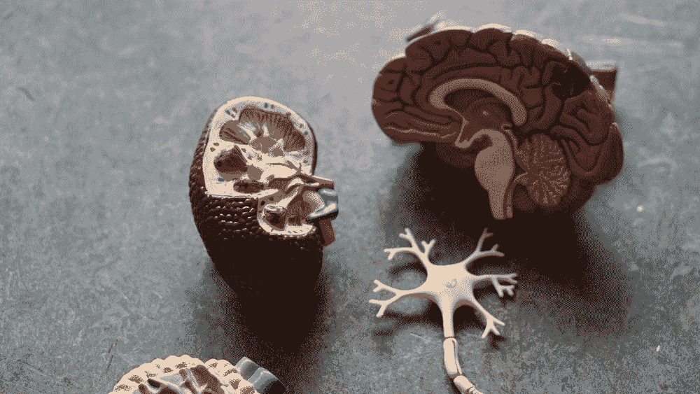
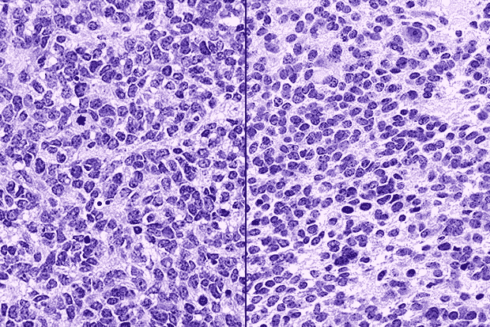
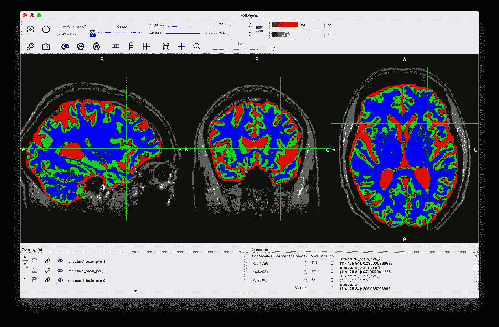
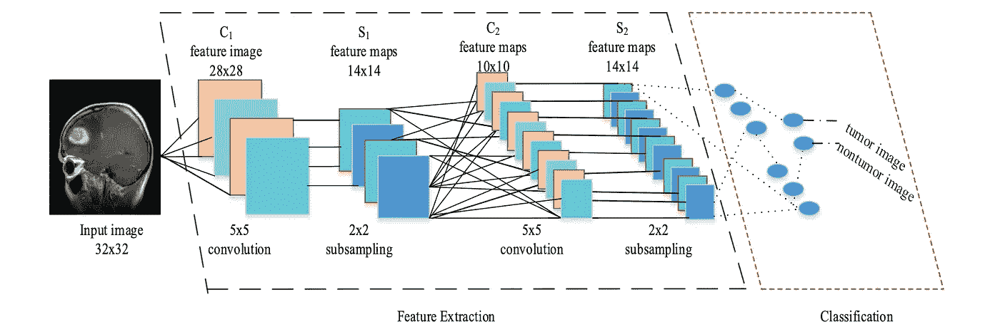

# 你可能就要死了，而你自己都不知道。

> 原文：<https://towardsdatascience.com/you-might-be-dying-and-you-wouldnt-even-know-it-c3d775f4a92c?source=collection_archive---------39----------------------->

## —智能脑肿瘤检测和诊断

我认为很明显，医学成像完全改变了医疗保健领域的面貌，为早期检测、诊断和治疗的新形式开辟了一个领域。这有助于预防和优化病人护理。

这项技术是我们非常依赖的。它让我们能够在考虑患者护理的情况下做出明智的决定。**但是我们能让它变得更好吗？🤔**

围绕脑肿瘤诊断的当前医疗实践仅仅依赖于医生的经验和知识，以及他们对 MRI(磁共振成像)的解释。

然而，我们经常看到**被误诊为**脑瘤的案例，导致不正确的治疗，或者更糟糕的是，根本没有治疗。

这可能是由临床医生的失误造成的，但此外，我们可以通过**改进我们非常依赖的系统来防止这些误诊病例！**

生活在一个不断发展的世界，为什么我们仍然依赖过时的医学成像方法作为挽救病人生命的重要方法？

**疯了吧！**

以此为例。

随着新的发展和广泛的研究，我们开始了解我们误诊儿童某些癌症脑瘤是多么普遍。一些患有这些特殊罕见肿瘤的儿童得到了错误的诊断，在某些情况下，得到了错误的治疗。

[Based on these microscopic images, shown here side by side, both of these pediatric brain cancers would have been diagnosed as CNS-PNET. But molecular tests revealed that the one on the left is glioblastoma, and the one on the right is a supratentorial embryonic tumour. The two cancers have vastly different prognoses and treatment strategies.](https://www.fredhutch.org/en/news/center-news/2018/10/pediatric-brain-cancer-misdiagnosis.html)

> 有兴趣了解这个故事的更多内容:[https://www . Fred hutch . org/en/news/center-news/2018/10/pediatric-brain-cancer-missionary . html](https://www.fredhutch.org/en/news/center-news/2018/10/pediatric-brain-cancer-misdiagnosis.html)

现代医学的目标是减轻所有患者的疼痛和痛苦，努力促进疾病预防。

**医疗保健**是帮助每个人实现四大目标:预防过早死亡和残疾、维持和提高生活质量、个人成长和发展以及善终。

在诊断过程中，需要有某种改变来帮助医生，允许更快更准确地做出决定，并适当地突出受影响的大脑区域。

哦，等等！💡

— We can be friends if you like Aladdin 🙈

医学成像是医疗保健领域的一项重大进步，改变了我们看待人体和治疗患者的方式。但是，即使是我们最可靠的系统，如核磁共振扫描，也会遗漏一些重要的细节，从而完全改变患者护理的方向。

MRI 是广泛用于诊断各种组织异常的医疗技术，包括脑肿瘤的检测和诊断。计算机化医学图像分割的积极发展在科学研究中发挥了至关重要的作用，帮助医生理解和可视化异常，以采取必要的步骤，通过**快速决策进行**优化**治疗。**

常规的 MRI 扫描系统是医疗技术领域的巨大进步和发展，每年拯救数百万人的生命。然而，由于检测模型不完善，许多人仍然被误诊，甚至失去了生命。

**问题:**那么，我们该如何解决这个问题呢？

**答:**晚期脑肿瘤**从 MRI 图像中分割**

*My first reaction when learning about MRI Segmentation*

**没事，放松。别担心，我抓住你了。**

我向你保证，脑瘤分割并没有看起来那么复杂。但是在我们开始思考它是什么和它是如何工作的之前，让我们后退一步，从整体上理解脑瘤。

**保持简单；**

肿瘤基本上是身体任何部位不受控制的细胞生长，而脑肿瘤是这些异常细胞在大脑中的聚集或聚集。

肿瘤可以通过生长和挤压大脑的关键区域造成局部损伤。如果它们阻塞了大脑周围的液体流动，也会引起问题，这会导致颅骨内的压力增加。如果没有检测和治疗，某些类型的肿瘤可以通过脊髓液扩散到大脑或脊柱的远处。

*脑瘤分为***或* ***继发性*** *。**

*原发性脑瘤起源于你的大脑。而**继发性脑瘤**(转移)是生长在**大脑**内的**肿瘤**，它是由恶性**肿瘤** ( **癌症**)在身体其他地方的扩散引起的。*

*   *恶性肿瘤更危险，因为它可以快速生长，并可能生长或扩散到大脑的其他部分或脊髓。恶性肿瘤有时也被称为脑癌。转移性脑瘤总是恶性的，因为它们已经从身体的其他癌症区域扩散到大脑。*
*   *良性原发性脑瘤不是癌症。良性肿瘤可以通过生长和压迫大脑的其他部分造成损害，但它们不会扩散。在某些情况下，良性肿瘤会转变成恶性肿瘤。*

***关键要点** →肿瘤是坏的**(用你的🧠买吧)***

*只是为了显示这些脑瘤的严重性，它们可以影响我们大脑的每一个部分。**喜欢每一个零件**。[听神经瘤中心](https://www.hopkinsmedicine.org/neurology_neurosurgery/centers_clinics/brain_tumor/center/acoustic-neuroma/index.html)、[胶质瘤中心](https://www.hopkinsmedicine.org/neurology_neurosurgery/centers_clinics/brain_tumor/center/glioma/index.html)、[脑膜瘤中心](https://www.hopkinsmedicine.org/neurology_neurosurgery/centers_clinics/brain_tumor/center/meningioma/index.html)、[转移性脑肿瘤中心](https://www.hopkinsmedicine.org/neurology_neurosurgery/centers_clinics/brain_tumor/center/metastatic/index.html)、[神经纤维瘤中心](https://www.hopkinsmedicine.org/neurology_neurosurgery/centers_clinics/brain_tumor/center/neurofibromatosis.html)、[垂体瘤中心](https://www.hopkinsmedicine.org/neurology_neurosurgery/centers_clinics/brain_tumor/center/pituitary-tumor.html)等。只是源于大脑不同区域的几种类型的肿瘤，具有不同的症状和有害的，甚至致命的影响。*

**—提供了关于这些领域的更多信息，请随时查看并了解更多信息*😉*

*既然你已经对什么是脑瘤有了一个高层次的理解，让我们开始理解分割过程以及它如何完全改变当前的检测和诊断方法。*

***把我们的大脑一点点拆开**̶*s̶e̶g̶m̶e̶n̶t̶a̶t̶i̶o̶n̶***一点点***

*在**高级**中，脑肿瘤分割包括从健康脑组织中提取肿瘤区域。图像分割的目标是将图像分成一组语义上有意义的、同质的、不重叠的区域，这些区域具有相似的属性，如亮度、深度、颜色或纹理。*

**

*Looking something like that👆*

*然而，精确和有效的肿瘤分割仍然是一项具有挑战性的任务，因为肿瘤可能具有不同的大小和位置。它们的结构通常是非刚性的，形状复杂，具有各种各样的外观特性。*

*分割结果是标识每个同质区域的标签图像或描述区域边界的一组轮廓。这就是我们如何检测分割成像组中的不规则性以识别肿瘤。*

**

***Figure 1** — CNN Process Scheme*

*但是让我们把事情搞清楚。MRI 分割**在实践中并不新鲜**，它已经存在很多年了，但是我们需要了解与当前分析和诊断方法相关的挑战**，以使它** **比现在更好。***

*对于必须手动提取重要信息的临床医生来说，分析这些庞大而复杂的 MRI 数据集已经成为一项繁琐而复杂的任务。这种手动分析通常很耗时，并且由于各种操作者之间或操作者内部的可变性研究而容易出错。*

*脑 MRI 数据分析中的这些困难需要发明计算机化的方法来改进疾病诊断和测试。如今，用于 MR 图像分割、配准和可视化的计算机化方法已经被广泛用于辅助医生进行定性诊断。*

****深度学习已进入聊天****

****深度学习*** — WHA！？怎么！？*

**My Brain when trying to understand Deep Learning in Tumour Segmentation**

**那么深度学习究竟如何将* ***应用*** *到大脑分割和* ***有什么好处*** *？**

> *“**深度学习和**传统**机器学习**最重要的区别就是它在数据规模增大时的表现。”*

*当接受利用人工智能进行大脑分割的挑战时，数据需要通过 MRI 扫描充分准确地预测脑肿瘤，这将需要**吨**的数据。*

*处理这种数据的能力绝对是一个挑战，不仅需要获得患者扫描的能力，还需要计算能力，才能真正成功地进行预测和诊断。*

*与在医学成像上训练机器学习模型相关联的一些**主要挑战**是获取每个数据集、获得患者批准以及由专家对图像进行后期分析的**高成本。***

*为了用有限的数据构建医疗机器学习系统，研究人员应用了广泛的数据增强，包括拉伸、灰度缩放、应用弹性变形等，生成了大量的合成训练数据。*

**在遵循这些原则的过程中，我们看到了从患者磁共振图像中识别异常组织的巨大优势和进步:**

> **基于准确性、灵敏度、特异性和 dice 相似性指数系数，对所提出的技术的实验结果进行了评估，并验证了对磁共振脑图像的性能和质量分析。实验结果达到了 96.51%的准确度、94.2%的特异性和 97.72%的灵敏度，证明了所提出的技术用于从脑 MR 图像中识别正常和异常组织的有效性。**
> 
> ***—利用深度学习进行肿瘤检测和诊断的实验结果***
> 
> *【https://www.ncbi.nlm.nih.gov/pubmed/28367213 *

*关键问题是在非常早期阶段检测出脑肿瘤，以便采取适当的治疗措施。基于这些信息，可以决定最合适的治疗、放射、手术或化疗。因此，很明显，如果在肿瘤的早期阶段准确地检测到肿瘤，则肿瘤感染患者的存活机会可以显著增加。*

****Hmmm。节省时间和生命的更好的医学成像系统？！****

***DOPE！***

# *想跟我一起踏上旅程吗！*

*领英:[https://www.linkedin.com/in/alim-bhatia-081a48155/](https://www.linkedin.com/in/alim-bhatia-081a48155/)*

*中:[https://medium.com/@Alim.bhatia](https://medium.com/@Alim.bhatia)*

*简讯:[https://mailchi.mp/291f9d2b6bfb/alim-monthly-newsletter](https://mailchi.mp/291f9d2b6bfb/alim-monthly-newsletter)*