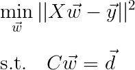
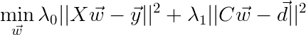
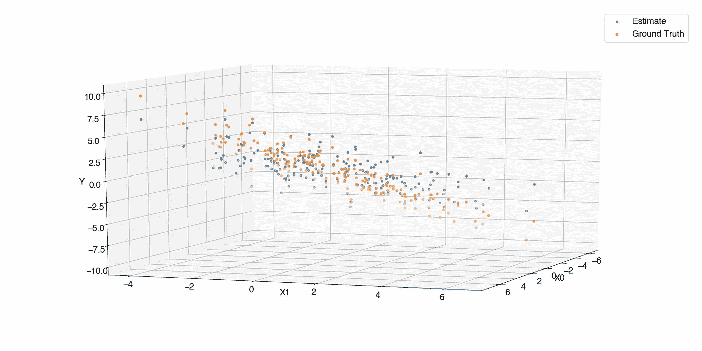

# 你必须知道约束最小二乘

> 原文：<https://towardsdatascience.com/you-must-know-constrained-least-squares-850aeedf2ef3?source=collection_archive---------8----------------------->

Photo by [Inactive.](https://unsplash.com/@o1234567890?utm_source=medium&utm_medium=referral) on [Unsplash](https://unsplash.com?utm_source=medium&utm_medium=referral)

## 增加多目标最小二乘以引入困难的问题约束。

我们之前讨论过最小二乘法，同样在多目标函数的情况下，将问题简化为经典公式是非常简单的。现在，有些问题的解是有约束的，并不是简单地将梯度设为 0 就能直接解决的。在本文中，我们讨论约束最小二乘。

新的优化问题采取以下形式:

与之前我们看到的[这里的](/you-must-know-least-squares-a900f63e0bf0)和[这里的](/you-must-know-multi-objective-least-squares-ff4a5bba0c8a)相比有什么不同？这条讨厌的 s.t .线。S.t .是 subject to 的简称，我们的优化 subject to 是什么？它受制于一组线性等式约束，因为现在我们知道这个公式是一组线性方程的简称。

现在，我们还必须引入一些术语来更详细地讨论这个问题。这很简单，如果一个解(即向量 **w** )满足约束集，则称之为**可行**。由此可见，满足约束集的一组解称为**可行集。**反之，可行集包含**最优点**，即问题的解。

如果你看了我之前关于[多目标最小二乘](/you-must-know-multi-objective-least-squares-ff4a5bba0c8a)的文章。众所周知，多目标最小二乘优化问题是用一个向量λ来表达的，该向量对各个目标进行加权。有趣的是，约束最小二乘优化问题可以看作是多目标最小二乘问题的一个特例。让我明明白白地说:

> 约束最小二乘是多目标最小二乘的特例。

这又是什么特例呢？在约束最小二乘的情况下，我们有两个目标:约束和主要目标。在某种意义上，我们可以将其公式化为多目标最小二乘问题:

但是，等等，这看起来与多目标最小二乘法非常相似，只是符号略有不同…

看起来很相似，对吧？那么，问题是什么……问题是，在约束最小二乘法的情况下，我们有硬约束，我们将λ 1 设为无穷大。逻辑上，最小化该目标，使得第二λ远大于第一λ:

产生具有一组硬约束的约束最小二乘问题的解。代码如下:

结果显然并不令人惊讶，与您预期的差不多—估计并不完全符合目标，因为目标函数的最优值并不包含在可行集中。请注意，该图是 3D 的，因为 X 中的每个点都是 2D，我们回归的输出是 1D。

当然，根据问题的不同，可能会出现包含最优解的情况。有了软约束，问题变得更容易管理，对此更深入的分析将在以后的文章中讨论。

干得好，如果你已经阅读了这篇文章和我以前关于最小二乘法的文章:

1.  [你必须知道最小二乘法](/you-must-know-least-squares-a900f63e0bf0)
2.  [你一定知道多目标最小二乘法](/you-must-know-multi-objective-least-squares-ff4a5bba0c8a)

你对最小二乘法很了解。这并不是说我已经涵盖了关于最小二乘的所有内容，仍然有一些特定的情况需要对目标函数进行调整以适应问题。比如在我们使用核的情况下，或者在我们预测时间序列的情况下。但是，大多数时候我们可以将新问题简化为基本公式，从而允许我们使用简单直接的线性代数来求解一组线性方程以获得解。

在这一点上，继续学习，感谢阅读！

