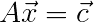
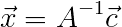
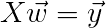
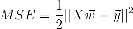
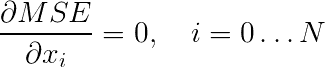
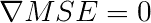
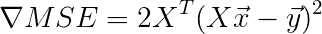
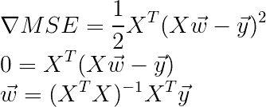
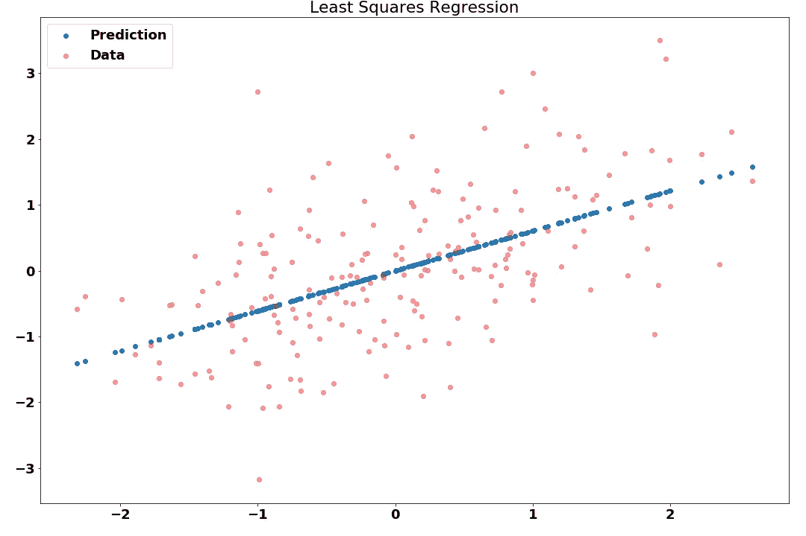

# 你一定知道最小二乘法

> 原文：<https://towardsdatascience.com/you-must-know-least-squares-a900f63e0bf0?source=collection_archive---------8----------------------->

## 让我们远离神经网络炒作，稍微回到基础，回到事情实际上有意义的时候，它们为什么工作。

机器学习是一个非常热门的话题，每个人都想在产品中使用它，或者降低企业运营成本。机器学习似乎是商业世界祈祷的答案。然而，人们跳入机器学习的方式可能非常令人惊讶。是的，我知道，神经网络是“东西”，但在我看来，跳入神经网络是被误导的。

> 所有的机器学习都不围绕神经网络

是的，他们可以做很酷的事情，用很多，真的很多计算。但曾经有一段时间，机器学习解决方案优雅、高效、快捷。在本文中，我们将深入基础知识，讨论最小二乘回归。我们为什么要谈这个？因为，信不信由你，这种简单的方法还用在统计分析中，那里有大量的数据要分析。在 Kaggle 竞赛中，它经常被用来观察数据的趋势或变化等。最小二乘法是一个东西，虽然它非常简单，但没有足够多的人知道它背后的数学。所以，让我们开始吧。

如果你上过简单的线性代数课，你就知道什么是矩阵，你很可能见过这种方程:

如果要得到这个方程的解，需要矩阵 A 的逆(我们只是要考虑 A 是可逆的情况，方程不是超定的)。所以解决方案看起来就像这样简单:

现在，我们知道如何得到这个简单方程的解，或者更好地说是方程组，因为我们可以把矩阵 A 的每一行单独看成一个线性方程。矩阵公式是描述一组线性方程的简单紧凑的形式。

但这并不是我们最终真正想要做的。我们想学东西，我们想做机器学习！所以这里面的学问在哪里……就是一堆线性方程，好无聊。那么，我们在机器学习中具体做什么呢？我们有一个我们想要拟合的函数，我们称之为函数 **f** ，它给我们一些数据 **x** 的值 **y** 。简单写下:

就这么简单。所以我们要学习 **f** ，在我们的例子中我们假设 **f** 是一个线性函数(不去考虑推广之类的问题，只是为了尽量简单)。我承认符号在这一点上有点乏味。之前使用 **x** 作为必须满足一组方程式的点。在这种情况下，我们希望找到描述数据的线性方程的系数。我们可以把它写成矩阵形式:

考虑到 X 中的每一行都是一个数据点，然后我们基本上取该数据点与 **w.** 的点积，这个表达式就很自然了。现在，我们需要定义我们的学习算法，这实际上只需要一步，封闭形式的解决方案。为此，我们需要一点微积分。首先，我们需要看看机器学习中的以下永不老化的目标函数，均方误差:

||括号在这里是因为当我们谈论向量时，我们谈论的是它们的范数，在这种情况下，它是每个数据点上误差总和的简写。如果你想知道规范和点积在 ML 中有多重要，看看[这篇文章](/kernel-secrets-in-machine-learning-2aab4c8a295f)。上面的误差项有一些很好的性质，其中之一是它是二次的。在最优化中，我们喜欢二次函数。它们相对容易优化，因为它们是凸的，它们有一个全局最小值。我们如何找到这个问题的解决方案，也就是说，我们如何最小化这个函数？微积分中相当标准的做法是，我们求导并寻找等于 0 的解。

也就是说梯度等于 0:

采用链式法则的 MSE 的梯度等于:

现在，通过一点矩阵乘法并将梯度设置为 0，我们可以写出很好的封闭形式的解:

如果你怀疑它是那么简单…是的，它是，你实际上是在用这一小块数学做机器学习，或者换句话说，优化。

注意，这个解是针对 **y** 是一维的情况的解，扩展到多维的情况是琐碎的，可以留做练习！这一小块数学可以用几行代码实现，实际上，最小二乘部分只需要 2 行代码！

这导致了下图，注意它如何找到数据的最佳拟合线(最小化平方误差)。

我们可以看到，该平面穿过数据簇的中间，在那里它使平方误差最小化。

显然，我们不能用一条直线或一个平面来拟合所有的数据，但是通过强大的特征提取器，我们可以将问题简化为一个更简单的问题。客观地说，这就是神经网络有效地做的事情，唯一的区别是我们在最后一层使用一些非线性作为激活函数。如果我们去除这一点，我们可以将神经网络的最后一层视为最小二乘问题，即在数据上拟合一个平面(来自先前层的激活)。

如果你对其他一些机器学习文章感兴趣的话，这是对最小二乘法的一个简短而轻松的介绍:

1.  [因果与统计推断](/causal-vs-statistical-inference-3f2c3e617220)
2.  [机器学习中的内核秘密](/kernel-secrets-in-machine-learning-2aab4c8a295f)
3.  [中心极限定理及其推论](/the-central-limit-theorem-and-its-implications-4a7adac9d6de)

下次见！

