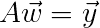
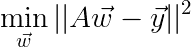
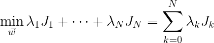
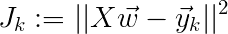
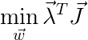
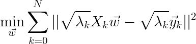
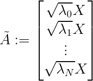
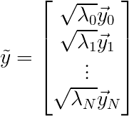
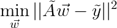
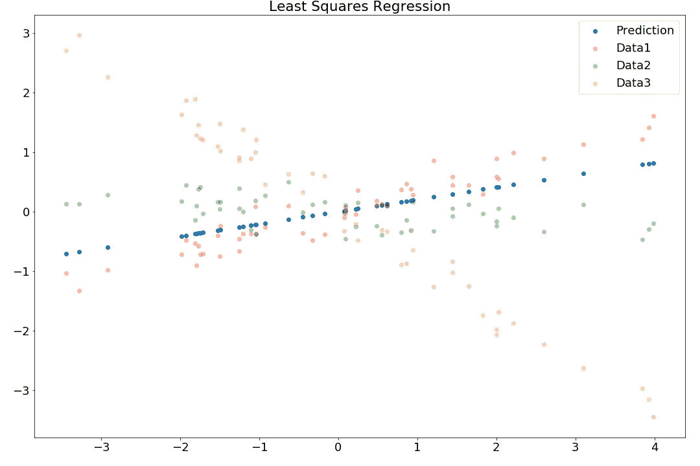

# 你必须知道多目标最小二乘法

> 原文：<https://towardsdatascience.com/you-must-know-multi-objective-least-squares-ff4a5bba0c8a?source=collection_archive---------18----------------------->

## 经典的最小二乘法不错，但是在很多方面有局限性。这里我们谈谈如何以优雅的方式使最小二乘法适应多目标优化问题。

在之前的[文章](/you-must-know-least-squares-a900f63e0bf0)中，我谈到了最小二乘法，它的简单令人惊叹，并且有着广泛的应用。然而，同样，应用程序仅限于某种类型的优化问题。然而，你不应该低估线性代数的能力和普遍性。

在很多问题中，我们不希望只优化一个目标函数，我们希望优化多个目标函数。这就是多目标最小二乘法的用武之地。

回想一下在拟合数据的情况下，最小二乘法的等式是什么样的:

最小化的目标函数是:

因此，想象一个由多个 J 组成的目标，每个 J 都是它们自己的最小二乘问题，如下所示:

其中，我们将每个 J_k 定义为:

或者我们可以用简单的线性代数友好的符号来写，作为点积:

引入向量λ是解决多目标问题的典型方法，它定义了每个目标对优化问题的贡献(逻辑上)。所以，现在我们问一个问题，这如何适应最小二乘框架？嗯，要做的一件事是将λ移入 **J，**得到一个结果:

通过观察规范中的项，你是否注意到了与经典最小二乘法相似的模式？嗯，你应该这样做，因为通过替换下面这些部分，我们将得到一个经典的最小二乘公式(我们知道如何求解):

因为线性代数是一个美丽的东西，现在我们可以将我们的多目标最小二乘写成如下，一切都开箱即用:

基于[之前的文章，我们已经知道如何解决这个问题！](/you-must-know-least-squares-a900f63e0bf0)尽管如此，让我们把代码写下来，这样我们在完整的表述中就具体了:

您应该从上面的代码中得到的结果应该如下所示(模随机生成器在不同版本的 numpy 中工作方式不同):

注意蓝线(预测)是如何最符合红色数据点的？这是因为我们通过λ向量给了红色数据点最高的成本。这很好，我们现在可以在优化问题中平衡多个目标了。但是，最终，现实世界充满了一些硬约束，甚至告诉我们可以考虑哪些解决方案。幸运的是，有一种方法可以解决这个问题，完全基于古老的线性代数！未完待续…

