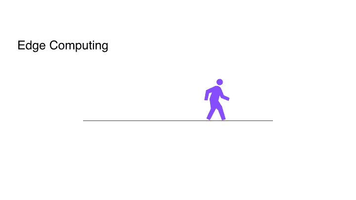

# 您现在需要从云计算转向边缘计算！

> 原文：<https://towardsdatascience.com/you-need-to-move-from-cloud-computing-to-edge-computing-now-e8759eb9690f?source=collection_archive---------14----------------------->

## 到 2025 年，边缘计算市场规模预计将达到 290 亿美元。

Cloud (Image by [rawpixel](https://pixabay.com/users/rawpixel-4283981/?utm_source=link-attribution&utm_medium=referral&utm_campaign=image&utm_content=2104829) from [Pixabay](https://pixabay.com/?utm_source=link-attribution&utm_medium=referral&utm_campaign=image&utm_content=2104829))

在这十年中，出现了从内部计算到云计算的转型运动，使系统集中化和可访问，并增加了安全性和协作性。今天，在新的十年即将到来之际，我们见证了从云计算到边缘计算的转变。

# 什么是边缘计算？

边缘计算是指发生在互联网“外部边缘”的计算，与云计算相反，云计算的计算发生在一个中心位置。边缘计算通常在靠近数据源的地方执行，例如在连接的摄像机上或附近。

自动驾驶汽车是边缘计算的一个完美例子。为了让汽车安全地行驶在任何道路上，它必须实时观察道路，如果有人走在汽车前面，它就必须停下来。在这种情况下，使用边缘计算在边缘处理视觉信息并做出决定。

这个例子强调了边缘计算的一个关键动机——速度。集中式云系统提供了访问和协作的便利，但是服务器的集中化意味着它们远离数据源。数据传输会引入由网络延迟引起的延迟。对于自动驾驶汽车来说，从通过传感器收集数据到做出决定，然后根据决定采取行动，时间尽可能最短至关重要。

> 到 2025 年，边缘计算市场规模预计将达到 290 亿美元。—大观研究

VC Andreesen Horowitz presenting “Return of the Edge and the End of Cloud Computing”

所有这些实时应用都需要边缘计算。根据 Grand View Research，Inc .的市场研究未来(MRFR)研究显示，到 2024 年，边缘计算的市场规模预计将达到 224 亿美元，到 2025 年将达到 290 亿美元。像 Andreessen Horowitz 这样的顶级风投公司正在进行大规模投资。边缘计算已经被用于各种应用，从无人驾驶汽车和无人机到家庭自动化系统和零售，以这种流行速度，我们只能想象它的未来应用。

# 为什么要从云迁移到边缘？

## 速度

在云计算中，边缘设备收集数据并将其发送到云端进行进一步的处理和分析。边缘设备的作用有限，它们向云发送原始信息，并从云接收经过处理的信息。所有真正的工作都在云中完成。

这种类型的基础设施可能适合于用户能够承受等待 2 或 3 秒来获得响应的应用。然而，这不适合需要更快响应的应用程序，尤其是那些寻求实时操作的应用程序，如自动驾驶汽车。但是，即使在一个更普通的例子中，比如基本的网站交互，开发人员也会部署 JavaScript 来检测用户的动作，并在用户的浏览器中做出响应。在响应时间对应用程序的成功至关重要的情况下，如果可能的话，在接近数据源的地方解释输入数据是更好的选择。当输入和输出发生在同一位置时，例如在物联网设备中，边缘计算消除了网络延迟，实时成为可能。

## 带宽

边缘计算意味着更少的数据传输，因为大多数繁重的工作都由边缘设备完成。而不是将原始数据发送到云端，大部分处理都在边缘完成，只有结果发送到云端，因此需要的数据传输带宽更少。

让我们以一个智能停车系统为例，它使用云计算基础设施来找出有多少停车位可用。比如说，每隔几秒钟就有 1080p 的实时视频或静态图像被发送到云端。想象一下这种解决方案每小时所需的网络带宽和数据传输成本，通过网络持续传输大量原始数据:

Could Computing vs Edge Computing in terms of network bandwidth consumption

相比之下，如果智能停车系统使用边缘计算，它只需每隔几秒钟向云发送一个整数，即有多少停车位可用，从而减少带宽，并降低数据传输成本。

## 规模

物联网意味着更多的系统，更多的系统意味着集中式服务器上更多的带宽和更多的负载。在云计算架构中，增加一个物联网设备会导致带宽需求和云计算能力的增加。

让我们以上面的智能停车系统为例，将实时 1080p 视频传输到云端。客户希望在另外 10 个停车场安装该系统。为了实现这一点，他们需要增加网络带宽，并且需要大约 10 倍的计算能力和云存储空间，因为中央服务器上的负载会随着来自 10 个额外摄像机的传入数据而增加。这增加了网络流量，上行链路带宽成为瓶颈。因此，随着每增加一台设备，网络流量、带宽和云资源的使用都会增加，因此扩展成本很高。

相比之下，在边缘计算中，增加一个物联网意味着设备的单位成本增加。不需要增加每台设备的带宽和云计算能力，因为大多数处理都是在边缘完成的。借助边缘计算架构，在停车场系统中添加 10 个额外的物联网设备似乎不那么令人生畏，因为不需要增加云计算能力或网络带宽。因此，边缘计算架构的可扩展性更强。

从内部计算到云计算，再到现在的边缘计算，随着我们对计算系统提出更高性能和更多创新的要求，软件架构也在不断发展。随着我们当前基于云的架构的增长，边缘计算市场在实时应用需求和物联网成本压力等因素的推动下不断增长。这是一个将影响 2020 年软件行业的趋势。欢迎来到未来。

您已经在使用边缘计算了吗？边缘计算的其他优势是什么？ ***在下面留下你的想法作为评论。***

原载于***。***

***更多故事:***

**[*在计算受限的设备上运行深度学习计算机视觉的挑战*](https://www.xailient.com/post/challenges-of-running-deep-learning-computer-vision-on-computationally-limited-devices)**

**[*在树莓上挣扎奔跑的物体检测*](https://www.xailient.com/post/struggles-of-running-object-detection-on-a-raspberry-pi)**

*****关于作者*****

**Sabina Pokhrel 在 Xailient 工作，这是一家计算机视觉初创公司，已经建立了世界上最快的边缘优化物体探测器。**

****参考文献:****

**[https://www . marketresearchfuture . com/reports/Edge-Computing-market-3239](https://www.marketresearchfuture.com/reports/edge-computing-market-3239)**

**[https://www . grandviewresearch . com/press-release/global-Edge-Computing-market](https://www.grandviewresearch.com/press-release/global-edge-computing-market)**

**[https://www.ncbi.nlm.nih.gov/pmc/articles/PMC6539964/](https://www.ncbi.nlm.nih.gov/pmc/articles/PMC6539964/)**

**[https://www . the verge . com/circuit breaker/2018/5/7/17327584/Edge-Computing-Cloud-Google-Microsoft-apple-Amazon](https://www.theverge.com/circuitbreaker/2018/5/7/17327584/edge-computing-cloud-google-microsoft-apple-amazon)**

**[https://www . sales force . com/products/platform/best-practices/benefits-of-Cloud-Computing/#](https://www.salesforce.com/products/platform/best-practices/benefits-of-cloud-computing/#)**

**[https://www . control eng . com/articles/key-drivers-and-benefits-of-edge-computing for-smart-manufacturing/](https://www.controleng.com/articles/key-drivers-and-benefits-of-edge-computing-for-smart-manufacturing/)**

**[https://ces.eetimes.com/the-advantages-of-edge-computing/](https://ces.eetimes.com/the-advantages-of-edge-computing/)**