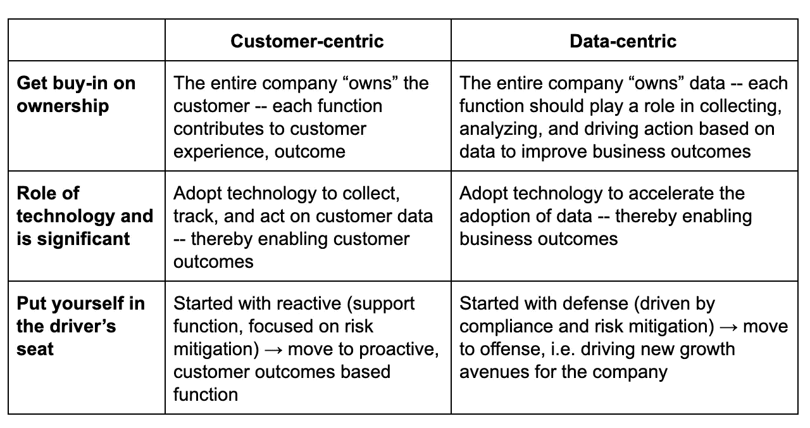

# 你说你想要一场(数据)革命

> 原文：<https://towardsdatascience.com/you-say-you-want-a-data-revolution-6ceefded38b7?source=collection_archive---------39----------------------->

## 让数据成为企业中的一等公民

Photo by [Paul Skorupskas](https://unsplash.com/@pawelskor?utm_source=medium&utm_medium=referral) on [Unsplash](https://unsplash.com?utm_source=medium&utm_medium=referral)

当基于订阅的商业模式开始风靡时，公司开始意识到以客户为中心对生存和成功至关重要。在 Gainsight，我曾帮助创建并支持客户成功类别，并担任 CS 运营副总裁，我很幸运能够在这场变革中占据第一排的位置。这些天来，我很高兴参与另一场革命:随着每个企业都成为科技企业，也有义务成为以数据为中心的企业。

我不禁要说:数据第一是新的客户第一吗？我发现反思这两个主要的业务转型很有启发性，希望我们能从中吸取教训。这里有三个有趣的相似之处可以考虑。

# **让客户和数据成为全公司的重中之重**

首先，考虑一下:公司中谁“拥有”客户体验？这几乎已经成为客户成功领域的老生常谈——当然，组织中的*每个人*都这么做。组织中的每一个职能都对客户体验和结果有贡献。

但是我认为，在数据领域，这个问题仍然存在争议。公司中谁“拥有”数据？是专注于将洞察力转化为行动的数据业务消费者吗？还是那些负责生成大量数据的基础架构的人？我看到客户、IT、数据、工程或其他部门的答案各不相同。

如果我不得不打赌，我敢打赌，各公司都会同意类似的答案:最终，*组织中的每个人*都拥有数据。收集、存储、分析和推动数据行动是每个职能部门的共同责任。与客户体验类似，这并不是说没有一个人对它的每个部分负责(甚至可能有一个首席数据官全面领导战略)，而是整个组织共同拥有数据和基于数据的行动——即使一开始我们可能不喜欢这个想法。

# **采用技术加速数据驱动的客户成果**

在客户成功中，最关键的步骤之一是找出如何卸载和自动化某些任务，所有这些都是为了专注于最重要的事情:为客户创造价值和成果。我们利用软件和自动化来更快、更高效地收集、跟踪和处理客户数据，并取得了巨大的成效。

最近的一个例子是 TD Ameritrade 如何依靠人工智能来实现他们的“客户之声”。通过将人工智能应用于呼叫中心记录，以提取观点、做出响应和定制建议，TD 还能够释放带宽，以优先考虑更广泛的客户至上的项目。例如，当他们的分析显示客户打电话是为了获得他们投资的基本信息时，TD 推出了一个新的网页，向他们提供在线信息。简单。

自然，这个客户成功的例子有其数据基础。但是数据行业也必须关注这项工作。例如，基于云的数据仓库正变得越来越普遍，用于存储数据，卸载曾经被视为核心的活动——存储。但是如果你仔细想想，依赖基于云的仓库为数据团队开辟了其他机会——比如采用其他技术来加速创新。一旦解决了基础问题——如治理、访问、质量控制、安全性等——团队就可以专注于推动客户和业务成果的真正创新。

# **从被动转为主动(也就是防御转为进攻)**

起初，客户成功是支持功能的同义词。从这个角度来看，客户服务通常是事后的想法，是保护你的基础的一种方式，带有处理查询的风险框架。但大约十年前，当 SaaS 的商业模式获得牵引力时，人们开始意识到卓越的客户管理不仅仅是一种防御机制。现在看起来很明显:*当然*伟大的客户优先排序可以让客户更成功地使用你的产品——也让生意更成功。

很快就清楚了，在客户成功方面积极主动(例如，建立一个负责向客户展示价值的 CS 功能)是一个真正的增长引擎。如今，具有前瞻性思维的组织将客户成功视为推动公司增长的基于结果的功能。

在这里，我们也可以与数据行业相提并论。数据行业基本上是从防御开始的，受法规遵从性和风险缓解的驱动。它位于 It 组织中，其技能主要用于检测问题，并找出如何在问题变得更加严重之前阻止它们。但防守方面的进步开始暗示，数据也可能有机会进入进攻。它开始成为一个业务驱动的、基于结果的、主动的职能，推动公司的增长，但我们仍处于早期阶段。

所有这些当然都是一种简化——它不是 1:1 的直接比较，我们当然应该从基本原则出发评估每种情况。也就是说，我们成为客户*和*数据优先组织的共同机会和需求从未像现在这样重要。这使得考察一个走在我们前面的行业是如何转型的更有帮助。