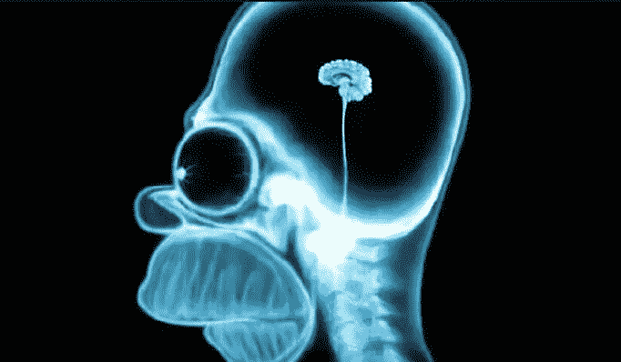
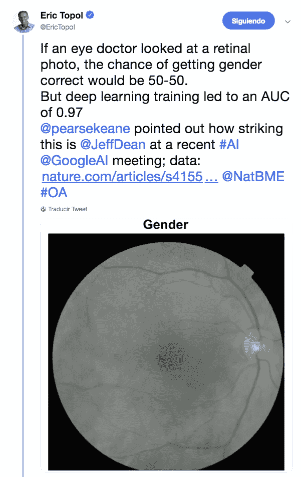
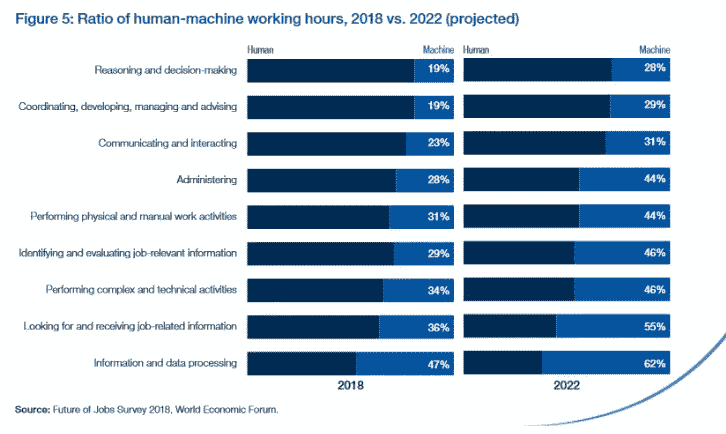
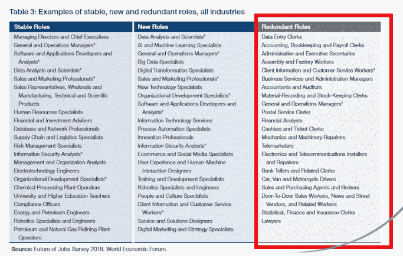
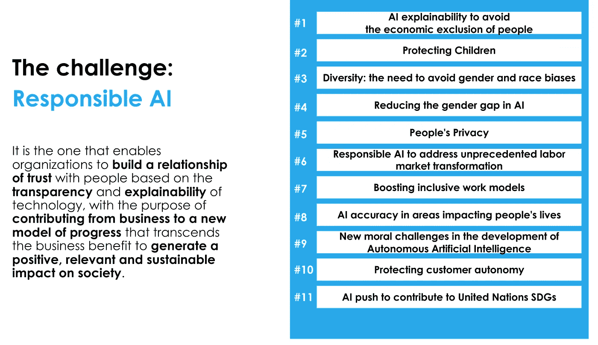

# 你应该害怕超级愚蠢，而不是超级聪明

> 原文：<https://towardsdatascience.com/you-should-fear-super-stupidity-not-super-intelligence-19f93a46fa4d?source=collection_archive---------22----------------------->

Artificial Intelligence is not match for Natural Stupidity

我被邀请参加一个相当大的活动，在这个活动中，一些专家和我(请允许我不认为我是一个专家)将讨论人工智能，特别是关于超级智能的概念。

原来我最近发现了这个非常有趣的 TED 演讲，是由 [Grady Booch](https://es.wikipedia.org/wiki/Grady_Booch) 做的，正好是我准备演讲的最佳时机。

Grady Booch — Don’t fear superintelligent AI TED Talk

不管你同意还是不同意布奇先生的观点，很明显今天的**我们仍然生活在** [**弱或窄的 AI**](https://en.wikipedia.org/wiki/Weak_AI) ，**远的**离[一般的 AI](https://en.wikipedia.org/wiki/Artificial_general_intelligence) ，更远的**离一个潜在的超级智能**。尽管如此，从今天起**机器学习给我们带来了巨大的机遇**。**让算法与人类合作解决我们最大的挑战****的机会:气候变化、贫困、健康和福祉等。**

**事实上，如果我们想作为人类生存足够长的时间，有朝一日有可能解决超级智能问题，我们似乎应该担心许多挑战。我们真的足够担心吗？让我怀疑。这就是为什么我们应该担心超级愚蠢。**

**人工智能已经多次表明，它能够找到我们人类无法识别的关系/ [模式。如果当前的人工智能帮助我们找到治愈疾病的模式，或者帮助我们应对气候变化，会怎么样？](https://www.nature.com/articles/s41551-018-0195-0)**

****

**AI can find hidden patterns for humans**

**让我说清楚:**我强烈认为，我们必须努力避免人工智能的不良使用可能带来的风险，通过道德准则和监管**，但不放弃我们作为一个社会可以从中获得的巨大利益。实际上，**我们在这一领域面临的最大挑战之一是避免陷入技术过度监管**，因为**全球监管和道德考量之间的巨大差异最终可能会改变全球地缘政治秩序**，并产生/加剧国家/地区之间的不平等。但这也许是另一篇文章的精神食粮…**

**话虽如此，让我继续从布奇先生的讲话中摘录一段，并谈谈我自己的一些想法:**

> **“我们正处在与机器共同进化的不可思议的旅程中。我们今天的人类不是那时的人类。现在担心超级智能的崛起在许多方面都是一种危险的分心，因为计算本身的崛起给我们带来了许多我们现在必须关注的人类和社会问题。当对人类劳动力的需求减少时，我该如何最好地组织社会？我怎样才能在全球范围内带来理解和教育，同时又尊重我们的差异？我如何通过认知医疗延长和提高人类寿命？我该如何利用计算机来帮助我们到达恒星？”**

**我完全同意。**人工智能在当前状态下的崛起，以及 ML 的使用，特别是深度学习扩展，使我们面临任务自动化方面的巨大挑战**。我说任务而不是工作是有原因的:我们越来越需要将工作视为任务的组合，其中一些是可重复的且缺乏创造力(因此受制于自动化)，而另一些则不是(因此仍由人类来执行)。正如布奇先生提到的，这种新的人机合作(被称为增强智能)本身带来了巨大的挑战。**

********

**但不仅如此。**最先进的** **人工智能还引入了其他挑战**，它们都**与伦理**有关，以及信任应该如何成为创造**负责任的人工智能**的基本原则，如下图所示。**

****

**Challenges around Responsible AI**

**最后，我非常同意博奇先生演讲的最后一段摘录:**

> **此时此地，利用计算提升人类体验的机会触手可及，而我们才刚刚开始。**

**所以，让我们不要把精力放在避免一种超级智慧上，这种智慧只能(暂时)是我们自己超级愚蠢的产物。让我们把注意力集中在真正的问题上，**以及如何利用我们掌握的难以置信的技术造福人类。****