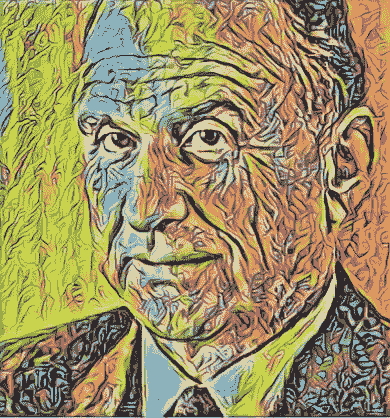
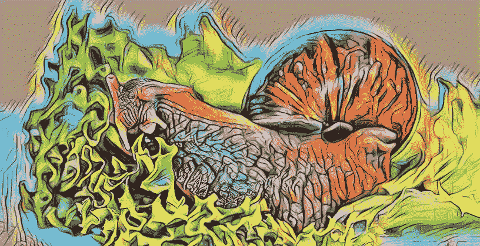

# 你的算法分不清绿色和蓝色

> 原文：<https://towardsdatascience.com/your-algorithm-doesnt-know-green-and-blue-from-grue-8cfdb71d1c2c?source=collection_archive---------28----------------------->

## 数据科学之道

## 古德曼的新归纳之谜与人工智能中的逻辑

[*数据科学之道*](https://medium.com/tag/the-tao-of-data-science/archive) *专栏探讨了几个世纪以来哲学家们是如何攻克机器学习和数据科学的关键问题的。*

Nelson Goodman’s little riddle makes even commons sense inductive reasoning feel futile.

**归纳**指从例子中学习一个大概的概念。

> 我们见过许多蜗牛。我们见过的每只蜗牛都吃莴苣。所以，所有的蜗牛都吃生菜。

哲学的核心问题之一是归纳法的[问题——归纳法推理是否能通向知识的问题。](https://en.wikipedia.org/wiki/Problem_of_induction)

在统计机器学习中，我们试图创造从数据中学习的机器。归纳的问题让人质疑这种学习过程是否能让机器*知道*一些东西。

我想将一些基本的机器学习理论与哲学中关于归纳的经典讨论联系起来。我想把归纳问题上的基础哲学工作和建造学习机器的人所面临的挑战联系起来。

这篇关于*纳尔逊·古德曼的新归纳之谜*的文章代表了对这个相当大的杯子的最初投入。

## 绿色，蓝色，还是灰色？

归纳法的部分问题在于，看似简单的观点，即过去定期观察到的模式将持续到未来，显然缺乏正当理由。

纳尔逊·古德曼根据文字游戏和基本命题逻辑编造了一个有趣的谜语，展示了这种推理方式如何导致相互矛盾的结论。

Is this gemstone green, blue, or grue? Photo by [Jens Johnsson](https://unsplash.com/@jens_johnsson?utm_source=medium&utm_medium=referral)

假设你是一名研究宝石的地质学家。在“这个宝石是绿色的”这个表达中，“是绿色的”是所谓的*谓词*。假设这个断言在 2020 年 1 月 1 日午夜之前对你见过的所有宝石都成立。归纳法让你得出结论，这个谓词在未来将是真的。你可以说“预测”，而不是“断定”——你*预测*未来所有宝石的颜色都将是绿色。

谜语的工作原理是将“是绿色的”换成一个新的谓词，并显示你得到了一个矛盾。新谓词是“is grue”，其中“grue”表示“是绿色的，在 2020 年 1 月 1 日午夜之前看到，*或*是蓝色的，在 2020 年 1 月 1 日之后看到”。

下面是这个谜语的分解:

1.  如果我们在 2020 年 1 月 1 日之前看到的所有宝石都是绿色的，那么观察陈述“2020 年 1 月 1 日之前看到的所有宝石都是绿色的”是正确的。
2.  此外，根据我们对“grue”的定义，观察结果“2020 年 1 月 1 日之前见到的所有宝石都是 grue ”也是正确的。
3.  通过归纳推理，我们从第一个观察陈述中得出结论:“所有未来的宝石都将是绿色的。”
4.  同样，我们从第二个陈述中得出结论，“所有未来的宝石将 *grue。*
5.  既然我们得出了这两个结论，那么我们得出的综合结论是“所有未来的宝石都将是绿色和*绿色的。*
6.  但这是一个矛盾。这一综合结论意味着，一旦我们过了 2020 年 1 月 1 日午夜，所有宝石都将是绿色和蓝色的！

## 这个谜语是不是坦克基于逻辑的机器学习？

在机器学习中，我们有许多模型使用这种类型的命题逻辑作为原语。例如，Pedro Domingos 在他的书 [The Master Algorithm](https://www.goodreads.com/book/show/24612233-the-master-algorithm) 中提出了基于[一阶逻辑](https://en.wikipedia.org/wiki/First-order_logic)的建模方法，称为[马尔可夫逻辑网络](https://en.wikipedia.org/wiki/Markov_logic_network)。命题逻辑是一阶逻辑的基础。这些框架是如何处理“grue”的？

Goodman 的结论是，虽然归纳推理不能对所有谓词都有效，但它确实对一些谓词有效。然而，它是否有效似乎取决于人类使用和曾经使用什么语言来描述和预测我们世界的行为。

不知何故，我们似乎希望我们的算法*而不是*依赖于人类对世界的偏见感知，以及人类的口语如何塑造我们对这些感知的解释。否则，他们如何揭示真正新奇的世界洞察力？

## 延伸阅读:

*   [新归纳之谜](https://en.wikipedia.org/wiki/New_riddle_of_induction) —维基百科
*   [归纳的问题](https://plato.stanford.edu/entries/induction-problem/) —斯坦福哲学百科全书
*   纳尔逊·古德曼图片来源:( [WP:NFCC#4)，合理使用](https://en.wikipedia.org/w/index.php?curid=41879513)