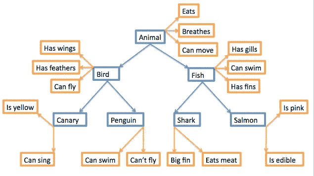
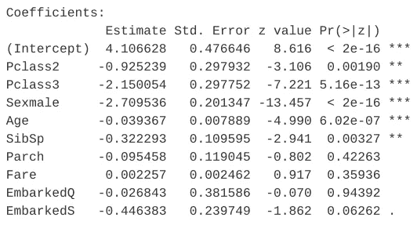
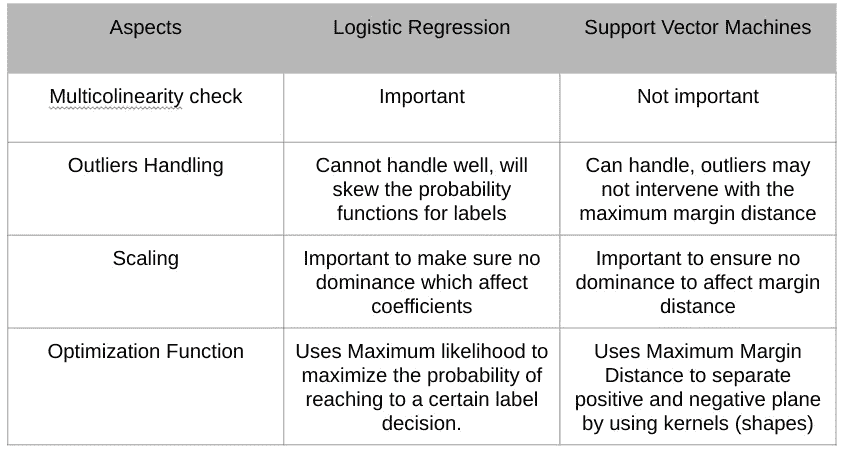

# 基本分类模型入门指南:逻辑回归和 SVM

> 原文：<https://towardsdatascience.com/your-beginner-guide-to-basic-classification-models-logistic-regression-and-svm-b7eef864ec9a?source=collection_archive---------15----------------------->

## 机器学习模型权威指南

## 关于对数据集中的要素进行分类，您只需知道

Source: Unsplash

# 介绍

还记得你的小孩或侄子/侄女，他们还在学习如何识别物体和动物吗？我知道。

我有一个 1 岁的小侄女，她非常聪明，每当我指给她一只猫时，她总是说“喵”，甚至没有告诉她那是什么。不管它的毛是什么颜色，也不管它的大小，她都能准确无误地认出它是一只猫。

那么她怎么能认出那只猫呢？有趣的是，通过每次观察，她知道了哪一只是猫，哪一只不是。这是她心智模式的一部分。当然，通过我们和她的互动。每次她看到动物，我们都会说。“看，这是一只猫”。她会说“苗”来确认。然后每当她看到一只小狗(比如吉娃娃)说“苗”的时候，我们就会说，不，是狗。

慢慢地，她学会了通过每次观察更准确地分辨出，哪一只是狗，哪一只是猫。当然它延伸到哪一个是老虎，绵羊，甚至大象。她的心智模式随着她所拥有的每一个观察而进化。

Mental model for each classification of animal

同样，在机器学习中，我们会发现各种分类问题。还记得追求幸福的威尔·史密斯吗？假设你是一名销售经纪人，你需要从众多潜在客户中找出买家。你可以联系他们中的任何一个，但是时间和精力都非常有限。问题是，哪个会买你的产品？

分类是一个有监督的问题，其中有一个带标签的数据集。这意味着您可以使用历史数据和标注来预测任何新观测值的标注。最后，我们可以用一个模型来预测我们配偶的情绪——这会让我们的生活变得多么美好！！！

Source: Giphy

# 逻辑回归和支持向量机(SVM)

事不宜迟，我在这里的工作是向您介绍分类机器学习模型的两个基础:逻辑回归和 SVM。

我试图让这个指南非常清晰，适合初学者，并为进一步的学习增加参考。如有困惑，请评论。

# 逻辑回归

逻辑回归是一种分类模型，用于预测特定事件的有利概率。优势比代表我们想要预测的积极事件，例如，在 UCI 数据集中，样本患[乳腺癌的可能性有多大。](https://archive.ics.uci.edu/ml/datasets/breast+cancer+wisconsin+(original))

Odds Ratio for Positive Events (positive probability/negative probability)

比值比通常也被定义为 **logit，它是比值比的对数(log-odds)。**这里注意 log 是指自然对数，取 0 到 1 之间的输入值。这意味着它表示给定某个特征的正事件的条件概率。

Logistic Regression Formula with logit

为了理解这个公式，我们需要慢慢地把它分解成左手边(LHS)和右手边(RHS)。

在右侧(RHS ),它显示了一个带有 b 系数和输入特征的简单线性方程公式。类似于线性回归，这些系数被优化以最小化成本函数。

左手边的网站(LHS)，你会看到比值比的自然对数。p(X)是正事件/默认类。在泰坦尼克号数据集中，这可能意味着你存活的可能性，或者在乳腺癌分类中，癌症的可能性。

该方程将转化为逻辑 sigmoid 函数，它是 logit 函数的 S 形逆函数。

Sigmoid function Logistic Regression

## 逻辑回归中的优化

我们使用最大似然估计来优化训练系数的最佳值，以最小化预测到实际标签的测试距离。

有趣的是，这些系数也会转化为某个特征对影响预测概率的重要程度。例如，在该数据集中，您可能会发现与票价相比，性别具有较大的对数回归系数。这意味着性别决定了预测。向你的经理提出见解的一个非常有用的方法！

Coefficients table from titanic dataset with sex being one of the important feature.

## 逻辑回归中的调整:正则化参数

为了调整好**偏差-方差权衡**，逻辑回归引入了正则化参数来处理特征间多重共线性，过滤信号间的噪声，并防止模型过于复杂。它引入了额外的信息来惩罚具有极端权重的参数。

[这是关于逻辑回归的 L1 和 L2 正则化的更具描述性的信息。](https://stats.stackexchange.com/questions/228763/regularization-methods-for-logistic-regression)

Source: Giphy

# 支持向量机

支持向量机(SVM)是一种非常强大的学习算法，可以最大化类别变量之间的间隔。这个余量(别名:支持向量)表示分离超平面的距离(别名:决策边界)。

Support Vector Machine Model: Source

## 为什么支持向量机

具有大余量的决策边界的基本原理是用可调整的偏差-方差比例来分离正负超平面。目标是分离，使得负样本落在负超平面下，而正样本落在正超平面下。

## 逻辑回归中的调整:松弛变量

1995 年，Vladimir Vapnik 提出了软间隔分类的概念，增加了松弛变量来松弛非线性可分数据。这个松弛变量将控制边距的宽度和位置，并调整偏差-方差权衡。你可以在这个由[里沙布](/support-vector-machines-soft-margin-formulation-and-kernel-trick-4c9729dc8efe)撰写的惊人帖子中找到更多信息

# 逻辑回归与支持向量机

Logistic Regression vs SVM

逻辑回归的优点是它引入了一个更简单的模型，可以更容易地实现。它确定每个变量的重要性权重，这些权重可以分配给每个预测的概率函数。这对于发现对信用风险评分等评级问题的见解非常重要。此外，逻辑回归可以很容易地随着新数据的到来而更新，这对于流式数据来说是完美的。

然而，当逻辑回归试图最大化训练数据的条件似然性时，逻辑回归非常容易出现异常值。作为共线检查的标准化也是确保特征的权重不会超过其他特征的基础。

另一方面，SVM 不容易出现异常值，因为它只关心最接近决策边界的点。它可能会根据新的积极或消极事件的位置来改变决策界限。

SVM 非常流行的另一个原因是它可以很容易地做成核来确定非线性分类问题。这个想法是将数据点投射到高维映射中，在那里它是可分离的。这意味着，现在可以用 2D 要素(平面)来分隔 3D 要素(超平面),而不是用 1D 要素(线)来分隔 2D 要素(平面)。内核将数据作为输入，然后将其转换成[所需的形式(线性、非线性、放射状、sigmoid 等)](https://data-flair.training/blogs/svm-kernel-functions/)。

# 没有一个模型是完美的(免费午餐定理)

> 特别是，即使算法之一是随机猜测，这种等价也是成立的:任何特定的学习算法被数据混淆并且表现得比随机算法差的目标“一样多”,就像它表现得更好一样。—大卫·h·沃伯特(没有免费的午餐定理)

在“没有免费的午餐”定理中，它指出没有一个模型对所有问题都是最好的。在实践中，总是建议比较每个学习算法的性能，并为特定问题选择最佳模型。

**过度拟合**是机器学习中的一个问题，在这种情况下，模型可以很好地拟合训练数据，但不能用测试(看不见的)数据进行足够好的概括。这将引入很高的方差，因为它引入了太多的参数，使得模型更加复杂。

另一方面，**欠拟合**可能会发生，这意味着机器学习模型不能捕捉足够的复杂性来表示训练数据中的模式——这也将引入测试数据的低性能。

这些是你应该避免的每个模型中非常大的问题。因此，要选择是否需要使用 SVM 或逻辑回归。你需要问自己几个问题:

1.  您是否已经正确理解了正确的功能和训练样本？如果样本中有许多您不想排除的异常值(例如:乳腺癌的分类)。那你可能想用 SVM。
2.  您是否正确评估了模型的准确性、召回率和精确度，尤其是在不平衡类别集的形式下？根据需要，您需要考虑每个型号在分类矩阵中的权衡。
3.  你正确地调整算法了吗？每个模型都应该根据其自身的成本函数进行优化(逻辑回归:最大似然，SVM:最大利润距离)

记住，没有完美的模型，每个模型都是一个工具。这意味着它需要根据每种情况进行适当的调整和优化。

# 更多参考

如果你需要更多的例子和对逻辑回归和 SVM 能提供什么更好的见解。请随意访问以下链接。

1.  [逻辑回归理论](https://christophm.github.io/interpretable-ml-book/logistic.html)
2.  [逻辑回归介绍](/introduction-to-logistic-regression-66248243c148)
3.  [SVM 理论](https://medium.com/machine-learning-101/chapter-2-svm-support-vector-machine-theory-f0812effc72)
4.  [SVM 简介](/support-vector-machine-introduction-to-machine-learning-algorithms-934a444fca47)

# 最后…

Source: Unsplash. Look at how aligned each truck is

我真的希望这是一本很棒的读物，是你发展和创新的灵感来源。

请在下面**评论**出来建议和反馈。就像你一样，我也在学习如何成为一名更好的数据科学家和工程师。请帮助我改进，以便我可以在后续的文章发布中更好地帮助您。

谢谢大家，编码快乐:)

# 关于作者

Vincent Tatan 是一名数据和技术爱好者，拥有在 Google LLC、Visa Inc .和 Lazada 实施微服务架构、商业智能和分析管道项目[的相关工作经验。](https://bit.ly/2I8jkWV.?source=post_page---------------------------)

Vincent 是土生土长的印度尼西亚人，在解决问题方面成绩斐然，擅长全栈开发、数据分析和战略规划。

他一直积极咨询 SMU BI & Analytics Club，指导来自不同背景的有抱负的数据科学家和工程师，并为企业开发他们的产品开放他的专业知识。

文森特还在 best top 上开设了他的一对一导师服务，指导你如何在谷歌、Visa 或其他大型科技公司获得你梦想中的数据分析师/工程师职位。 [**如果你正在寻找良师益友，请在这里预约他**](https://www.besttopcareer.com/mentors-datascience) **。**

最后，请通过 [**LinkedIn**](http://www.linkedin.com/in/vincenttatan/?source=post_page---------------------------) **，**[**Medium**](https://medium.com/@vincentkernn?source=post_page---------------------------)**或** [**Youtube 频道**](https://www.youtube.com/user/vincelance1/videos?source=post_page---------------------------) 联系文森特