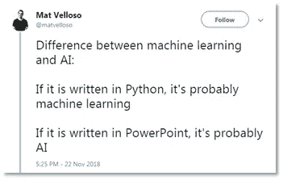

# 你的公司可能还没有为人工智能做好准备

> 原文：<https://towardsdatascience.com/your-company-is-probably-not-ready-for-ai-1098d089e889?source=collection_archive---------36----------------------->

## 先别叫它 AI。

Photo by [Ian Battaglia](https://unsplash.com/@ianjbattaglia?utm_source=medium&utm_medium=referral) on [Unsplash](https://unsplash.com?utm_source=medium&utm_medium=referral)

最近有人问我，为什么我们团队中的一名数据科学家不从事数据科学，而是从事数据争论:数据准备、清理和数据质量保证。花哨的统计数据在哪里？模特在哪里？或许是图表？或者至少有一张幻灯片提到了人工智能、机器学习或深度学习。

我意识到数据科学并不总是符合上层管理的宣传。这可能是因为它没有达到预期，因为坦率地说，有人对我们这些凡人设置了太高的标准(咳咳，谷歌)。也可能是因为，或许，公司还没有为数据科学做好准备。

> 有人问我们，为什么我们的数据科学家不从事数据科学…

尽管世界各地涌现出许多纯粹从事人工智能驱动技术或人工智能工具的公司，但普通公司尚未在该领域找到出路。

这是为什么呢？为什么有些公司能够将 AI 货币化。为什么其他更传统的机构，比如银行，发现很难采用新技术？为什么他们不能得到一些好的人工智能或数据科学？

## 首先，我们应该停止称它为 AI…

我们应该从房间里的大象开始。我们真的不应该再叫它 AI 了。人工智能是一种类似人类的智能，距离大多数公司需要的一些适当的统计数据或有监督的 ML 模型还有很长的路要走。公司并不真的需要人工智能。最重要的是，这是一个臃肿和过度使用的术语。

## 但是如果你坚持 AI。订单很重要…

当你想到流行的例子时:像谷歌照片，Snapchat 过滤器，甚至无人驾驶汽车，你必须认识到这些是围绕人工智能打造的产品(和整个公司)。图像识别是伟大和有用的，但它的应用不是无限的。

**人工智能→产品。**谷歌、Snapchat、脸书和特斯拉等公司之所以有如此成功的记录，是因为它们的使用案例。用例是非常仔细地选择的，因此他们在完全适合目的的模型上构建产品(可以说自动驾驶汽车很难使用机器学习算法来生成真正的自动驾驶汽车)。

ML 模型大放异彩的领域不在少数；关系不明确的模糊数据集就是其中之一。(不要与低质量数据集混淆)。我们看到同样的用例正在我们周围使用:前面提到的图像识别、语音到文本和翻译、疾病和医疗数据之间的关系——结果和输入之间的关系并不立即清晰，但一台强大的计算机可以在两者之间建立一种似乎合理的关系。

**产品→ AI。**对于许多公司来说，问题往往是反过来的。他们有一个问题，想把人工智能应用到。这导致了一路上各种意想不到的曲折。例如，当你的问题不适合人工智能的应用或者甚至不需要人工智能时，会发生什么？它需要的是一些流程优化。或者数据质量，或者用户的一些简单访问？

并非所有问题都适合人工智能。AI →产品≠产品→ AI。

Photo by [Pietro Jeng](https://unsplash.com/@pietrozj?utm_source=medium&utm_medium=referral) on [Unsplash](https://unsplash.com?utm_source=medium&utm_medium=referral)

## 你甚至还没有做好分析…

通常，公司也会因其业务知识和目标而限制机器学习和数据科学的应用。我的意思是，来自业务的问题决定了正在创建或研究什么，以及什么值得数据科学团队花费时间。这意味着你的边界条件就是业务。不是你花大价钱雇来的数据科学家。

数据科学家可以更容易地接受培训，根据业务目标进行思考。他们能够理解投入的时间和获得的商业价值之间的权衡。很难让一个业务经理为一群数据科学家定义有意义的工作。这也是很难找到优秀的 DS 经理的原因之一——他们需要了解业务并与之沟通，同时拥有深厚的技术知识并在技术上领导团队。

当您没有一个可靠的交付平台来进行基本分析时，有效地交付更复杂的产品将会更加困难。

## 你甚至不是数据驱动的…

大多数公司倾向于认为他们是数据驱动的，但事实并非如此。数据驱动并不意味着:寻找数据，构建任何你喜欢的故事并呈现出来。数据驱动意味着对数据所包含内容的细致理解，它需要对数据如何产生以及它排除了什么有深入的纵向了解。它需要一个可证明的假设，并采取整体的方法。结果不会总是如你所愿，你应该愿意接受这一点。

> 分享你的轶事真相，但如果数据并不总是与你的经历相呼应，不要感到惊讶。

数据驱动也意味着你不能只选择你喜欢的答案而忽略其他的。或者甚至问一些“引导证人”的问题我知道这听起来很难，但是你不能挑挑拣拣。

你被允许(甚至高度鼓励！)将您的知识和经验带给分析团队。当我们了解工作流程、实验、组织或法律方面的变化时，这很有帮助。但是，如果数据并不总是与你的轶事真相相呼应，也不要感到惊讶。

Photo by [Martin Adams](https://unsplash.com/@martinadams?utm_source=medium&utm_medium=referral) on [Unsplash](https://unsplash.com?utm_source=medium&utm_medium=referral)

## 你真的不能跳过步骤…

和许多事情一样，数据科学也是如此:你不能走捷径。没有数据争论、上游质量数据、准备好的数据集、数据理解、适当设计的特征，整个努力都处于危险之中。慢板“拉进来，拉出去”是千真万确的。如果你没有强有力的理由去相信基础数据，你就不能相信你的结果。

没有几个小时盯着电脑屏幕，就没有 T2 数据科学；理解数据。没有深刻的见解从页面中涌现出来，没有完整功能的人工智能在不理解其输入的情况下被制造出来，团队不得不投入繁重的工作。[数据的行为不像石油](/data-is-not-the-new-oil-721f5109851b)，它在价值提取方面耗费大量的时间和精力:

数据科学并不性感——它很难，有时很无聊，而这正是它有趣的地方。奋斗后的回报。你的团队付出努力后的发现。

## 你可能不需要人工智能…

你也不太可能需要人工智能——这个术语非常臃肿，但在企业中却随处可见。更有可能的是，你需要一些普通的解决方案；一些描述性统计，一些成熟的回归，可能是一个监督的 ML 或者甚至可能是图形数据库来寻找最近的邻居。很可能不是人工智能。

问问你自己，你认为什么能给你和你的团队增加最大的价值？新信息，新见解？还是无人干预的自动化过程？如果是后者，那就尽情享受吧。如果没有，问问你是否需要人工智能或简单的商业分析。

## 即使你做了，你也没有准备好使用它…

即使你真的想要人工智能，你可能还没有准备好拥有它。与上面类似，当你的系统和流程没有准备好，你也没有准备好。你能放弃对机器的控制吗？大概不会。

当引入新的解决方案来自动化以前的人工选择时，会有大量的阻力。并不总是因为无知，而仅仅是因为无知。

当营销被告知谁应该优先考虑，什么应该优先考虑时，你的营销经理准备好相信结果并执行了吗？营销经理准备好让系统取代他们的工作了吗？作为一家公司，你能找到有意义的方法来使用他们的技能吗？当你真正准备好去人工智能时，要意识到这些问题。

接下来是关于可靠性、监督、所有权和合规性的问题。所以，即使你使用人工智能，也不要完全使用人工智能，要在你的系统周围保持一个稳固的控制和测试网络。

Photo by [Sander Weeteling](https://unsplash.com/@sanderweeteling?utm_source=medium&utm_medium=referral) on [Unsplash](https://unsplash.com?utm_source=medium&utm_medium=referral)

## 所以你走了，你可能还没有准备好人工智能…

好了，就这样。你的公司可能还没有准备好。这没关系。有大量的信息可以被解析成有意义的见解。从一开始就把基础做好,(字面上)可以赚一百万。

所以，不要再追逐黄金了，看看一叠美钞也价值连城。允许过程就是过程，把它看作更大整体的一部分。从小处着手，然后一步一步来。

因此，当我们的数据科学家不从事*数据科学*时，他会投入必要的工作，以到达他需要的地方:在分析、建模、可视化都有意义的情况下，因为底层数据是可信的。他正在做的工作是为我们的公司准备一个可靠的分析和模型。他正在努力为人工智能做准备。

*参见我之前的文章《走向数据科学》，文章认为数据不是新的石油:*

[https://towards data science . com/data-is-the-not-the-new-oil-721 f 5109851 b](/data-is-not-the-new-oil-721f5109851b)