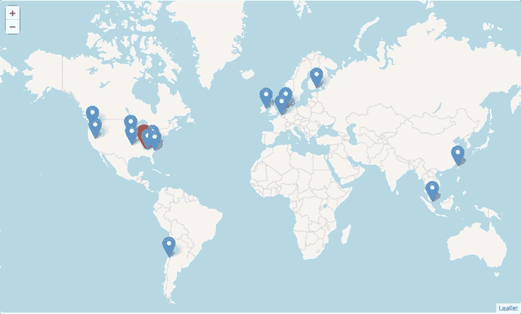

# 您的数据消耗了大量能源

> 原文：<https://towardsdatascience.com/your-data-is-using-a-lot-of-energy-cf06df9a7e2c?source=collection_archive---------21----------------------->

## *所有收集到的用户数据和保存在云中的数据都对环境产生了巨大影响*

如果你开始研究每年创建的数据量，你会很快发现一个乍一看似乎被过度使用和过时的统计数据: *90%的数据是在过去两年中创建的。*由于数据创建的指数速率，这几十年来一直如此(如果你想得到更好的解释，请查看[这个](https://www.quora.com/Who-said-90-of-data-ever-created-was-created-in-the-last-2-years))。

每一次点击、搜索、分享链接等都是一个新的数据点，公司正在用它来更好地预测你想要什么。仅在 2017 年，据估计每天就有 [2.5 万亿字节](https://www.domo.com/learn/data-never-sleeps-6)的数据被创建(大约每天 25 亿 GB)。这些数据包括上传的图片和来自家中联网设备的图片。基于 can 的操作系统 Domo 每年都会制作一张“数据永不休眠”的信息图。他们在列出我们日常互动的热门网站方面做得很好。([更新为 2019](https://www.domo.com/learn/infographic/data-never-sleeps-7?utm_source=google&utm_medium=x&campid=7015w000000vgsqAAA&gcreative=&gdevice=c&gnetwork=x&gkeyword=&gplacement=&gmatchtype=&gtarget=&gadposition=&s_kwcid=AL!5964!3!!!!x!!&gclid=CjwKCAjw_JuGBhBkEiwA1xmbRYZuPa4HRPtiv715j488UqtiZ25DoAINDm8xCrQjgjNJ5GWa8SH6xhoCI6cQAvD_BwE) )

## 数据如何产生碳足迹？

所有这些数据都必须存储在某个地方，而数据中心就是那个地方。2014 年，美国能源部估计，仅在美国就有 300 万个数据中心，也就是说每 100 个人就有一个数据中心。数据中心的规模各不相同，但谷歌、脸书、苹果等科技巨头。选择了大规模的能源密集型设施。脸书最近宣布计划建立一个更加分布式的系统，以更好地满足用户的需求——这可能会对他们的效率产生积极的影响。

一般来说，所有数据中心都有一些基本必需品:计算机房空调(CRAC)、服务器、网络设备、存储、不间断电源(UPS)、空气处理器、冷却器、加湿器、照明、办公区域和其他一些不同的项目。所有这些因素都增加了数据中心的能源密度。2017 年，该行业每年使用[200-300 太瓦时(TWh)的电力](https://www.theguardian.com/environment/2017/dec/11/tsunami-of-data-could-consume-fifth-global-electricity-by-2025)，目前约占二氧化碳总排放量的 3%。这种用途只会越来越多。

## 正在做什么？

为了更新这些系统和提高效率，已经做了大量的工作。数据中心正在配备新的服务器和硬件，这些服务器和硬件在不活跃时会保持较低的温度并处于待机状态。随着这些更新，冷却成为一个较小的问题——根据谷歌，他们一年只使用空调 36 小时。另一个选择是利用室外环境降温。空间中的灯可以更新为 led，使用更多的窗户/自然光是另一个很好的选择。

一个很大的关注领域是能源本身。目前，大多数数据中心至少从一种可再生能源来源获得能源— [83%的数据中心](https://www.datacenterknowledge.com/afcom/state-data-center-industry-2018-where-we-are-and-what-expect)知识调查对象表示，他们目前使用或计划使用太阳能。今年，谷歌宣布将建造两个最大的太阳能农场，为其在阿拉巴马州和田纳西州的最新项目供电。下面是他们全球所有数据中心的地图。红色标记代表这两个新设施。

Google’s data center locations world wide created using follium and Giphy Capture.

## 我能怎么做呢？

根据你的谋生方式，你的影响力会有所不同。然而，第一个重要的步骤是消除**数据垃圾**或**数据浪费**。那些自 2012 年以来就没有动过的文件就是一个典型的例子——尤其是当它们存放在云存储中的时候。

> 当软件代码以短而有效的方式编写，从而避免浪费 CPU 能力的冗余计算时，程序被认为是高效的。—斯蒂芬·施密特

作为开发人员，您可以通过编写更干净的代码来提高效率。这对公司使用的代码有更大的影响。据《卫报》的斯蒂芬·施密特(Stephen Schmidt)称，“当软件代码以简短有效的方式编写，从而避免浪费 CPU 能力的冗余计算时，程序被认为是高效的。”

从专业角度来说，另一个需要考虑的领域是存储的数据。数据垃圾的问题无处不在。尽管在企业层面更具挑战性，但我们需要考虑是否所有存储的数据都被使用或被需要。现在看起来几乎所有的东西都在收集数据，但是随着时间的推移，我们有望对存储的数据进行更有选择性的选择。