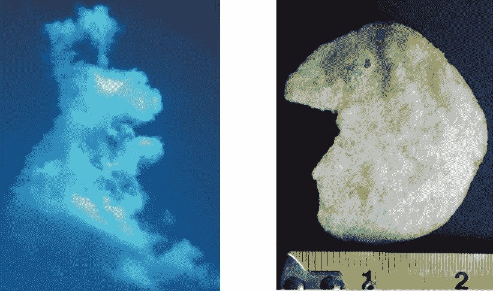
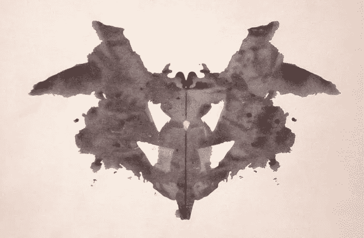
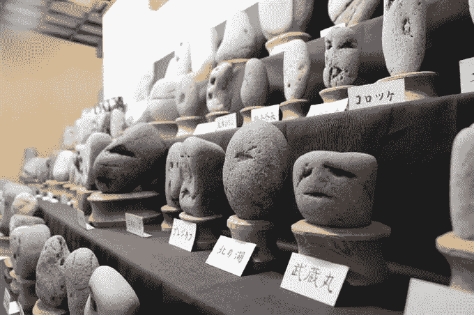
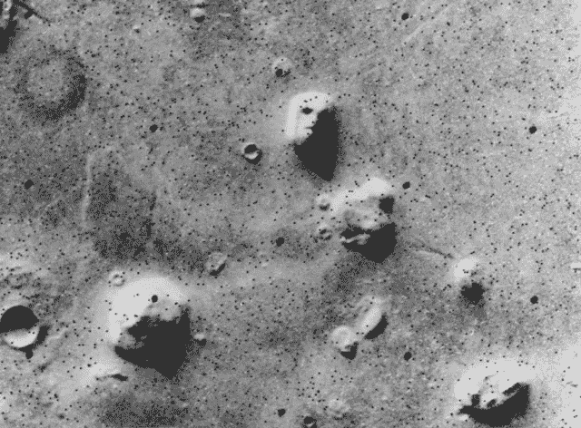
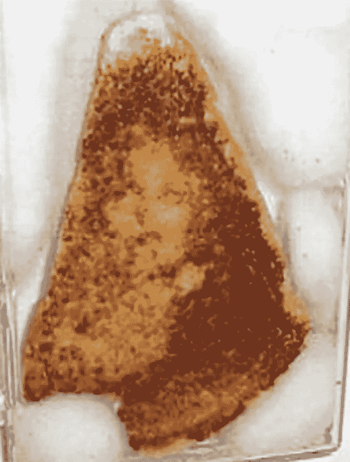
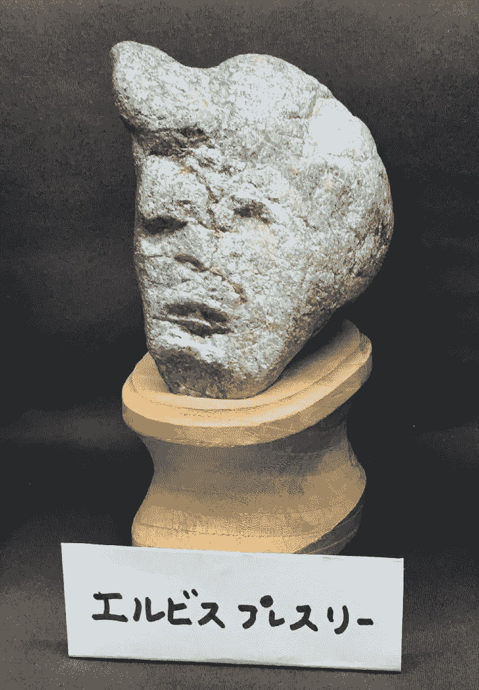

# 你的数据集是一个巨大的墨迹测试

> 原文：<https://towardsdatascience.com/your-dataset-is-a-giant-inkblot-test-b9bf4c53eec5?source=collection_archive---------3----------------------->

## 分析中的阿波芬尼亚的危险以及你能做些什么

用[数据](http://bit.ly/quaesita_hist)讲故事和说谎之间只有一线之隔。在我告诉你如何找到一流的[数据分析师](http://bit.ly/quaesita_analysts)并提升你的分析能力之前，让我先吓你一跳。

Here’s the audio version of the article, read for you by the author.

## 数据分析中的心理陷阱

人类的大脑是寻找模式的发电站……但是那些模式并不总是与现实有很大关系。我们是那种在云里发现[兔子，在薯片里发现](http://bit.ly/potatoelvis)猫王脸的物种。

Do these look like a rabbit and a portrait of Elvis to you? Image: [SOURCE](http://bit.ly/potatoelvis).

花一点时间考虑一下罗夏测验，向人们展示墨迹并询问他们看到了什么，你就会明白大脑是多么急切地将虚假的解释注入明显的随机性中。

Bat? Butterfly? Or just an ink blot? This is the first of the ten cards in the [Rorschach test](https://en.wikipedia.org/wiki/Rorschach_test), created in 1921\. Image: [Wikipedia](https://en.wikipedia.org/wiki/Rorschach_test#/media/File:Rorschach_blot_01.jpg)

心理学家给这种无中生有的趋势取了一个好听的名字:apophenia。给人类一个模糊的刺激，我们会发现面孔、蝴蝶和为我们最喜欢的项目分配预算或推出一个人工智能系统的理由。

*啊哈。*

在大多数数据集中有大量的随机噪声，那么你的[分析](http://bit.ly/quaesita_analysts)中没有 [apophenia](http://bit.ly/wikiapophenia) 发生的几率有多大？你真的能相信你对数据的解读吗？

> 大脑处理墨迹的方式也同样适用于数据。

更糟糕的是，分割这些数据集的方式越多，它们越复杂，它们作为刺激就越模糊。这意味着他们实际上是在恳求你在他们身上看到虚假的废话。

> 复杂的数据集实际上是在乞求你在其中找到错误的意义。

你确定你最近的数据顿悟不是伪装的 T21？

Another great word is [pareidolia](http://bit.ly/wikipareidolia), which is a kind of apophenia (finding familiar things in vague sensory stimuli). In Japan, they even have a [museum](http://bit.ly/japanfacerocks) of rocks that look like faces. It’s a beautiful world.

## 谎言，该死的谎言，和分析

如果这听起来令人沮丧，我还没说完。参加数据分析课程可以给这种心理火上浇油。学生们习惯于期待查看数据会产生真正的意义，因为每个家庭作业的探索性分析练习都埋藏着宝藏。很少有教授忍心让你白费力气(为了你好！)而且开放式作业很难评分，所以作为学生你通常接触不到足够多的开放式作业。

> 学生们在成长的过程中相信，每一个数据集都准备好了吐出一个确凿的事实。

数据讲故事只是一个跳跃，跳过，和直接用数据撒谎。抛开模式是否真实的问题，让我们来谈谈多种解释。仅仅因为你在墨迹中看到蝙蝠形状，并不意味着它里面没有蝴蝶、骨盆或一对狐狸。如果我没有提到狐狸，你会看到它们吗？大概不会。与动机和注意力相关的心理机制对你不利。这需要一种特殊的技能来释放蝙蝠的解释，并迫使自己看到意义的叠加。

> 一旦人们抓住了他们最喜欢的“洞察力”，他们就会努力去发现它。

问题是，一旦人们抓住了自己最喜欢的“洞察力”，他们就会努力去忽略它，去支持其他人。人们倾向于最强烈地相信最先抓住他们注意力的解释，每一个额外的意思都会降低他们继续寻找的动力。在不加重你最喜欢的故事的情况下，处理多个潜在的故事是一种需要努力锻炼的精神力量。唉，不是每个分析师都有这方面的训练。事实上，许多人受到激励，通过数据探索来“证明”一个故事的一面。为什么要培养只会妨碍你获得数据科学薪水的技能呢？

## 你的光剑是什么颜色的？

有很多方法可以用数据证明事情(诚实而严谨)——我的[数据分解文章](http://bit.ly/quaesita_sydd)会告诉你更多——但是探索性数据分析(EDA)不在其中。开放式数据探索始终是一次摸底调查。决定你光剑颜色的是你要钓的东西。

如果你加入了黑暗面，你就是在寻找证据来支持你已经“知道”是正确的理论(这样你就可以把它卖给一些天真的受害者)。如果你真的相信数据的客观性和你自己的[无偏性](http://bit.ly/cogbias_list)，你甚至不会意识到你的光剑是红色的。

> 开放式数据探索始终是一次摸底调查。

有了足够复杂的(模糊的)数据集，你会发现一个模式，你可以用它来支持你最喜欢的故事。毕竟，这就是罗夏测试的美妙之处。不幸的是，[数据](http://bit.ly/quaesita_hist)比墨迹更糟糕，因为你的方法越神奇( [p-hacking](http://bit.ly/quaesita_needles) )，有人知道吗？)，对那些不了解的人来说，你听起来就越合理，越有说服力。

Satellite photo of the “[Face on Mars](https://en.wikipedia.org/wiki/Cydonia_(region_of_Mars))” which many people took as evidence of extraterrestrial habitation.

那些拒绝黑暗面的人也去钓鱼，但他们追求的是别的东西:灵感。他们在寻找可能有趣或引人注目的模式，但他们知道不能把它们作为证据。相反，他们实践了一种思想开放的分析禅，遵守尽可能多的解释。

> 最优秀的分析师会挑战自己，寻找尽可能多的解释。

这需要敏锐的眼光和谦逊、坚定的头脑。他们不是欺骗利益相关者只看到一个故事的一面，而是挑战自己进行创造性思维，将相同的数据消化成尽可能多的故事。他们以一种激励严格跟进的方式展示他们的发现，而不会导致他们的领导团队过于自信而掉下悬崖。

> 开放的心态给了数据分析一个值得的机会。

一个额外的好处是，寻找多种解释的原则是分析师的秘密武器，让他们不会忽略隐藏在数据中的真正宝藏。如果你被自己相信的谎言分散了注意力，[确认偏差](http://bit.ly/quaesita_default)会让你很难注意到指向相反方向的证据。如果你的结论是预先确定的，为什么要费心去分析任何事情呢？开放的心态让整个努力有机会变得有价值。

This grilled cheese sandwich fetched [$28,000 in auction](http://bit.ly/virgintoast) because it features the Virgin Mary. Alternative interpretations of what we’re seeing, anyone?

## 雇佣优秀的分析师

如果你喜欢我关于分析的其他文章，这里是你已经在寻找一个伟大的分析师的特质:

*   他们不会做出超出他们正在探索的数据的推论。[【1】](http://bit.ly/quaesita_datasci)
*   他们善于使用数据科学工具，并拥有快速筛选大量数据集的技能。[【2】](http://bit.ly/quaesita_roles)
*   他们有相关的领域知识，所以他们不太可能在琐事上浪费利益相关者的时间。[【3】](http://bit.ly/quaesita_analysts)
*   他们明白他们的工作是寻找灵感。[【3】](http://bit.ly/quaesita_analysts)[【4】](http://bit.ly/quaesita_history)
*   他们以一种对大脑友好的方式可视化数据，以便尽可能缩短获得灵感的时间。[【3】](http://bit.ly/quaesita_analysts)
*   他们知道如何严格跟进他们发现的任何潜在见解(以及[向谁](http://bit.ly/quaesita_sydd)寻求帮助)。[【4】](http://bit.ly/quaesita_history)[【5】](http://bit.ly/quaesita_bsides)[【6】](http://bit.ly/quaesita_default)[【7】](http://bit.ly/quaesita_inspired)

除此之外，*这篇*文章建议你寻找具备以下三种特质的分析师:

*   他们意识到大脑在不存在的地方发现了意义，所以他们保持谦逊，避免妄下结论。
*   他们不会试图向你推销一个通过拷问数据找到的故事，直到它坦白。相反，他们在谈论数据时使用模糊/软化的语言。
*   他们有能力对每件事做出多种解释。他们产生多种解释的速度越快，产生的替代方案越多，他们的力量就越大。下次你雇佣一个分析绝地时，试着面试这种技能。

最后，如果你是一名领导者，请把批判的目光转向内部，确保你给了你的员工正确的激励。你是在找数据分析师还是数据顾问？这些需要不同的心态(和技能！)，所以要明智地选择，奖励正确的行为。

Forget potato chips! The [Chinsekikan](http://www006.upp.so-net.ne.jp/chinseki/index-ex.html) [museum](http://bit.ly/japanfacerocks) at Chichibua in Japan features an Elvis that really is the King of Rock.

# 感谢阅读！人工智能课程怎么样？

如果你在这里玩得开心，并且你正在寻找一个为初学者和专家设计的有趣的应用人工智能课程，这里有一个我为你制作的娱乐课程:

Enjoy the entire course playlist here: [bit.ly/machinefriend](http://bit.ly/machinefriend)