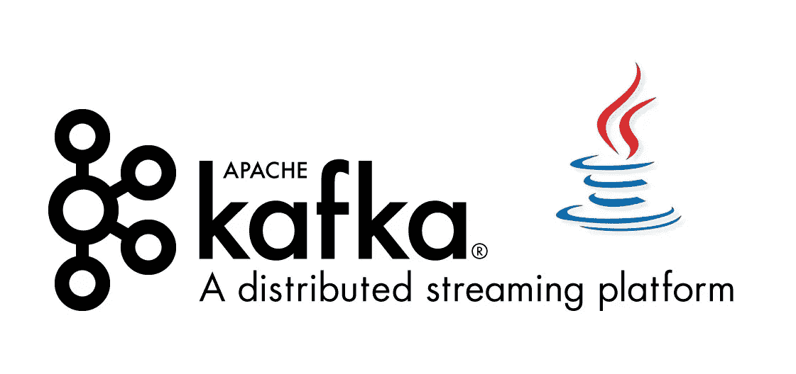
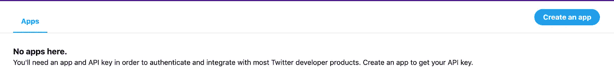
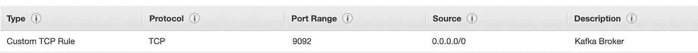
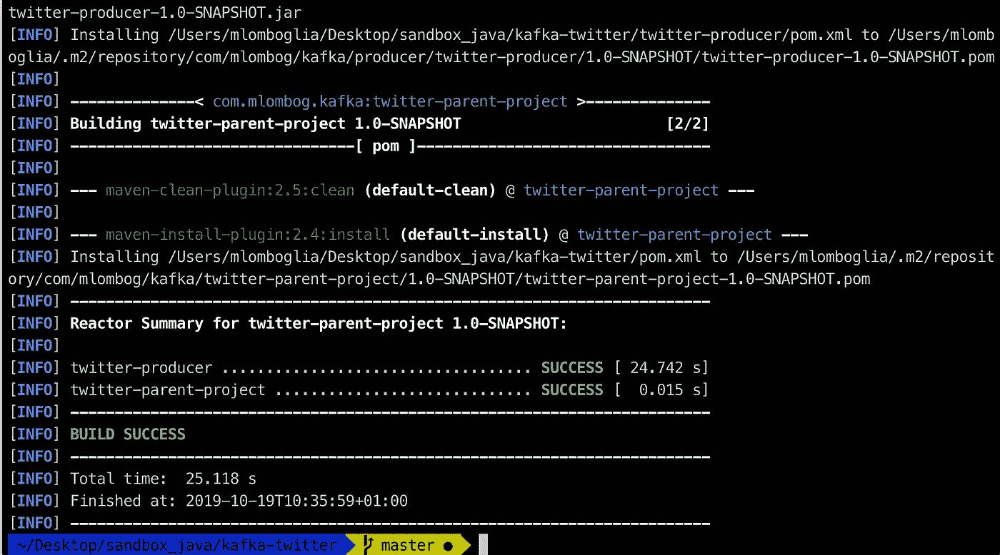
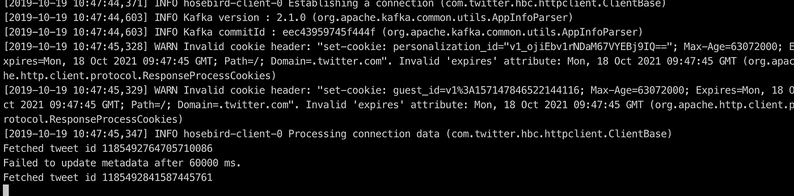
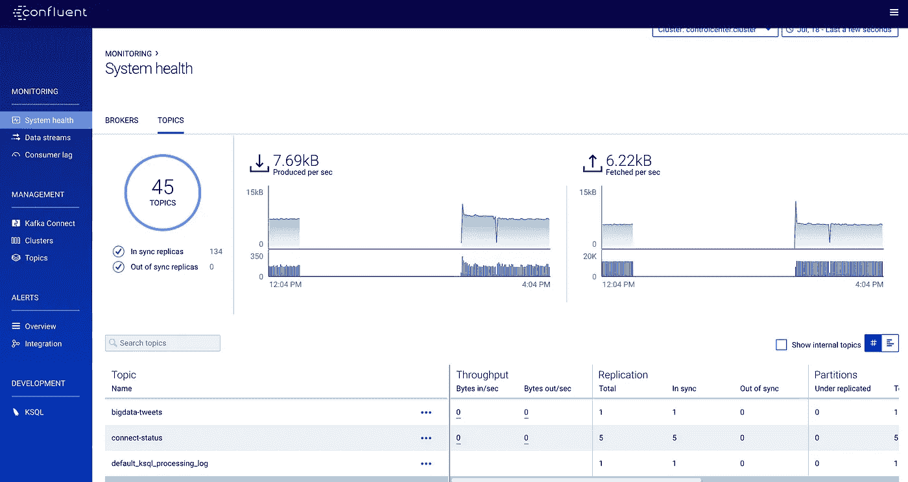

# 你的第一个 Kafka 应用

> 原文：<https://towardsdatascience.com/your-first-kafka-application-9b1358ccb870?source=collection_archive---------17----------------------->

## 使用 Twitter API 生成和消费消息



## 概观

在上一篇 Kafka [帖子](/install-a-kafka-cluster-on-ubuntu-in-aws-17c951287284)中，我们已经在 Linux Ubuntu 上安装了一个 Kafka 集群。在本文中，我将使用这个集群来创建一个生成和消费消息的 Kafka 应用程序。该应用程序将使用 Java (8+)编写。您还需要安装 maven 来运行它。

为了生成消息，我将使用 twitter API，使客户能够近乎实时地接收推文。每个 Twitter 帐户都可以访问流媒体 API，任何开发者都可以使用它来构建应用程序。

# 生成 Twitter API 密钥

去推特开发者:【https://developer.twitter.com/en/apps 



创建一个新的应用程序，并填写所有最低要求的信息。转到“密钥和令牌”选项卡，将消费者密钥和机密对复制到一个文件中供以后使用。
点击“创建”生成访问令牌和密码。将它们复制到一个文件中。现在，您已经拥有了开发生成器所需的所有东西。

# 配置到 Kafka 代理的远程连接

要远程访问您的 Kafka 代理，请确保在 AWS 中打开端口 9092。
登录您的 AWS。转到您的实例**描述**选项卡，并单击安全组创建。包括端口 9092 的新入站规则。你可以限制你的 IP 地址，或者允许所有人访问。



使用上一篇文章中描述的 ssh 连接到你的 Ubuntu 服务器。

```
sudo nano /etc/kafka/server.properties
```

取消对以下行的注释，并插入 Kafka 服务器的公共 IPv4 公共 IP

```
advertised.listeners=PLAINTEXT://<IPv4 Public IP>:9092
```

重新启动 Kafka 代理:

```
sudo systemctl stop confluent-kafka 
sudo systemctl start confluent-kafka
```

# 创建主题

运行以下命令，为演示创建 Kafka 主题:

```
kafka-topics --create --zookeeper localhost:2181 --replication-factor 1 --partitions 1 --topic bigdata-tweets
```

# 克隆存储库

现在，让我们在本地机器上构建我们的应用程序。

完整的代码可以在[我的 GitHub 这里](https://github.com/mlomboglia/kafka-twitter)找到。请克隆并安装此存储库。

```
git clone [git@github.com](mailto:git@github.com):mlomboglia/kafka-twitter.git
cd kafka-twitter
mvn clean install
```

运行 maven 后，您应该会看到:



Producer API 帮助您向 Apache Kafka 生成数据。我将连接到一个远程 Kafka 代理，使用 API 获取 Tweets 并将其发送到 Kafka 主题。

打开您选择的 IDE 并作为 maven 项目导入。

我会把我的命名为卡夫卡-推特

在**TwitterConfiguration.java**文件
中替换你的 Twiter 键，执行**App.java**，控制台将显示 tweets 被获取并发送给 Kafka 制作人。

```
mvn exec:java -Dexec.mainClass="com.mlombog.kafka.App"
```

这将通过一个简单的确认响应来触发回调。



按照上一篇文章中的解释，进入控制中心，你会在你的 **bigdata-tweets** 主题中看到消息



登录您的 Kafka 服务器并使用您的邮件:

```
kafka-console-consumer --bootstrap-server localhost:9092 --topic bigdata-tweets --from-beginning
```

恭喜你！！


*最初发表于*[*【https://marcoslombog.com】*](https://marcoslombog.com/2019/07/17/kafka-first-app.html)*。*