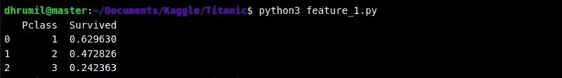
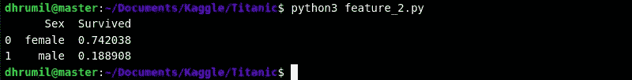
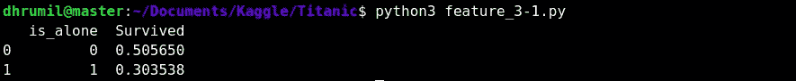
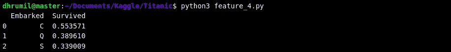
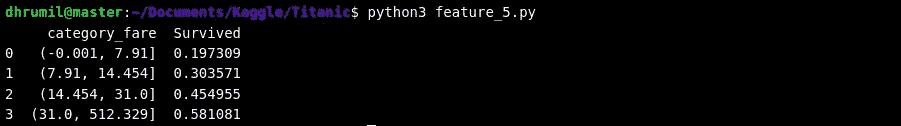
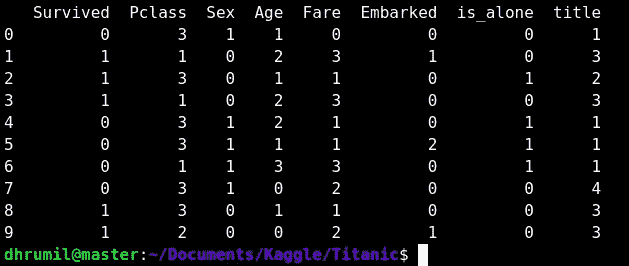
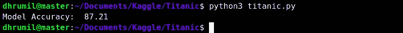
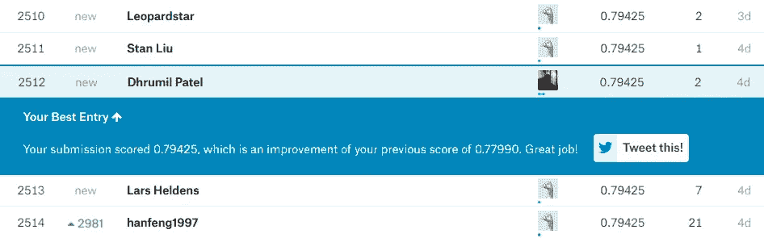

# 预测谁在泰坦尼克号灾难中幸存

> 原文：<https://towardsdatascience.com/your-first-kaggle-competition-submission-64da366e48cb?source=collection_archive---------5----------------------->

## 你的第一次 Kaggle 竞赛提交-简单的方法


Photo by [Joseph Barrientos](https://unsplash.com/@jbcreate_?utm_source=medium&utm_medium=referral) on [Unsplash](https://unsplash.com?utm_source=medium&utm_medium=referral)

谷歌公司(Google Inc .)旗下的 Kaggle 是一个面向数据科学和机器学习从业者的在线社区。换句话说，这是你的数据科学之家，在这里你可以找到数据集并参加比赛。然而；我努力完成我的第一份参赛作品，因为，我会说，*资源不当。我为这个比赛浏览了[内核](https://www.kaggle.com/c/titanic/kernels)(读作'*文章'*)，但是它们都不是为初学者设计的。我的意思是作为一个初学者，我不想看到我不能执行或解释的可视化，我只需要用简单的话来理解正在发生的事情。*

但我终于成功了。如果你在这里是因为你也在努力开始使用 Kaggle，那么我的朋友，这篇文章将会让你的一天变得精彩。没有不必要的代码行或可视化，只是一个直接的路径到你的第一次提交。

> 砖墙的存在是有原因的。不是为了阻挡我们；而是给我们一个机会来展示我们有多想要某样东西。砖墙的存在是为了阻止那些不够想要的人。他们在那里阻止其他人。
> 
> —兰迪·波许

**第 0 步——首先要做的事情**

为了配合这个【Kaggle 入门教程，你需要做两件事。主要是，朝[这个链接](https://www.kaggle.com/account/login)前进，给自己弄一个 Kaggle 账户。之后，请访问[此链接，参加 Kaggle 泰坦尼克号比赛。](https://www.kaggle.com/c/titanic)搞定了？太好了。我们都准备好了。让我们现在做一些真正的工作。

**第 1 步——了解您的数据**

一旦报名参赛，就可以在大赛首页找到数据。为了加载和执行非常基本的数据操作，我使用了 [Pandas](https://pandas.pydata.org/) ，这是一个 python 中的数据操作库。如果你还不知道，我建议你去看这个 [10 分钟指南](https://pandas.pydata.org/pandas-docs/stable/10min.html)来熟悉一下。

在机器学习中，数据主要分为两部分——训练和测试(第三部分是*验证*，但你现在不必关心这个)。训练数据用于训练我们的算法，测试数据用于检查我们的算法执行得有多好。训练数据和测试数据之间的分割比通常在 70-30 左右。因此，这里我们总共有 891 个训练条目和 417 个测试条目。通过写入加载数据将得到 12 列，如下所示。我们称之为特性。没什么新的，只是一个花哨的名字。*我鼓励你在前进之前至少浏览一遍数据。*

```
PassengerId : int     : Id
Survived    : int     : Survival (0=No; 1=Yes)
Pclass      : int     : Passenger Class
Name        : object  : Name
Sex         : object  : Sex
Age         : float   : Age
SibSp       : int     : Number of Siblings/Spouses Aboard
Parch       : int     : Number of Parents/Children Aboard
Ticket      : object  : Ticket Number
Fare        : float   : Passenger Fare
Cabin       : object  : Cabin
Embarked    : object  : Port of Embarkation
                        (C=Cherbourg; Q=Queenstown; S=Southampton)
```

此外，了解每个要素的数据类型也很重要。既然我们已经加载了数据并理解了它的样子，我们将继续进行特征工程。换句话说，衡量每个特征对我们输出的影响，也就是一个乘客是否幸存。

**第二步——特征工程**

正如我们所讨论的，特征工程是测量每个特征对输出的影响。但更重要的是，这不仅仅是使用现有的功能，而是创造新的功能，从而显著提高我们的产出。吴恩达说，“*想出特色是困难的，耗时的，需要专业知识。应用机器学习基本上是特征工程。*“我们将介绍我们正在使用的每个功能，以便您能够理解如何使用现有功能以及如何创建新功能。

2.1-乘客等级

显而易见，乘客的等级与存活率成正比。如果一个人比其他人更重要，他们会先从灾难中走出来。我们的数据告诉我们同样的故事。63%的人从 1 班幸存下来。所以这个功能肯定是有冲击力的。Pclass 列中的数据是完整的，因此不需要操作。



2.2——性

性别也很重要，并与存活率成正比。在这场悲剧中，妇女和儿童首先获救。我们可以看到 74%的女性得救了，而只有 18%的男性得救了。同样，这将影响我们的结果。



Feature 2 Output

2.3 —家庭规模

接下来的两列是 SibSp 和 Parch，它们与一个人是否幸存没有直接关系。这就是创建新功能的想法的来源。对于每一排/每一位乘客，我们将通过添加 SibSp + Parch + 1(他/她本人)来确定他/她的家庭规模。家庭规模从最小 1 人到最大 11 人不等，其中 4 人家庭的存活率最高，为 72%。


这似乎对我们的预测有很好的影响，但让我们更进一步，对人们进行分类，以检查他们是否独自在这艘船上。看了之后，它似乎对我们的产出有相当大的影响。



2.4 —已装船

乘客从哪个地方上船与生存有关(不一定)。那么，让我们来看看。在这个专栏里，有很多 NAs。为了解决这个问题，我们将 NAs 替换为“S ”,因为它是出现频率最高的值。



Feature 4 Output

2.5 —票价

该列中也有缺失的数据。我们不能以同样的方式处理每个特性。为了解决这个问题，我们将采用整个列的中间值。当您使用`qcut`进行切割时，将选择箱，以便您在每个箱中有相同数量的记录(相等的部分)。翻看产量，相当可观。



Feature 5 Output

2.6 —年龄

年龄有一些缺失值。我们将用(平均年龄减去平均[标准差](https://www.wikiwand.com/en/Standard_deviation))和(平均年龄加上平均标准差)之间的随机数来填充。之后，我们将它归入 5 个一组。这也有很好的影响。


Feature 6 Output

2.7 —名称

这个有点棘手。从姓名中，我们必须检索与该姓名相关联的头衔，即先生或上尉。为此，我们必须使用 Python 的*正则表达式*库([正则表达式操作指南](https://docs.python.org/3/howto/regex.html))。首先，我们从名字中获取标题，并将它们存储在一个名为 *title* 的新列表中。之后，让我们通过缩小到常见的标题来清理列表。


就是这样。我们已经清理了我们的功能，现在可以使用了。然而；在我们将数据输入 ML 算法之前，还有一个步骤。ML 算法的特点是它们只接受数值而不接受字符串。因此，我们必须将数据映射为数值，并将列转换为整数数据类型。

**步骤 3 —映射数据**

映射数据很容易。通过浏览代码，你会知道它是如何工作的。一旦完成，现在我们必须选择使用哪些功能。特征选择与特征创建同样重要。我们将删除不必要的栏目，这样就不会影响我们的最终结果。



Final data that we will feed to ML algorithm

就是这样。你已经完成了最难的部分。看看你的数据，看起来真漂亮。现在，我们只需要预测我们的结果，这很容易。或者至少我会让你容易理解。


Jack, come on buddy, we’re almost there

**步骤 4 —预测**

正如我们所讨论的，我们需要训练和测试数据。是的，德鲁米尔，我们拿到了，现在怎么办？好极了。现在我们需要训练我们的模型。为此，我们需要提供两部分的数据——X 和 y。

```
X : X_train : Contains all the features
Y : Y_train : Contains the actual output (Survived)
```

为了进一步阐述，我们需要告诉我们的模型我们正在寻找这个输出。所以，它会这样训练。例如，你的朋友外出购物，你想要一副护目镜，你给你的朋友发了一张护目镜的照片，说你也想要一副。那是训练。你正在训练他/她，所以他可以通过解释特征(飞行员、旅行者)和提供准确的输出(护目镜的图片)来带来类似的护目镜。

我们已经分离了数据，现在我们调用我们的分类器，借助 scikit-learn 库的`.fit`方法拟合数据(训练),并使用`.predict`方法预测测试数据的输出。



注意——由于本教程是为初学者编写的，所以我不包括其他分类器，但过程是一样的。调用分类器，拟合数据，预测。以防你想进一步探索。还有其他几个分类器，但我使用决策树，因为根据我的知识，它最适合这个数据集。要了解更多关于决策树的知识，请参考[这篇文章](https://www.digitalvidya.com/blog/a-in-depth-decision-tree-learning-tutorial-to-get-you-started/)。


Yes, Tony, that’s great for the first time

**第 5 步——你的第一次提交**

最后，提交我们的输出。我们的输出`.csv`文件应该只有两列——乘客 Id 和幸存者——正如竞争页面上提到的。创建并提交到竞赛页面，我的提交得分为 0.79425，在我写这篇文章的时候排名前 25%。



The position I got on the leaderboard, where do you sit?

我鼓励你探索不同的功能，以提高你的模型准确性和你在这场比赛中的排名。我很乐意听到你说你已经进入了前 5%或者更好，前 1%。你会在我的 [GitHub 库](https://github.com/Dhrumilcse/Surviving-from-the-Titanic)上找到完整的代码。

**尾注**

希望这篇文章已经回答了你的首要问题“如何从 Kaggle 开始？”充足的知识、良好的资源和学习新事物的意愿是你前进所需的一切。你不必一开始就是主人。这一切都来自于坚持。如果你正在读这篇文章，你有足够的精力去实现你的目标，无论如何都不要停下来。如果你对这篇文章有疑问，请通过[电子邮件](http://dhrumil.xyz)或[推特](https://twitter.com/dhrumilcse)甚至 [Linkedin](https://www.linkedin.com/in/dhrumilcse/) 联系我。即使你没有任何疑问，我仍然希望在我的收件箱里看到你有价值的反馈或建议，如果有的话。

快乐学习。