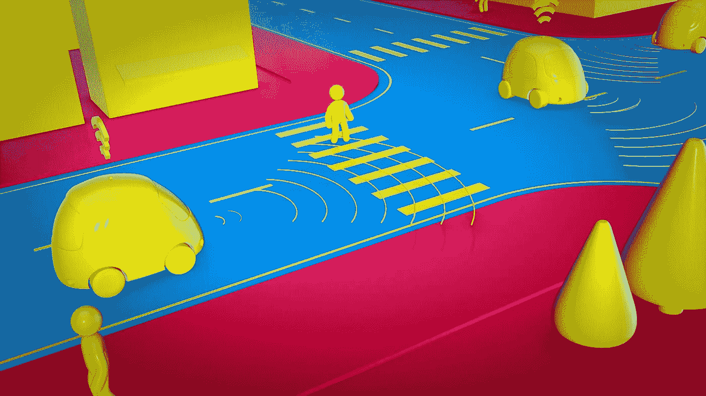
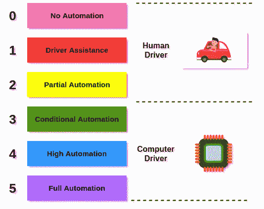
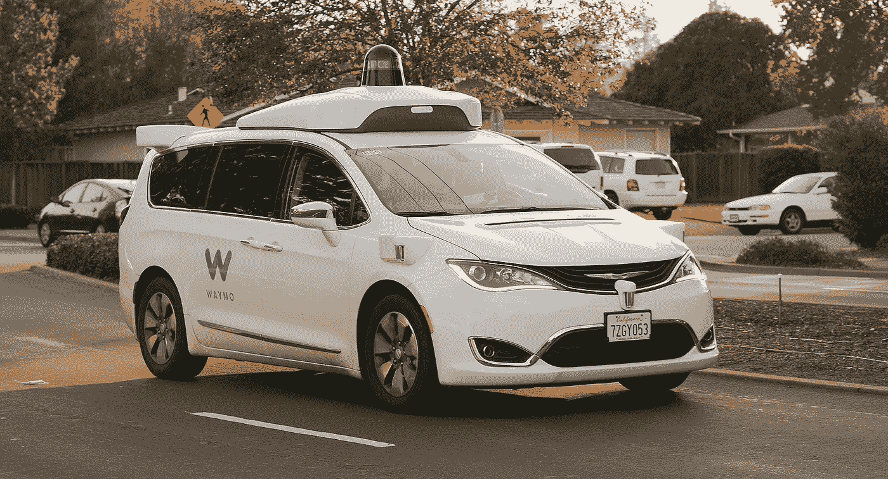
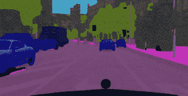
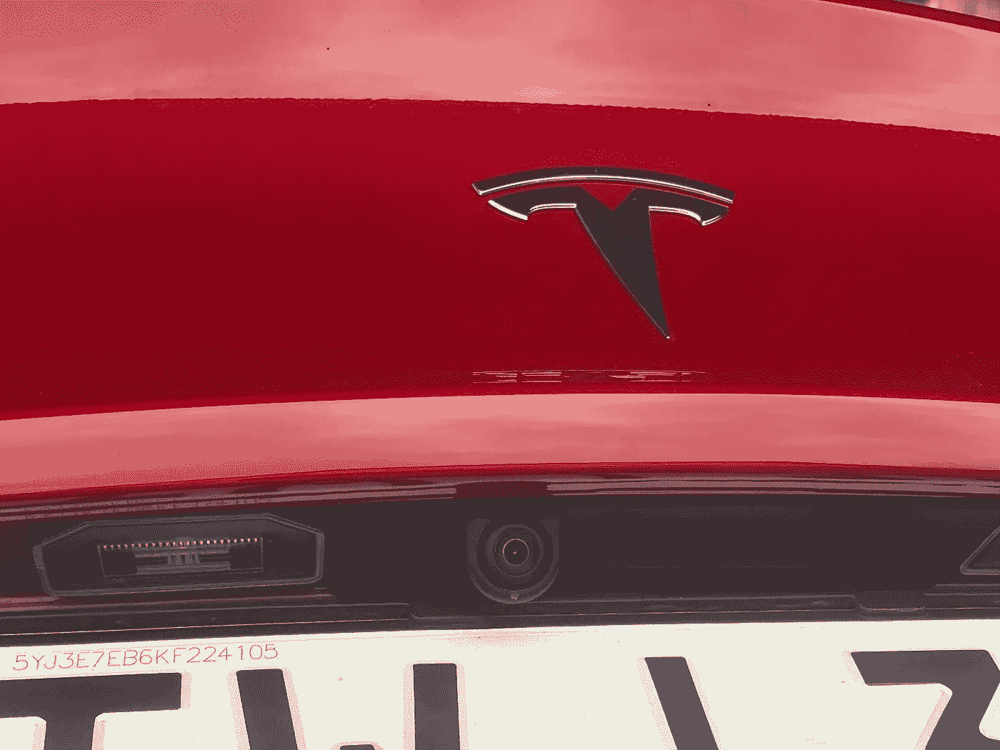

# 你的 2020 年自动驾驶汽车人工智能指南

> 原文：<https://towardsdatascience.com/your-guide-to-ai-for-self-driving-cars-in-2020-218289719619?source=collection_archive---------3----------------------->

## 深度学习是基础

[Source](https://pixabay.com/images/id-4343635/)

> 想获得灵感？快来加入我的 [**超级行情快讯**](https://www.superquotes.co/?utm_source=mediumtech&utm_medium=web&utm_campaign=sharing) 。😎

[自动驾驶汽车](https://en.wikipedia.org/wiki/Self-driving_car)，也被称为*自主*汽车，是能够在很少或没有人类输入的情况下驾驶的汽车。一辆完全自动驾驶的汽车将能够独自把你从洛杉矶开到纽约，而你可以坐下来，放松，享受平稳的旅程。

自动驾驶汽车最近受到了极大的关注，这在很大程度上是由于人工智能的技术繁荣。就在过去几年里，人工智能已经从几乎被遗忘变成了全世界许多组织最大的研发投资。

简而言之，人工智能赋予了我们自动化大量手工工作的能力，这些工作以前需要某种形式的人类知识或技能。在自动驾驶汽车的情况下，人工智能可以帮助成为汽车的大脑，做一些事情，如自动检测车辆周围的人和其他汽车，停留在车道上，转换车道，并跟随 GPS 到达最终目的地。

那么所有这些是如何工作的呢？科学家、工程师和软件开发人员是如何给计算机编程让它们驾驶汽车的？

# 自动驾驶技术概述

## 自治程度

谈到自动驾驶汽车，大多数技术专家都会提到 [*自主级别*](https://www.iotforall.com/5-autonomous-driving-levels-explained/) *。*自动驾驶汽车的自主水平指的是相对于人类，有多少驾驶是由计算机完成的。级别越高，计算机完成的驾驶就越多。请查看下面的插图。

*   **0 级**:汽车的所有功能和系统都由人控制
*   **级别 1:** 像巡航控制、自动刹车或检测盲点中的东西这样的小事情可能由计算机控制，一次一个
*   第二级:电脑可以同时执行至少两项自动化功能，比如加速和转向。安全操作和紧急程序仍然需要人
*   **Level 3** :电脑可以同时控制汽车的所有关键操作，包括大多数情况下的加速、转向、停车、导航和驻车。仍然希望有人类驾驶员在场，以防他们被警告有紧急情况
*   **Level 4** :这款车是全自动驾驶的，在*的一些*驾驶场景中，完全不需要人类驾驶员。例如，汽车可以在晴天或阴天完全自动驾驶，但在下雪和车道被覆盖时就不行
*   第五关:这辆车完全能够在任何情况下自动驾驶

我们今天在新闻中听到的大多数自动驾驶汽车，如特斯拉和 Waymo 制造的汽车，都处于第 2 级。他们已经达到了可以自己驾驶的水平，但是仍然需要人类驾驶员来确保车辆的安全操作。

## 自驾的各个阶段

今天的自动驾驶汽车使用各种尖端硬件和软件技术的组合来执行驾驶。典型的自动驾驶系统将经历 3 个阶段来执行其驾驶。出于本文的目的，我们将这些*称为传感*、*理解*和*控制*。

在*感测*阶段，摄像机和各种传感器用于观察汽车周围的任何物体，如其他汽车、人、自行车和动物。真的是车的*眼睛*，不断看到周围的一切，360 度。

在*理解*阶段，各种人工智能算法，主要是计算机视觉，被用来处理来自传感器的信息。例如，我们可能有一个计算机视觉系统，它处理来自汽车周围摄像头的视频，以检测汽车周围道路上的所有其他汽车。理想情况下，这种系统能够检测出汽车的位置、大小、速度和行驶方向。实际上，这些系统被设计用来绘制汽车周围的整个环境。所有这些信息都将被输入自动驾驶的*控制*阶段。

在*控制*阶段，自动驾驶系统将处理计算机视觉系统能够提取的所有信息。基于这些信息，它将控制汽车。通过了解所有的周围环境，汽车周围有什么以及它是如何变化的，控制系统的工作就是安全地移动汽车并驶向目的地。如果前车减速，它会启动刹车，如果需要退出，它会切换车道，如果下雨，它会打开雨刷。

我们将更详细地了解每个阶段。

# (1)传感器

当我们人类开车时，我们用眼睛看周围的东西。自动驾驶汽车也需要眼睛来看。自动驾驶汽车的眼睛是它的各种传感器。大多数自动驾驶汽车使用 3 种不同传感器中的一种或某种组合:摄像头、雷达和[激光雷达](https://en.wikipedia.org/wiki/Lidar)。

## 摄像机

相机和我们自己的视力最相似。他们捕捉连续的照片，也就是像我们一样通过镜头拍摄视频。就像我们自己的视力一样，如果汽车的摄像头可以捕捉高质量的视频——高分辨率和高 FPS，这对驾驶有很大的帮助。

无人驾驶汽车将在每一面都放置摄像头:前、后、左、右等等，以便能够全方位地看到周围的一切。有时，会混合使用不同类型的相机——一些广角相机有更宽的视野，一些窄但高分辨率的相机看得更远。

使用相机的好处是它们是世界最自然的视觉呈现。汽车看到的和人类司机看到的完全一样——而且更多，因为它的内部计算机可以同时通过所有的摄像头进行观察。相机也很便宜。

缺点是相机捕捉的数据，即图像和视频，无法让我们了解其他物体离汽车有多远，或者它们的移动速度有多快。摄像机在晚上也很难使用，因为我们根本看不到太多东西。

## 雷达

雷达传统上被用于探测移动物体，如飞机和天气状况。它的工作原理是以脉冲形式发射无线电波。一旦这些波击中一个物体，它们就会反弹回传感器，给出物体的速度和位置数据。

在自动驾驶汽车中，雷达用于检测汽车周围各种物体的速度和距离。这是对相机的完美补充，相机可以看到物体是什么，但不能精确地知道它们在哪里(有多远)。就像摄像头一样，雷达将在汽车周围 360 度使用。

在光线较暗的情况下，如夜间驾驶，雷达也是摄像头的补充。因为雷达发射信号，所以不管是凌晨 3 点还是中午，信号都以完全相同的方式移动和反射。这与相机形成了鲜明的对比，因为光线的原因，相机在晚上真的不能很好地工作。

雷达的缺点是这种技术目前的精确度有限。当前的雷达传感器提供非常有限的分辨率。因此，雷达确实给了我们其他物体的距离、位置和速度的概念，但这种概念有些模糊——不像我们希望的那样准确。

## 激光雷达

激光雷达代表光探测和测距。它的工作原理是发出光束，然后计算光线击中物体并反射回激光雷达扫描仪所需的时间。然后可以使用光速计算到物体的距离——这些被称为 [*飞行时间*](https://en.wikipedia.org/wiki/Time_of_flight) 测量。

A Waymo car with LiDAR sensor on top. [Source](https://en.wikipedia.org/wiki/Self-driving_car#/media/File:Waymo_Chrysler_Pacifica_in_Los_Altos,_2017.jpg)

激光雷达传感器通常放置在汽车顶部，每秒发射数千束光束。基于收集的数据，可以创建称为 [*点云*](https://en.wikipedia.org/wiki/Point_cloud) 的 3D 表示来表示汽车周围的环境。

激光雷达传感器的最大优势是其准确性。一个好的激光雷达传感器可以识别距离 100 米远的物体仅几厘米的细节。例如，据说 [Waymo 的激光雷达系统甚至可以检测到*一个人正在哪个方向*行走](https://www.usatoday.com/story/tech/2018/03/25/waymo-ceo-krafcik-has-lot-confident-his-tech-would-have-avoided-deadly-uber-accident/456819002/)，基于他们来自激光雷达的精确 3D 点云。

激光雷达的缺点是成本，目前比相机和雷达贵 10 倍。

# (2)计算机视觉

自动驾驶系统的理解阶段是大脑——它是大多数主要处理发生的地方。在理解阶段，目标是获取来自传感器的所有信息并对其进行解释。这种解释的目的是收集有用的信息，可以帮助安全地控制汽车。这些信息可以是:

*   我周围的物体是什么，它们在哪里，它们是如何运动的？所以我们的系统可能会检测到像人、汽车和动物这样的东西
*   我在哪里？该系统将确定所有车道的位置，以及汽车是否完全在正确的车道上，或者汽车相对于道路上其他汽车的位置(太近、盲点等)

在 2019 年，这些信息主要是通过人工智能获得的，更具体地说，是使用计算机视觉的深度学习。大型神经网络被训练用于诸如[图像分类](https://paperswithcode.com/task/image-classification)、[物体检测](https://paperswithcode.com/task/object-detection)、[场景分割](https://paperswithcode.com/task/semantic-segmentation)和[车道检测](/tutorial-build-a-lane-detector-679fd8953132)的任务。然后，网络会针对汽车的计算单元进行优化，以便能够处理自动驾驶所需的实时速度。

Semantic Segmentation for Self-Driving. [Source](https://github.com/meetshah1995/pytorch-semseg)

请记住，自动驾驶汽车可能有来自多个不同来源的数据:摄像头、雷达和激光雷达。因此，所有这些常规的计算机视觉任务都可以应用于各种传感器数据，从而以非常全面的方式收集关于汽车周围环境的信息。这也产生了一种冗余——如果一个系统出现故障，另一个系统仍有机会进行检测。

使用深度学习来完成这些任务的好处在于，网络是可训练的。我们给他们的数据越多，他们得到的就越多。公司正在大力利用这一点——自动驾驶汽车被放在路上，车上有人类司机，他们可以不断收集新的训练数据来提高自己。

计算机视觉真的是自动驾驶汽车系统的核心。一个理想的系统将能够准确地检测和量化汽车周围环境的每一个方面——移动物体、静止物体、路标、路灯——绝对是一切。所有这些信息都被用来决定汽车下一步应该如何行驶。

# (3)控制

一旦计算机视觉系统处理了来自传感器的数据，自动驾驶汽车现在就拥有了驾驶所需的所有信息。控制阶段的作用是根据理解阶段提取的信息，找出如何最好地驾驶汽车。

描述自动驾驶汽车如何导航道路的技术术语是*路径规划*。路径规划的目标是使用计算机视觉系统捕获的信息安全地引导汽车到达目的地，同时避开障碍物并遵循道路规则。

汽车将基于 GPS 了解其目标目的地——来自 GPS 的数据包含*长距离路径*的信息。为了向其目标目的地移动，自动驾驶系统将首先“规划路径”，即计算到达其目标的最佳(读取:最短时间)路径。这意味着决定走哪条路，开多快。

一旦确定了最佳路径，系统的下一步就是确定最佳可能的“下一步行动”。该下一步移动将再次总是基于沿着最优路径到达其目标目的地。下一步可能是加速、刹车、变换车道或任何其他常规驾驶动作。

同时，它的任何举动都必须遵守道路规则，维护汽车乘客的安全。如果计算机视觉检测到前方有红灯，那么汽车应该减速或停下来(取决于它有多远)。

所有这些控制都直接发送到汽车的机械控制。如果汽车需要变换车道，那么一个将方向盘转动一个非常具体的量的命令被发送到汽车的适当部分。如果汽车需要刹车，就会发出命令，以所需的精确压力踩下刹车，减速到足以遵循最佳路径，同时保持安全并遵守道路规则。

这个感知、理解和控制的过程尽可能频繁和精确地重复，直到汽车到达目的地。

# 自动驾驶领域的大玩家

自动驾驶汽车和更普遍的自动驾驶汽车有可能成为一个数万亿美元的产业。伴随着巨大的机遇而来的是激烈的竞争，而这一领域并不缺乏这种竞争。有几个大玩家。

## 特斯拉

特斯拉，尤其是埃隆·马斯克(Elon Musk)在电视上时，对他们的汽车没有使用激光雷达摄像头感到自豪。相反，他们主要依靠位于汽车周围的 8 个标准摄像头。然后，他们训练一个多头卷积神经网络(CNN)来检测汽车周围的一切，并相应地执行导航。

特斯拉自动驾驶技术的真正威力在于它的软件。通过软件更新，可以快速轻松地将汽车上运行的模型更新部署到全球所有特斯拉汽车上。快速简单的软件更新意味着特斯拉汽车在不断改进，用户无需支付任何额外费用或注意力。

特斯拉还利用其自动驾驶车队进行数据收集。所有配有适当摄像头的特斯拉汽车都用于收集新的训练数据。所有这些数据都用于重新训练模型，并再次部署到整个车队。这是一个自动化的迭代管道，用于持续改进自治系统。

A rear camera on a Tesla car, used for self-driving. [Source](https://commons.wikimedia.org/wiki/File:Tesla_Model_3_rear_camera.jpg)

## **Waymo**

Waymo 是谷歌旗下的自动驾驶汽车公司。Waymo 的一大优势是，他们为自己的汽车制造自己的专有硬件。这包括传感器(相机、雷达和激光雷达)以及用于运行计算机视觉推理的定制芯片。这使得 Waymo 汽车能够实现最佳的硬件和软件优化。

通常，激光雷达的一个大缺点是成本。然而，Waymo 声称已经开发了自己的激光雷达传感器，比竞争对手便宜 90%。这种传感器据称还能探测到 300 米外的物体。如果在这个范围内保持任何像样的精度水平，那么它为 Waymo 汽车提供了超越 Telsa 的巨大优势。普通相机根本看不到那么远。

Waymo 还在寻求与包括克莱斯勒、丰田、雷克萨斯和捷豹在内的大型汽车公司建立合作伙伴关系。

## 优步和 Lyft

优步和 Lyft 都是非常受欢迎的打车公司，处于从无人驾驶汽车中获利的绝佳位置。他们正在建立自己的自动驾驶汽车车队，配备摄像头、雷达和激光雷达——在 Lyft 的情况下是多个激光雷达。

与传统汽车公司不得不出售配备自动驾驶功能的整车(价格昂贵)不同，优步和 Lyft 的目标是建立一支自动驾驶汽车车队，供他们的拼车服务使用。这将有效地消除对人类驾驶员的需求，从而降低成本。任何地方的任何人都可以订购无人驾驶汽车，价格与呼叫优步或 Lyft 差不多。它变成了自动驾驶服务。

# 我们离 5 级自驾还有多远？

在看到所有这些未来技术和正在取得的重大进步后，人们不禁要问:我们离全面的 5 级自动驾驶汽车还有多远？

看情况。

一些人认为这项技术不到几年就能实现。[埃隆·马斯克声称](https://www.theverge.com/2019/4/22/18510828/tesla-elon-musk-autonomy-day-investor-comments-self-driving-cars-predictions)“一年后，我们将拥有超过一百万辆完全自动驾驶的汽车”。这当然是可能的。

随着数十亿美元的资金被投入到尖端研究中，人工智能正在以令人难以置信的速度发展。用于传感和计算的硬件正在改善，特别是因为公司现在正在投资用于自动驾驶的定制硬件。因此，这项技术看起来肯定是朝着正确的方向发展。

如果我们从技术领域的另一个角度来看，事情会变得更加复杂。

为了让自动驾驶汽车被人们接受并在日常生活中使用，他们真的需要尽善尽美。当另一个人犯了一个小错误时，我们人类会宽容得多，但当计算机或机器犯了错误时，我们会严厉批评。

电脑应该只是工作，没有任何错误。他们毕竟是机器，所以期望值要高得多。我们常常期望机器比我们自己精确一个数量级或者更精确。门槛只是高了很多。

除此之外，我们还有法律方面的考虑。你可以打赌，一旦自动驾驶完全上路，新的法律法规将不得不出台。

万一发生事故，谁应负责任？既然是自动驾驶，汽车现在应该能开得更快吗？人类必须一直呆在车里吗？这些都是自动驾驶汽车在某个时候必须回答的问题，才能真正在第 5 级全面上路。

总的来说，自动驾驶汽车对社会来说是一大利好。当汽车成为自动驾驶时，更少的污染、更少的交通、更高的效率和更安全的驾驶都是可以预期的。这项技术正朝着正确的方向发展，并有望带来一个光明、自主的未来。