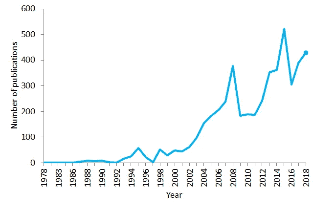
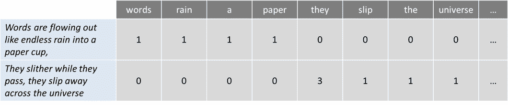
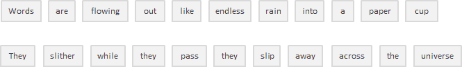
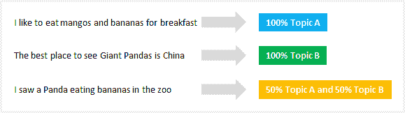
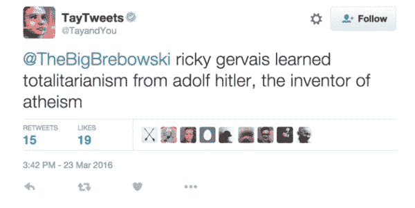

# 自然语言处理(NLP)指南

> 原文：<https://towardsdatascience.com/your-guide-to-natural-language-processing-nlp-48ea2511f6e1?source=collection_archive---------0----------------------->

## 机器如何处理和理解人类语言

我们表达的一切(无论是口头还是书面)都携带着大量的信息。我们选择的主题，我们的语气，我们选择的词语，每一件事都增加了某种类型的信息，可以被解读并从中提取价值。理论上，我们可以利用这些信息理解甚至预测人类行为。

但有一个问题:一个人可能会在一份声明中产生数百或数千个单词，每个句子都有其相应的复杂性。如果你想在一个给定的地理范围内扩展和分析数百、数千或数百万的人或声明，那么情况就不可收拾了。

从对话、声明甚至推文中生成的数据是非结构化数据的例子。**非结构化数据**并不完全符合关系数据库的传统行列结构，而是代表了现实世界中可用的绝大多数数据。这是混乱和难以操纵的。然而，由于机器学习等学科的进步，关于这个话题正在发生一场大革命。如今，人们不再试图根据关键词来解释文本或演讲(老式的机械方法)，而是理解这些词背后的含义(认知方法)。这样就有可能检测出像反语这样的修辞，甚至进行情感分析。

> **自然语言处理**或 NLP 是人工智能的一个领域，它赋予机器阅读、理解人类语言并从中获取意义的能力。

它是一个专注于数据科学和人类语言之间的交互的学科，并且正在扩展到许多行业。如今，由于数据访问的巨大改进和计算能力的增强，NLP 正在蓬勃发展，这使得从业者能够在医疗保健、媒体、金融和人力资源等领域取得有意义的成果。

# **自然语言处理的使用案例**

简单地说，NLP 代表了像语音或文本这样的自然人类语言的自动处理，尽管这个概念本身很吸引人，但这项技术背后的真正价值来自用例。

NLP 可以帮助你完成很多任务，应用领域似乎每天都在增加。让我们举一些例子:

*   NLP 能够根据电子健康记录和患者自己的语音识别和预测疾病。这种能力正在从心血管疾病到抑郁症甚至精神分裂症的健康状况中进行探索。例如，亚马逊理解医疗是一项使用自然语言处理从患者笔记、临床试验报告和其他电子健康记录中提取疾病状况、药物和治疗结果的服务。
*   组织可以通过识别和提取社交媒体等来源中的信息来确定客户对服务或产品的看法。这种 [**情绪分析**](/sentiment-analysis-concept-analysis-and-applications-6c94d6f58c17) 可以提供大量关于客户选择及其决策驱动因素的信息。
*   IBM 的一位发明家开发了一种认知助手，它像一个个性化的搜索引擎一样工作，通过学习你的一切，然后在你需要的时候提醒你一个名字、一首歌或任何你不记得的事情。
*   像雅虎和谷歌这样的公司用 NLP 过滤和分类你的电子邮件，通过分析流经他们服务器的电子邮件中的文本，在垃圾邮件进入你的收件箱之前阻止它们。
*   为了帮助**识别假新闻**，麻省理工学院的 [NLP 小组](http://nlp.csail.mit.edu/)开发了一个新系统来确定消息来源是否准确或带有政治偏见，检测新闻来源是否可信。
*   亚马逊的 Alexa 和苹果的 Siri 是智能**语音驱动界面**的例子，它们使用 NLP 来响应语音提示，并做任何事情，如找到特定的商店，告诉我们天气预报，建议去办公室的最佳路线或打开家里的灯。
*   洞察正在发生的事情和人们正在谈论的话题对 [**金融交易员**](https://news.efinancialcareers.com/nl-en/331386/charles-elkan-goldman-sachs-machine-learning) 来说是非常有价值的。NLP 被用来跟踪新闻，报道，关于公司间可能合并的评论，一切都可以被整合到一个交易算法中以产生巨大的利润。记住:买谣言，卖新闻。
*   NLP 还被用于 [**人才招聘**](https://www.forbes.com/sites/forbeshumanresourcescouncil/2018/09/27/how-ai-makes-recruiting-more-human/#7531fc116ba4) 的搜索和选择阶段，识别潜在雇员的技能，并在他们活跃在就业市场之前发现前景。
*   在 IBM Watson NLP 技术的支持下， [LegalMation](https://www.legalmation.com/) 开发了一个平台来自动化日常**诉讼任务**并帮助法律团队节省时间、降低成本和转移战略重点。

自然语言处理在医疗保健行业发展尤为迅速。在医疗保健组织越来越多地采用电子健康记录的同时，这项技术正在改善护理服务、疾病诊断并降低成本。事实上，临床记录可以得到改善，这意味着患者可以通过更好的医疗保健得到更好的理解和受益。目标应该是优化他们的体验，一些组织已经在这方面努力了。

Number of publications containing the sentence “natural language processing” in PubMed in the period 1978–2018\. As of 2018, PubMed comprised more than 29 million citations for biomedical literature

像 [Winterlight Labs](https://winterlightlabs.com/) 这样的公司通过语音监测认知障碍，在阿尔茨海默病的治疗方面取得了巨大进展，他们还可以支持各种中枢神经系统疾病的临床试验和研究。遵循类似的方法，斯坦福大学开发了一个聊天机器人治疗师，目的是帮助患有焦虑和其他疾病的人。

但是围绕这个主题有严重的争议。几年前，微软展示了通过分析搜索引擎查询的大量样本，他们可以[识别出患有胰腺癌的互联网用户](https://www.nytimes.com/2016/06/08/technology/online-searches-can-identify-cancer-victims-study-finds.html)甚至在他们收到该疾病的诊断之前。用户对这样的诊断会有什么反应？如果你被检测为假阳性会怎么样？(意思是即使你没有患病，也可以被诊断出患有这种疾病)。这让人想起了谷歌流感趋势的案例，该趋势在 2009 年被宣布能够预测流感，但后来由于准确性低和无法满足其预测率而消失。

NLP 可能是未来有效临床支持的关键，但短期内仍有许多挑战要面对。

# **基本的自然语言处理给你的非自然语言处理的朋友留下深刻印象**

我们现在面对的 NLP 的主要缺点是语言非常复杂。理解和操作语言的过程极其复杂，因此在将所有东西结合在一起之前，通常会使用不同的技术来应对不同的挑战。像 Python 或 R 这样的编程语言经常被用来执行这些技术，但是在深入研究代码行之前(这将是另一篇文章的主题)，理解它们下面的概念是很重要的。让我们总结并解释一下 NLP 中定义术语词汇表时最常用的一些算法:

## **袋字**

是一个常用的模型，允许您计算一段文本中的所有单词。基本上，它为句子或文档创建一个出现矩阵，不考虑语法和词序。这些词频或出现次数然后被用作训练分类器的特征。

举个简短的例子，我引用了甲壳虫乐队的歌曲《穿越宇宙》的第一句话:

> 文字像无尽的雨水一样流入纸杯，
> 
> 它们滑过，滑过宇宙

现在让我们数数单词:

这种方法可能反映了几个缺点，如缺乏语义和上下文，以及阻止单词(如“the”或“a”)的事实给分析增加了噪声，并且一些单词没有相应地加权(“universe”的权重小于单词“them”)。

为了解决这个问题，一种方法是根据单词在所有文本(不仅仅是我们正在分析的文本)中出现的频率来重新调整单词的频率，以便像“the”这样在其他文本中也经常出现的频繁单词的分数会受到惩罚。这种评分方式被称为**“词频—逆文档频率”(TFIDF)** ，通过权重来提高单词包。通过 TFIDF，文本中频繁出现的术语会得到“奖励”(如我们示例中的单词“他们”)，但如果这些术语在我们包含在算法中的其他文本中频繁出现，它们也会受到“惩罚”。相反，这种方法突出显示并“奖励”考虑所有文本的独特或罕见的术语。然而，这种方法仍然没有上下文和语义。

## **标记化**

是将连续文本分割成句子和单词的过程。本质上，它的任务是将文本切割成称为*记号*的片段，同时丢弃某些字符，如标点符号。按照我们的例子，标记化的结果将是:

很简单，对吧？虽然在这种情况下，以及在像英语这样的用空格分隔单词的语言(称为分段语言)中，这看起来很基本，但并不是所有语言的行为都是一样的，如果你仔细想想，空格本身并不足以让英语执行正确的标记化。在空格处进行拆分可能会将应该被视为一个标记的内容分开，例如某些名称(例如旧金山或纽约)或借用的外国短语(例如自由放任)。

**标记化也可以去除标点符号**，简化了正确分词的过程，但也引发了可能的复杂性。对于缩写后面的句点(例如 dr .)，该缩写后面的句点应被视为同一令牌的一部分，不能删除。

在处理包含大量连字符、括号和其他标点符号的生物医学文本领域时，标记化过程可能会特别成问题。

关于标记化的更深入的细节，你可以在[这篇文章](https://www.ibm.com/developerworks/community/blogs/nlp/entry/tokenization?lang=en)中找到很好的解释。

## **停止文字删除**

包括去掉英语中常见的冠词、代词和介词，如“and”、“the”或“to”。在这个过程中，一些看起来对 NLP 目标提供很少或没有价值的非常常见的单词被过滤并从要处理的文本中排除，因此移除了对相应文本没有信息性的广泛和频繁的术语。

通过在预定义的关键字列表中执行查找，可以安全地忽略停用词，从而释放数据库空间并缩短处理时间。

没有通用的停用词列表。这些可以预先选择或从头开始构建。一种可能的方法是从采用预定义的停用词开始，然后将词添加到列表中。然而，似乎过去的总趋势是从使用大的标准停用词表到根本不使用词表。

问题是停用词删除可以删除相关信息并修改给定句子中的上下文。例如，如果我们正在执行情感分析，如果我们删除了像“不”这样的停用词，我们可能会使我们的算法偏离轨道。在这些情况下，您可以选择一个最小的停用词列表，并根据您的特定目标添加额外的术语。

## **词干**

指的是为了去除词缀(词根的词汇附加物)而对单词的结尾或开头进行切片的过程。

> 附在单词开头的词缀称为*前缀*(如单词“astrobiology”中的“astro”)，附在单词末尾的词缀称为*后缀*(如单词“helpful”中的“ful”)。

问题是词缀可以创造或扩展同一个词的新形式(称为*屈折*词缀)，甚至可以自己创造新词(称为*派生*词缀)。在英语中，前缀总是派生的(词缀创造了一个新词，如单词“生态系统”中的前缀“生态”)，但后缀可以是派生的(词缀创造了一个新词，如单词“吉他手”中的后缀“ist”)或屈折的(词缀创造了一个新的单词形式，如单词“faster”中的后缀“er”)。

好的，那么我们如何区分这两者的不同并切掉正确的部分呢？

一种可能的方法是考虑常见词缀和规则的列表(Python 和 R 语言有不同的包含词缀和方法的库)并基于它们执行词干提取，但当然这种方法存在局限性。由于词干分析器使用算法方法，词干分析过程的结果可能不是一个实际的单词，甚至不会改变单词(和句子)的意思。为了抵消这种影响，您可以通过添加或删除词缀和规则来编辑那些预定义的方法，但是您必须考虑到，您可能在一个方面提高了性能，而在另一个方面却降低了性能。总要纵观全局，测试你的模型的性能。

那么，如果词干有严重的局限性，我们为什么要使用它呢？首先，它可以用来纠正单词的拼写错误。**词干分析器使用简单，运行速度非常快**(它们在字符串上执行简单的操作)，如果速度和性能在 NLP 模型中很重要，那么词干分析器无疑是一个不错的选择。请记住，我们使用它的目的是提高我们的表现，而不是作为一个语法练习。

## **词汇化**

目标是将一个单词简化为其基本形式，并将同一个单词的不同形式组合在一起。例如，将过去时态的动词改为现在时态(如“got”改为“go”)，统一同义词(如“best”改为“good”)，从而规范与词根意义相近的词。虽然它似乎与词干化过程密切相关，但词汇化使用不同的方法来获得单词的词根形式。

> 词汇化将单词解析为它们的字典形式(称为*词条*)，为此它需要详细的字典，算法可以在其中查看单词并将单词链接到它们相应的词条。

比如“*跑”、“跑”*、*“跑”*这些词都是“*跑”*这个词的形式，所以“*跑”*就是前面所有词的引理。

词汇化还考虑了单词的上下文，以便**解决其他问题，如消歧**，这意味着它可以根据特定的上下文区分具有不同含义的相同单词。想想像“蝙蝠”(可以对应于动物或棒球中使用的金属/木制球杆)或“银行”(对应于金融机构或水体旁边的土地)这样的词。通过为一个单词(无论是名词、动词等等)提供一个词性参数，就有可能为该单词在句子中定义一个角色并消除歧义。

正如您可能已经想到的，与执行词干处理相比，词汇化是一项更加耗费资源的任务。同时，由于它比词干法需要更多的语言结构知识，它**比建立或修改词干算法需要更多的计算能力**。

## **话题建模**

是一种揭示文本或文档集合中隐藏结构的方法。本质上，它对文本进行聚类，根据内容发现潜在主题，处理单个单词，并根据它们的分布为它们赋值。这种技术是基于这样的假设，即每个文档都是由主题混合而成的，每个主题都是由一组单词组成的，这意味着如果我们能发现这些隐藏的主题，我们就能解开文本的含义。

从话题建模技术的论域来看，**潜在狄利克雷分配(LDA)** 可能是最常用的。这种相对较新的算法(发明于不到 20 年前)作为一种无监督的学习方法，可以发现一组文档背后的不同主题。在像这样的**无监督学习**方法中，没有输出变量来指导学习过程，数据由算法探索以发现模式。更具体地说，LDA 通过以下方式查找相关单词组:

1.  将每个单词分配给一个随机的主题，用户可以定义希望发现的主题数量。您不需要定义主题本身(您只需要定义主题的数量)，算法会将所有文档映射到这些主题，使得每个文档中的单词大部分都被这些虚构的主题捕获。
2.  该算法迭代地遍历每个单词，并且考虑单词属于主题的概率以及文档将由主题生成的概率，将单词重新分配给主题。这些概率被计算多次，直到算法收敛。

与其他执行硬聚类(其中主题是不连续的)的聚类算法不同，LDA 将每个文档分配给主题的混合，这意味着每个文档可以由一个或多个主题描述(例如，文档 1 由 70%的主题 A、20%的主题 B 和 10%的主题 C 描述)，并反映更真实的结果。

主题建模对于文本分类、构建推荐系统(例如，根据你过去的阅读向你推荐书籍)甚至检测在线出版物的趋势都非常有用。

# **未来是什么样子的？**

目前，NLP 正在努力检测语言意义的细微差别，无论是由于缺乏上下文，拼写错误还是方言差异。

2016 年 3 月，微软推出了人工智能聊天机器人 *Tay* ，作为 NLP 实验在 Twitter 上发布。这个想法是，随着越来越多的用户与 Tay 对话，它会变得越来越聪明。结果是，16 个小时后，Tay 因其种族主义和辱骂性的评论而被删除:

微软从自己的经历中吸取了教训，几个月后发布了第二代英语聊天机器人 [*Zo*](https://www.zo.ai/) ，它不会犯与上一代相同的错误。Zo 使用一系列创新方法来识别和产生对话，其他公司正在探索能够记住特定个人对话细节的机器人。

尽管 NLP 的未来看起来极具挑战性并且充满威胁，但该学科正在以非常快的速度发展(可能是前所未有的),并且我们很可能在未来几年内达到一定的发展水平，这将使复杂的应用成为可能。

感谢[Jesus del Valle](https://medium.com/@yeysus)、 [Jannis Busch](https://medium.com/@JannisBusch) 和 [Sabrina Steinert](https://medium.com/@Binsi) 的宝贵意见

> 对这些话题感兴趣？在 [Linkedin](https://www.linkedin.com/in/lopezyse/) 或 [Twitter](https://twitter.com/lopezyse) 上关注我