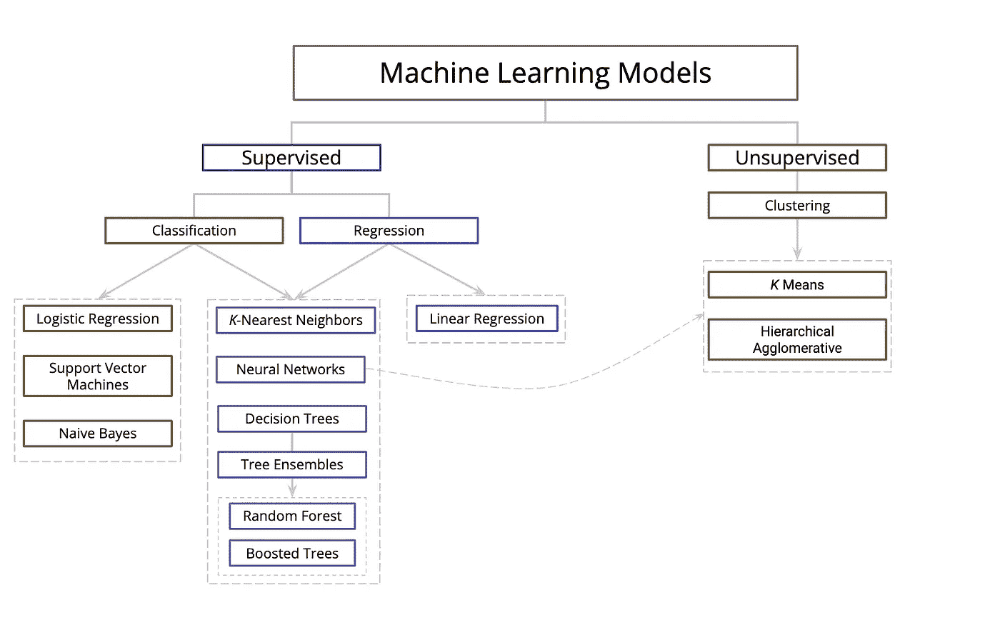
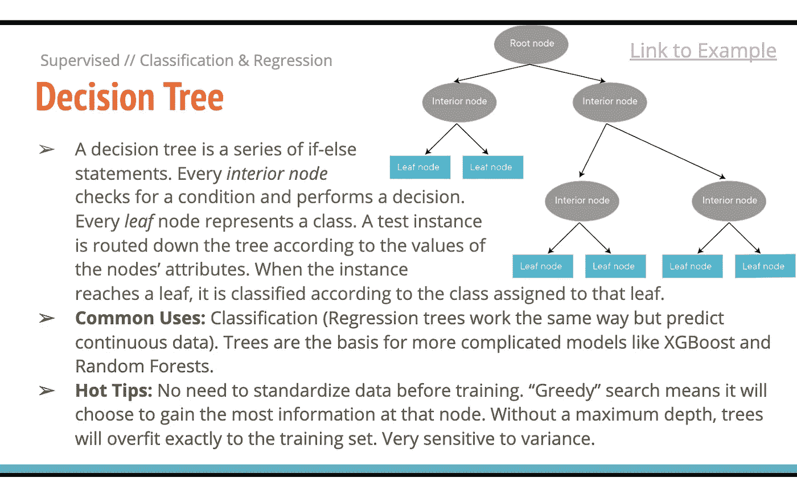

# 你的下一个超模

> 原文：<https://towardsdatascience.com/your-next-top-model-65052c6a8d3b?source=collection_archive---------35----------------------->

## 机器学习模型的高级概述

***注:在这篇简短文章的最后，点击链接与由*** [***帕特·富勒***](https://medium.com/@patrickbfuller)*[***康纳·安德森***](https://medium.com/@connor.anderson_42477) ***，以及*** [***米亚·伊泽曼***](https://medium.com/@miaiseman) ***创建的文档进行互动。****

*什么是随机森林？如果一棵决策树倒在那里，我的参数会影响它是否发出声音吗？*

*贝叶斯是什么，为什么过了这么多年还这么幼稚？它现在不应该更清楚吗？*

*说真的，SVM 到底代表什么？*

*现在有很多机器学习模型，而且你不可能一下子就找到所有问题的答案，这是有道理的。也许你是数据科学的新手，也许你已经在朝九晚五的工作中使用相同的模型很多年了，或者你需要一些快速的面试准备。无论哪种方式，有一个资源来提醒你存在哪些机器学习模型的选项是很好的。*

*我和我的同事已经创建了许多不同模型的高层次概述以及分类法。我们最近研究了列出的大多数，我们发现当我们从我们的课程中毕业时，更难记住我们首先研究的那些或那些没有成为我们项目之一的那些。*

**

*preview of the taxonomy we developed*

*虽然我们知道资源本身是有帮助的，但听说创建资源的行为对我们个人更有益，这可能并不令人惊讶。所以，我们希望你能帮助我们保持这份活的文件，因为它会让其他人受益，也是对你理解的一种检验。*

**

*我们知道这不是什么开创性的东西，它只是一个有用的资源。让我们保持更新-毕竟，在数据科学发展和变化的速度下，我们需要一些东西来帮助我们保持所有这些模型及其目的的直线。[请在这里](https://docs.google.com/presentation/d/1hiFRhHr7K2OCZSO0RwetD8xxbdUbPcPQ-dJqs93ERYY/edit?usp=sharing)的卡牌上留言评论，希望有用！*

**

*example slide from the deck*

*链接到 deck:[https://docs . Google . com/presentation/d/1 HIF rhhr 7k 2 oczso 0 rwet d 8 xxbdubpcpq-djqs 93 eryy/edit？usp =共享](https://docs.google.com/presentation/d/1hiFRhHr7K2OCZSO0RwetD8xxbdUbPcPQ-dJqs93ERYY/edit?usp=sharing)*