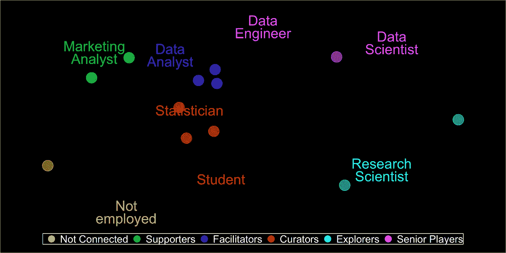
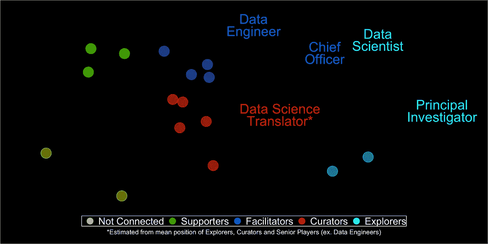

# 你在数据科学中的位置

> 原文：<https://towardsdatascience.com/your-place-in-data-science-de4fb405be7?source=collection_archive---------22----------------------->

我最近目睹了一个真实的第三类错误——不是假阳性也不是假阴性——是通过错误的问题和答案得出的真实结果。

我当时正在墨尔本参加一个数据科学活动，演讲者转向观众，问我们当中有多少人是 STEM 毕业生。

几乎每个人都举起了手。没什么好惊讶的。

真正困扰我的是后续…

“有没有 STEAM 的毕业生？”

唯一在空中的手是我自己的。

按照纯粹的逻辑，将类别扩大到包括艺术应该会增加或者至少保持反应不变。然而，自我排斥的普遍错误很有启发性。

作为一个喜欢数学胜于计算、喜欢讲故事胜于编程、喜欢人胜于技术的人，我真的属于数据科学吗？如果是，在哪里？

为了回答这个问题，我转向了我能找到的最好的数据——ka ggle 的 2018 年[机器学习和数据科学调查](https://www.kaggle.com/kaggle/kaggle-survey-2018/)——并开始进行细分。

我根据相似的职责将角色分组，然后，根据我自己的知识和经验，我勾画出一个框架，说明它们是如何组合在一起的。

抛开专业知识的极端——那些与学科无关的人和各种资深参与者——我的分析集中在四个主要群体上；产生数据的**支持者**、确保数据安全通过的**促进者**、提炼数据的**管理者**以及追求数据的**探索者**。

Method: For each job title (Q6) get share who have each responsibility (Q11), then reduce these proportions down to two principle components, and use K-means to derive six main clusters.

# **支持者**

让我们从**支持者**开始，你在现场的人和任何数据项目中最基本的利益相关者。这一类别包括业务和营销分析师，但也可以扩展到簿记员、实验室助理或任何在第一线处理数据的人。

从某种意义上来说，这可能意味着每个人，所以从高层次的角度来看，很容易忽略这些人，并将我们的数据视为*creation ex nihilo*——在开始时，什么都没有，直到有人说‘让数据存在’，数据就存在了，而且很好。

但是，当然，没有什么比这更偏离事实了。所有人类数据都来自经济学的基本力量，然后进化以适应其环境。成功的数据项目从理解上下文开始。

例如，当营销人员开展数字活动时，只有以一种易于在系统中找到的方式来命名和标记它们才有意义。但是在一个团队的环境中，不一致的元数据使得很难聚集许多个体的度量。

在这种情况下，管理集策略可能坚持它们总是通过严格的命名约定包含关键元数据；导致愤怒的工作人员面对同质的竞选名称和频繁的关于偶尔的打字或拼写错误的谈话。

或者，协商的策略可能涉及将元数据保存在一个匹配表中，并建立一个 ID 来连接它，让软件来完成剩下的工作，并允许一些自由来有效地命名事物。

我们如此依赖我们的支持者，让他们参与进来是关键。

# **主持人**

随着数据对我们的运营变得越来越重要——通过集成的报告和分析——一个组织将需要**主持人**来照看其管道。数据分析师、项目和产品经理，甚至顾问都在这个节点上。

从粗略的估计转向完全由数据驱动是一个巨大的变化。员工需要确定术语，连接不同孤岛上的数据，微调技术并管理您的各种数据实践。所有这些都需要一套独特的技能。

这些专业人士充当你的数据的管理层，这听起来可能很奇怪，直到我们考虑为什么这些人是至关重要的。正如雷·菲斯曼和蒂姆·沙利文的巨著《组织 T4》所指出的，在关于*的一章中，什么样的管理对*有益…

> 有效的管理不仅需要有效的信息收集，还需要将事实和数据分发给那些需要它们的人……至少在组织的经济逻辑中，管理者的基本角色在很大程度上是收集和处理要在组织结构图中上下传递的信息，以扩大所有者的控制，并对员工的智力进行筛选和分类。

本质上，你的辅导员的角色是让数据为你服务。

如果没有它们，你首先要做的就是获取数据。

# **策展人**

一旦我们有了数据，特别是当我们有很多数据时，我们需要让它有用。鉴于人类和机器的处理能力有限，我们需要**策展人**仔细选择重要的东西，并善加利用。

想想数据记者、统计学家甚至软件工程师。无论他们是在估计一个行业的规模，推导一个客户终身价值的模型，还是琢磨一种算法来检测社交媒体情绪的变化，他们的目标本质上都是一样的——驯服复杂性和规模。一个真正专业人士的标志不是他们的正确性或准确性，而是他们的工作如何解决问题。

例如，考虑一个书店老板的挑战，他需要估计他们的货架空间需求。最精确的方法——测量每本书的宽度以得到总数——会耗费大量的时间和资源。

统计学的价值在于能够让事情变得更简单。通过测量一个小的随机书籍样本，并通过简单的平均得出一个'*模型书*，所有者不再需要关注细节——简单的乘法就足以满足这个和未来的答案。

通过将数据简化为本质，策展人给了我们所需要的东西。

不多也不少。

# **探险者**

最后，从数据分析到数据科学需要能够测试其他一切所基于的假设和理论的人****。为此，我们需要探索者——科学家和研究人员，他们可以质疑我们运作的根本基础。****

****正如杰森·福克斯在他那本关于如何领导一项任务的精彩著作的结尾所总结的那样…****

> ****对任何企业来说，两个最大的威胁是不确定的未来的无限复杂性，以及每个人都很忙的事实。如此高效…****
> 
> ****为了保持相关性，我们必须接受一种开创性的领导形式。这意味着要敢于超越我们默认的、高效的和既定的工作方式，并寻求新的增长途径。****

****在历史上的不同时期，我们人类相信房价永远不会下跌，奴隶制和贫困是不可避免的，地球是宇宙的中心。在每一个案例中，我们都有现成的数据。****

****当数据丰富且干净时，最大的挑战是我们的确定性。****

****一个真正的探险家是破坏性的，这正是我们需要他们的原因。****

# ******成为高级玩家******

****数据科学从根本上讲是关于人的。要做好它，组织需要实地的支持者、管理交付的促进者、展示其价值的策展人以及释放新潜力的探索者。****

****这有点像一场演唱会需要一个后台工作人员，一个声音和灯光团队，音乐家和导演。让一个人扮演多个角色是可行的，甚至有必要保持在预算之内，但这通常会使后勤工作更加困难。****

****随着我们每个人在职业生涯中的发展，我们在哪里能够最好地为数据科学服务将始终取决于我们培养的人才、我们掌握的工具以及我们能够为周围团队贡献的价值。****

****就我自己而言，我不得不接受我永远无法掌握定义我周围团队的技术。但没关系，因为我知道自己的优势。****

****作为一名数据科学翻译，我仍然在乐队中，但我的角色有点不同。****

****我把我的声音借给数据，所以它会唱歌。****

********

****Method: For each Senior Player, use their nearest (non-senior) neighbor to reclassify.****