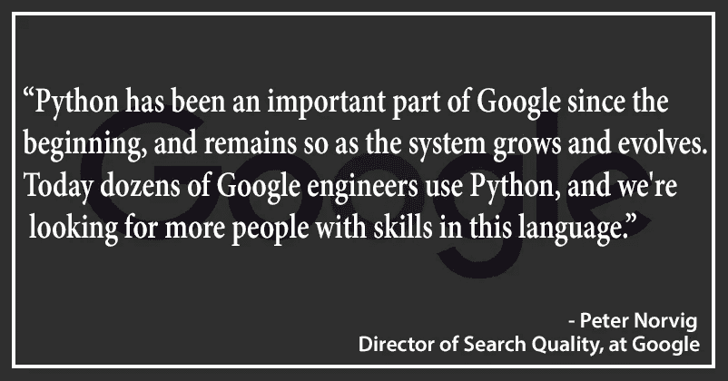
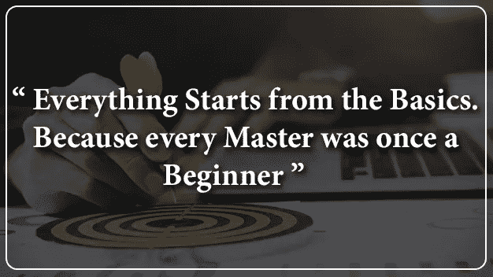
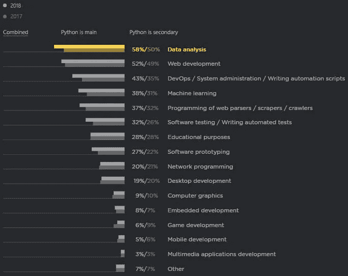
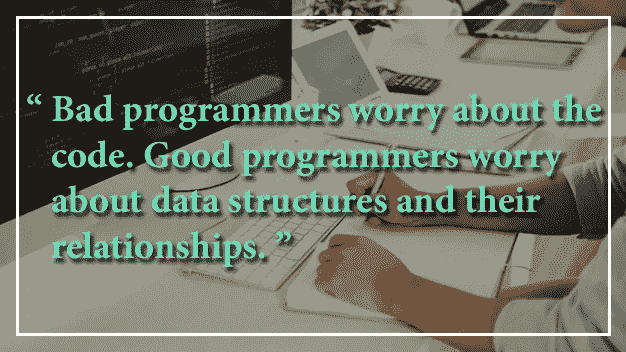
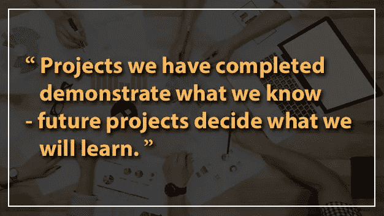

# 你的 Python 之旅解码了

> 原文：<https://towardsdatascience.com/your-python-journey-decoded-acc806106947?source=collection_archive---------23----------------------->

## 成为 Python 编程专家

# 介绍

Python 是当今发展最快的编程语言。这有点令人惊讶:Python 是一种非常通用的、容易学习的语言。如果你想以编程为职业，掌握这门语言是有意义的。

根据 StackOverflow 开发者调查报告，Python 已经连续三年位居最受欢迎的编程语言的榜首。它是继 Javascript 之后**最受欢迎的**编程语言，也是继 Rust 之后**最受喜爱的**编程语言。无论你是初学者还是专业人士，这种语言对所有人来说都是很棒的。

一定要看一看！！
[***关于 Python 的 16 个最引人入胜的事实***](https://data-flair.training/blogs/facts-about-python-programming/)

# 旅程开始了…

## **一切从基础开始**

编程语言的基础是每个人建立坚实基础的必要条件。熟悉这些基本的核心编程概念。

*   **数字、字符串、字典、列表和元组:**
    深入研究这些数据类型。理解这些数据结构的行为以及可以对它们执行的操作，问这样的问题:这种数据类型是可变的还是不可变的？
*   **控制结构(if-else，while loops，for loops):**
    使用控制结构，做类似计算单利的小程序，检查一个字符串是回文还是打印素数的程序。
*   **功能:**
    功能有助于将程序分解成用于特定任务的小模块。学习关于函数的一切，因为它们几乎无处不在！即使在 python 的第一个程序中，也要使用 print()函数。
*   **面向对象编程:** 面向对象编程概念包括抽象、封装、继承、多态。它们是基于真实世界的实体，其中所有的东西都被认为是类和对象。

[***您旅途中需要的理想 Python 指南***](https://data-flair.training/blogs/learn-python-notes/)

## 确定你感兴趣的领域

Python 是一种通用编程语言。它被用于各种工作。

*   数据分析
*   Web 开发
*   移动应用
*   数据科学/机器学习
*   自动化
*   物联网应用、机器人

这些领域中的每一个都涉及不同的职业机会，所以最好决定你的兴趣所在，并努力掌握那个领域。

## 自动化你的日常任务

使用 python 可以自动化许多重复性的任务。开始构建小型应用程序，在其中实现如何自动化任务的想法。

例如，您可以在 web 上自动搜索特定对象并下载其内容(也称为数据抓取)，更新和格式化大型 Excel 文件，发送提醒电子邮件和通知，创建聊天机器人，以及通过 python 脚本自动填写在线表格。

为这些自动化任务构建小脚本将增强您的基本编程逻辑，通过将各部分集成在一起，您将能够构建项目。

## **数据结构和算法**

要成为编程专家，就不能忽视数据结构和算法。这些课题需要研究透彻，深入实施。这些数据结构将伴随你的整个旅程。

数据结构包括堆栈、队列、列表、树、图等。您需要能够决定哪种数据结构最适合某个问题，只有当您深入研究它时，您才能产生这种能力。

排序算法、搜索算法、动态规划算法、贪婪算法、递归算法、回溯算法等等，这些概念可以增强你解决问题的技能，提高你成为更好的程序员的技能，并使你成为有能力构建最佳解决方案的人。

## **项目**

语法和编程结构只告诉你允许做什么，不允许做什么。制作小程序会告诉你如何处理和解决问题。构建项目并在现实世界中实现你的想法会让你成为编程专家。

> ***实施项目是成为专家的最佳途径。除此之外别无选择。***

有许多框架可以简化项目的构建。对于 web 开发，Django 和 Flask 主要用于创建大型复杂的 web 应用。

**用这些** [***惊人的 Python 项目***](https://data-flair.training/blogs/python-projects-with-source-code/) 成为顶尖的 Python 竞争者

对于一个数据科学家来说，你需要做很多项目。Numpy 和 Pandas 对于对数据执行操作并分析它们以建立机器学习模型非常有用。制作与不同类型学习(监督、非监督和强化学习)相关的项目

尝试建立独特的项目，你可以在现实世界中实施，并在你的投资组合和简历中展示。

**用这些** [***惊人的数据科学项目***](https://data-flair.training/blogs/data-science-projects-code/) 离你的梦想更近一步

## **Python 高级主题**

你可能不太了解其中的一些概念。为了精通 python，我列出了一些需要深入研究的高级主题。这些措施如下:

*   列出理解
*   词典释义
*   生成器(基于类和方法)
*   python 中的一切都是对象
*   λ函数
*   多线程编程
*   pep 8—python 编程风格指南

# 尾注

现在您已经知道了如何精通 python 的细节，是时候投入一些时间并致力于学习了。学习 python 很有趣，如果你真的很投入，你真的可以走很长的路。

> **我希望这个导游足智多谋。祝你旅途好运！**

[***向 Python 许下你的承诺***](https://data-flair.training/blogs/python-tutorials-home/)