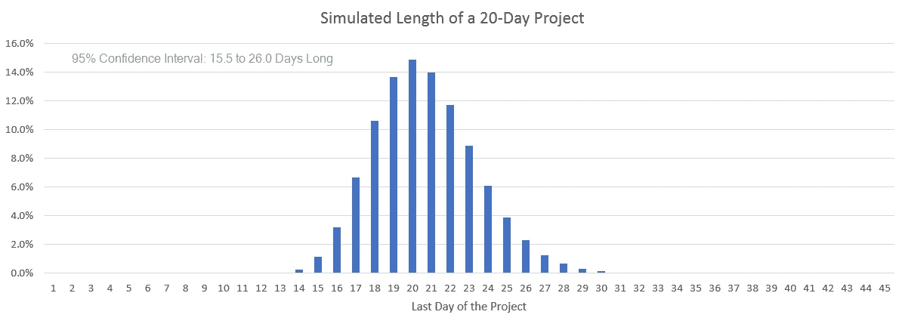
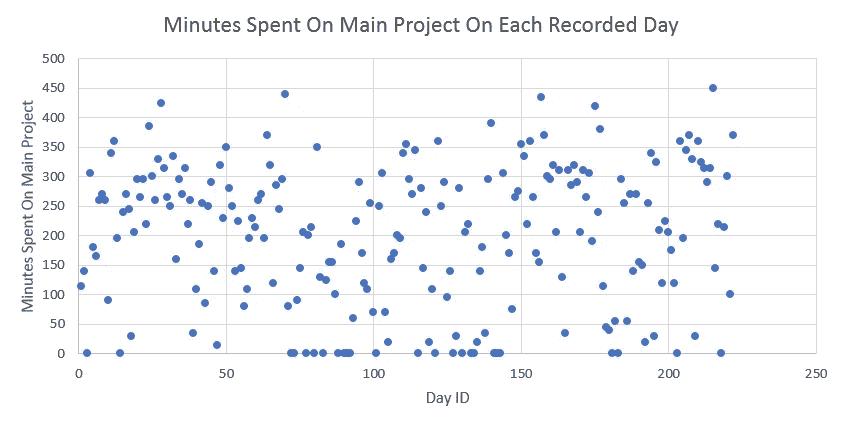

# 你不可预知的日程可能会破坏你的估计

> 原文：<https://towardsdatascience.com/your-unpredictable-daily-schedule-might-be-wrecking-your-estimates-efa6e37d9d0f?source=collection_archive---------23----------------------->

## 通过使用真实数据的模拟，我们可以发现不可预测的进度在多大程度上导致了不可预测的项目长度。

How unpredictable my schedule is from day to day, approximately.

# 并非所有工作日都是平等的

假设给你一个软件项目，要求你估计一下完成这个项目需要多长时间。

…

…在你笑完或哭完之后，继续读这篇文章。

假设你做了一些思考，然后决定大约需要 10 个工作日来完成，误差在几天之内。

接下来，您处理该项目，并完成它，但它并没有花费 10 个工作日来完成。花了 8 个！或者，也许花了 13 分钟。或者 20。不是 10 的东西。

为什么？

我是说，你是软件开发之神。你总是知道任何项目所需的确切工作量。而且，很明显，你永远不会有意想不到的困难，不明确的要求，或者精力或士气的变化。所有的随机变量都不在方程中！

(是啊没错。但是，在这里跟我一起滚，让我们假设以上是真的。)

发生了什么事？！让我们原路返回。

大概，你首先在脑子里对工作量做了一个估计。然后你可能把它转换成一个不可约的时间单位，比如说，X 总工作时间。

但是，企业在商业时期需要它。所以你想，“嗯，平均来说，我每天在一个项目上完成 Y 个小时的工作，相差不了几个小时。”所以你用 X 除以 Y，得到 Z 个工作日。

问题就在这里！并非所有工作日都是平等的。它们是随机的。你忘了考虑你每天在一个项目上工作多少小时的**方差** 。“给或拿几个”。是*每天持续接近*到 Y 小时的工作时间，还是*变化很大*，经常是 1 小时，经常是 8 小时，只有在大观中平均达到 4 小时？

但是，这种差异究竟会对整个项目长度的差异产生多大的影响呢？它真的能改变项目的长度吗？

让我们继续忽略影响项目长度的其他随机变量，并特别关注这个“不可预测的计划”变量，因为，我一直在收集关于我的计划的不可预测性的数据…

…我们可以使用这些数据来了解 ***它对我的估计的不准确性有多大的影响*** ！

It started off as a promising week…

# 记录我的数据

在过去的 14 个月里，我记录并分类了我工作中的每一分钟。

下面是一个实际的例子:

How each minute of my day was spent, on July 16, 2018.

一天被分成几个部分，每个部分的分钟被分成六类。大多数类别对本文并不重要，但我会为感兴趣的人快速解释一下。

如果我在做一些我认为重要的事情，但不是我的“主要项目”，那么我会把这些时间放在“重要的事情”栏里。如果我在为公司做一些事情，比如调查或全体会议，这些会议记录会被添加到“公司”栏。如果时间花在了某人想让我做的事情上，但我认为这是浪费，就像大多数会议一样，这属于“无聊”一类。“午餐”就是午餐。其他任何事情，比如四处走走，暖暖我冰冷的手，或者社交，都属于“其他”范畴。

所以，看起来我在 7 月 16 日有点内向，我的手没有那么冷。很不寻常。

在本文中，我们主要关心的是花费在“主项目”类别中的时间。7 月 16 日，看起来我在我的主要项目上花了大约 225 分钟。

碰巧的是，对我来说，225 分钟非常接近正常。纵观迄今为止我记录的所有日子，**我每天花在主要项目上的平均时间是 200 分钟**(也就是 3 小时 20 分钟)。

顺便问一下，我说的“主要项目”是什么意思？在我的团队中，每个开发人员通常都有一个指定的“主项目”，他们正在进行这个项目，并且给出了很多评估，但是开发人员通常还有其他的职责，比如生产支持、维护/保养任务、会议等等。

# 我的时间表的变化

所以，我每天花在主要项目上的平均时间是 200 分钟。

但这是我工作的性质，它实际上从 200 分钟变化很大。它通常不会接近 200 分钟。

可视化这种差异的一个很好的方法是直方图。这是一个条形图，我们把每天放入一个桶中:我们计算我完成 0-50 分钟工作的所有日子，这将是条形图上的 0-50 条。然后我们计算我完成 50-100 分钟工作的天数，这将是条形图的下一个柱。诸如此类。

这是直方图:

The distribution of how much I work on my main project each day. There are 222 recorded days included in this chart. Each day is placed in a bin (bar) based on the number of minutes I worked on my main project that day. **Example**: There were 39 recorded days where I worked 0–50 minutes on my main project.

它看起来非常随机，离均匀分布不远。差异很大。但是，你可以在 275 分钟左右看到一个中心趋势，左右两边都有厚尾。我的实际平均值是 200 分钟，而不是 275 分钟，因为左边的尾巴更粗更长，也因为 0-50 棒线中有很多天。

在本文的附录中有更多关于数据是如何收集的细节。

我当然只有自己的数据，但我对其他开发者非常好奇。有没有差异很小的开发人员，他们每天都在他们的主要项目上持续地接近一些平均值？

在我开始收集数据之前，我认为我是那些开发者中的一员。但事实证明，我不是。如果你认为你是，也许你也不是。事实上，也许你的有更多的变化！很难知道。我看了看我周围的开发人员，我怀疑他们中大约一半的人可能有*更多*不可预知的时间表！

毕竟，我们不都有问题要回答、代码要审查、人要交谈、生产火灾要扑灭吗？

# 模拟项目长度

好了，精彩的部分来了。

假设给我一个项目，我想了想，决定花 2000 分钟完成。平均来说，我知道我每天在一个主要项目上花 200 分钟，所以这个项目的预期时间是 10 天，可能会有几天的误差，这取决于运气。

我可以用我的数据来模拟这个项目*实际上*会花多长时间。我可以一遍又一遍地模拟它，看看它与预期长度的差异有多频繁，有多大。

(记住，我们还在“假设”我是上帝开发者，其他所有的随机变量都不存在。)

这里有一个 sim 运行的例子:在项目的第一天，我们从我的数据集中随机选择一天，并取它的“我的主项目的分钟数”。好吧，我们有 150 分钟。我们已经达到 2000 分钟了吗？没有吗？然后继续第二天。同样，我们从我的数据集中随机选择一天。好吧，我们有 300 分钟。我们已经到达 2000 分钟了吗？没有，目前只有 450 个。…等等。最终，在第八天的中途，我们达到了 2000 分钟。因此，在这次模拟运行中，完成项目需要 7.5 天(我们只需要第 8 天的一半时间)。

这只是一次运行，但我们真正想做的是，在柱状图中记录我们在“第 8 天”完成的工作，然后再进行一百万次模拟运行，并在柱状图中记录每个结果。

希望你能看到为什么这个模拟有效的直觉:我一天做多少“主要项目”工作是一个随机变量，但我收集的数据捕捉到了那个随机变量的分布。如果我有很多“0 分钟”的日子，那么我的数据集将反映这一点，因此模拟将经常随机选择 0 分钟的日子。如果我收集的日期非常一致，那么模拟将随机选择一致的日期。

# 模拟结果

无论如何，这是使用我的不可预测的时间表模拟这个 10 天项目的结果直方图，并找出*实际上*需要多长时间:

The distribution of 1 million simulated runs of a 10-day project. The runs simulate the effect of the variance of my daily schedule, and so they vary significantly from 10 days. **How to read the graph**: the bar labelled “13” has height “8.4%”, which means that 8.4% of the runs finished during day 13 of the project.

太棒了。对吗？这里有一些有趣的观察例子。

*   60.1%的运行与预期的 10 天相差 1 天或更多天。
*   95%的运行需要 7.0 到 14.5 天才能完成。

最后一个观察也被称为我的项目长度的“双尾 95%置信区间”。

# 初始反应

所以，你惊讶吗？或者你觉得它看起来合适吗？

对我来说，我很惊讶。我确实认为项目长度的差异很大。甚至比这还宽。然而，我主要考虑的是诸如“意想不到的困难”、“不明确的需求”之类的差异来源。我从来没有想过“不可预测的时间表”有什么关系。

然而，项目差异已经如此巨大*,还不包括那些明显的其他差异来源！*如果我们能够将这些也包括在内，这个图表将会更宽！

许多需要报告估计值的软件开发人员宁愿不报告预期的平均长度(10 天)，而宁愿给出 95%的置信区间(7.0 到 14.5 天)。上面的图表和观察可能证明了为什么:10 天的估计真的不能告诉我们太多，如果在 60.1%的情况下*误差超过 1.0 天*！也许这些开发人员对软件开发的巨大随机性有很好的直觉。

但是只要看看那个 95%置信区间的大小，就是 7.0 到 14.5 天的工作！如果你给出这样一个估计范围，有人会给你脸色看。我想很多人会对第二个数字是第一个数字的两倍感到震惊，这看起来像是 100%的错误，或者类似的事情。他们没有想象钟形曲线的形状和尾部。

也许这就是为什么许多软件开发人员更喜欢报告时间间隔的最右端(14.5 天)。真相可能很可怕。

然而，实际上，考虑到所有其他的随机变量，这个图表可能会更宽。也许宽得离谱…这让我觉得根本没有估计这回事，真的…

**这让我想到，没有“相当确定一个项目会在 X 日期前完成”这样的事情。只有设定一个合理的限度，并在此之前不断努力。如果你在那之前完成了，很好，你很幸运。如果你没有，那很正常，当你达到协商的极限时，试着让某些事情合理地工作……因为否则，你可能会比你想要的工作*更长的时间。***

这只是我的反应，也许你的不同！想想吧！

# 一个重要的外卖

我认为这个实验很好地展示了一件重要的事情。

当一个项目远离它的估计时，它经常被归咎于开发人员的估计技能——如果他们在估计方面做得更好，他们就会更接近于预测真正的完成日期。

但是在这个实验中，我们完全不考虑评估技巧。我们把所有的技能都去掉了！我们保证以分钟为单位的实际项目长度是已知的和恒定的。 2000 分钟。然而，我们可以看到，无论如何，误差会很大！因为**软件开发存在固有的随机性**。

当你掷出一个六面骰子，你给出的估计是 3.5，最后你掷出的是 6，*这并不意味着你的估计很差*。你估计得很完美，3.5 真的是平均期望值。在滚动六面骰子的过程中存在固有的随机性。你应该责怪固有的随机性。

你可以在“你应该知道骰子会那样反弹，我没有看到随机性，只是无知”之后声称“你应该知道这个项目会那样，我没有看到随机性，只是无知”。这两种说法都同样不明智。

即使是软件开发之神也不能保证实际的项目长度与预期的项目长度相匹配。**软件开发存在固有的随机性**。对于许多随机变量来说，*很难证明*随机性是与生俱来且不可消除的，尽管几乎所有软件开发人员都知道强烈的随机性存在。但是“不可预测的进度”这个随机变量是一个非常有用的研究对象，因为它是如此清晰可见，如此容易显示它对项目长度的影响。

估计技能可能确实存在，但它只是许多随机变量中的一个，当项目的实际长度与估计的不同时，没有理由比其他随机变量更多地指责估计技能。

…另一方面，有时人们说“估计技能”,他们实际上是在谈论估计项目长度的*方差*——估计 95%置信区间的右端。我认为谈论这个更合理。我们*应该*都在学习并努力真正擅长理解软件开发中有多少随机性。毕竟，这正是这个实验想要做的！对一个特定的随机变量会给项目长度增加多少变化有一个相当好的感觉。

(顺便说一句，我怀疑总的来说，大多数关于“估计”的分歧实际上是由估计“平均预期长度”和“95%置信区间的右端”之间的混淆引起的。每次你和别人讨论评估的时候，我建议你弄清楚你们是否在谈论同样的事情！)

好吧，本文的其余部分只是这些模拟更有趣，最终，慢慢远离科学领域。

# 不同项目长度的相同模拟

好了，我们用我的进度数据模拟了一个 10 天预期长度的项目。…让我们也在其他项目长度上试试吧！

咻！那是没有理由的！

再一次，这些都忽略了所有的随机变量，除了我收集的不可预测的日程数据。

我喜欢 20 天的项目结果:对于 4 周预期长度的项目，3-5 周是一个容易记住的范围。

# 为更一致的时间表伪造数据

只是为了好玩，让我们试着为一个开发人员构建一些假数据，这个开发人员的进度变化比我少。

为此，我从我的 222 个数据点中去掉了 70 个更极端的数据点。我没有使用数学策略，我只是试图大大减少直方图上的粗左尾，并使它看起来更像一个钟形曲线形状。这是假数据的直方图。

The distribution of all of the days in my fake dataset. The 152 days were categorized into bins (bars) based on the number of minutes “worked on main project” that day.

希望这看起来足够合理。它更像一个钟形曲线，而不是我的真实数据，它看起来几乎像一个均匀分布(骰子滚动)。

现在，让我们再次对一个为期 10 天的项目进行 100 万次模拟，使用更加一致的假数据。结果如下:

The distribution of 1 million simulated runs of a 10-day project. **Uses fake schedule data instead of my real schedule data**. The runs simulate the effect of a fairly consistent schedule. The project length is still has fairly high variance, but less than my real data.

以下是这次的一些观察结果:

*   41.7%的运行与预期相差 1 天或更多天(而不是我的 60.1%)。
*   95%置信区间:8.0 到 12.9 天(我的是 7.0 到 14.5 天)。

所以，不出所料，差异变小了，但是比我在开始这个实验之前预期的要大。

请记住，在看图表时，少于 2 根棒线几乎是不可能的。这是因为，按照我的定义，一个“10 天项目”平均需要 10 天的时间。那正好在第 10 天和第 11 天的边界上。因此，即使只有一点点差异，一半的跑步会在第 10 天完成，另一半可能会在第 11 天完成。

所以真的，如果你考虑图表的时间足够长，你可能会开始更喜欢考虑 95%的置信区间。

# 加入其他随机变量

请记住，项目长度受到许多随机变量的影响，这些变量会导致方差，但是整篇文章中的所有上述模拟都只考虑了“不可预测的进度”随机变量。

但只是为了好玩，我们可以猜测一下其他*随机变量对项目长度的影响程度，然后再运行一次模拟，并加入随机性！*

让我们确定一些其他随机变量，并发明它们对项目长度增加/减少多少:

*   **意想不到的困难**:有时项目会因为意想不到的技术困难或意想不到的简单部分而延长或缩短。比方说，33%的项目需要 20%的时间，33%的项目需要 20%的时间。这当然是保守的，我们都有过这样的项目，我们意识到它们比我们想象的要难两倍……但是不管怎样。
*   **不明确或变化的需求**:有时项目需要更长或更短的时间，因为这些需求是需要的，但直到项目进行期间才显示出来。比方说，33%的项目需要 20%的时间，33%的项目需要 20%的时间。也大概保守？
*   精力和士气:有时一个项目特别乏味，或者你的生活中还有其他事情要做。或者有时候你超级投入。比方说，33%的项目需要 10%的时间，33%的项目需要 10%的时间。也可能是保守的——就我个人而言，当开放的办公室很安静，我处于最佳状态，在一天结束前我没有十件事情要记住，我工作得非常快…
*   **估算技巧**:每当我们猜测我们正在进行一个 2000 分钟的项目时，我们并不知道。我们猜测，我们没有完美的估计技巧。我们实际上可能正在进行一个平均需要 1700 分钟、2300 分钟或其他时间的项目。所以对于 33%的项目，让我们多加 20%的工作量，对于 33%的项目，让我们减去 20%的工作量。不知道这是否保守。

所以现在，对于每次运行，我们仍然从 2000 分钟(整整 10 天)开始，但是我们将计算上面的随机变量增加和减少，并修改这 2000 分钟。*然后*我们将通过抽样我的进度数据来模拟项目的 1/2/3…日，就像之前一样。

这是:

The distribution of 1 million simulated runs of a 10-day project. Uses my real schedule data, but also randomly modifies the project length using make-believe formulas to represent unexpected difficulties, changing requirements, energy/morale, and estimation error.

*   78.0%的运行与预期相差 1 天或更多(而不是最初的 60.1%)。
*   95%置信区间:3.9 到 17.5 天(原来是 7.0 到 14.5 天)。

许多软件开发人员建议，如果你被要求在一个项目中选择一个日期并承诺它，那么:你应该估计预期的平均长度，并将其翻倍，这就是你的承诺日期。看上面的图表，这似乎是一个相当不错的选择。虽然，我认为大多数开发者倾向于低估预期的平均值…所以那些开发者可能应该把它翻三倍。

# 附录:数据收集规则

以下是我用来记录数据并选择将其纳入本实验的一些重要规则:

*   如果我有一天*意外休假*，那么这仍然被记录为“这一天我的主要项目工作了 0 分钟”，并且仍然包含在这个数据集中。比如说，病假。在我的数据集中的 25 个“零分钟”的日子里，大概只有 10 天是这样的(其他的大概是我被打扰太多的日子)。
*   如果我休了一天*计划的假*，就像如果我知道我在最后一次给出项目的估计/提交日期时休了那一天，那一天根本不会被记录，也不会包含在这个数据集中。
*   有一小段时间，我没有被分配一个“主要项目”，我只是在项目之间，做任何事情。这些天不包括在这个数据集中(我确实把它们记录在某个地方，以防我将来需要它们)。这种情况不常发生。
*   有一个大型项目明显是我参与的其他主要项目的异常值，所以这个时间段没有包含在这个数据集中。这是一个我充满热情的项目，并且有严格的商业驱动的最后期限。如果我把它包括在内，我的时间表的变化会更加极端，会进一步证明我的观点，但这感觉像是作弊。

严格地说，要做这样的统计研究，每个数据点都应该独立于其他数据点。我的数据实际上可能不是完全独立的——肯定有连续几天重复出现的中断。但是，我认为它足够接近，你可以看一看散点图，给它一个独立的眼球测试:

Every day included in my dataset, in the actual order they occurred. This is supposed to show that each data point doesn’t affect the adjacent data points to the left and right, much, or similar patterns.

相当随机。我怀疑，无论如何，对于大多数关于现实生活的统计研究来说，独立性很少能完美实现。