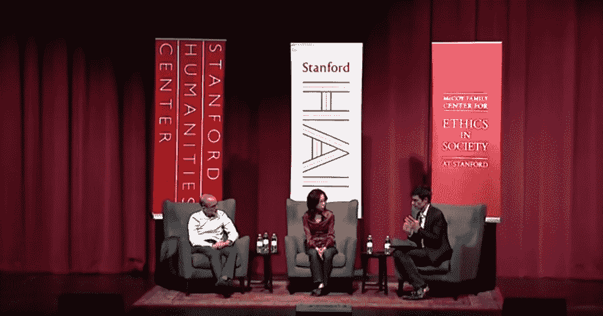
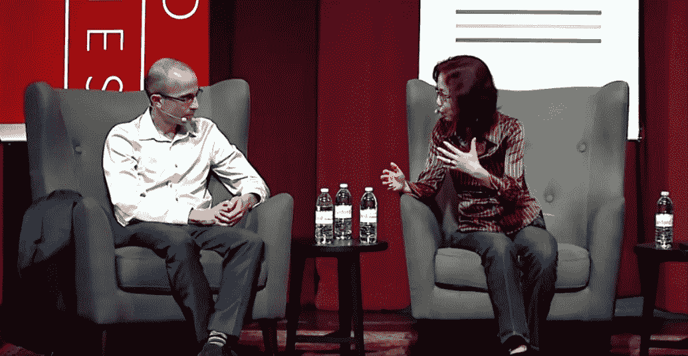
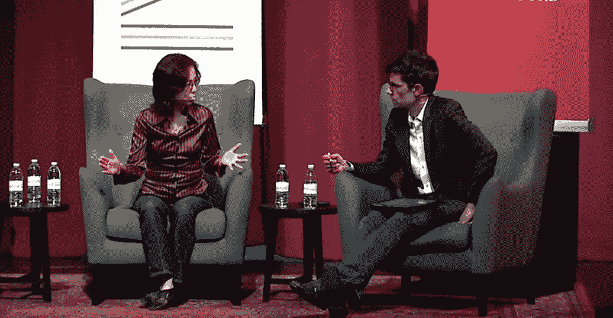
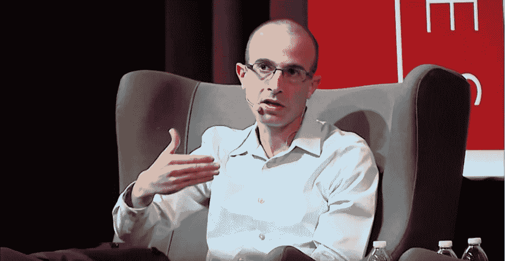
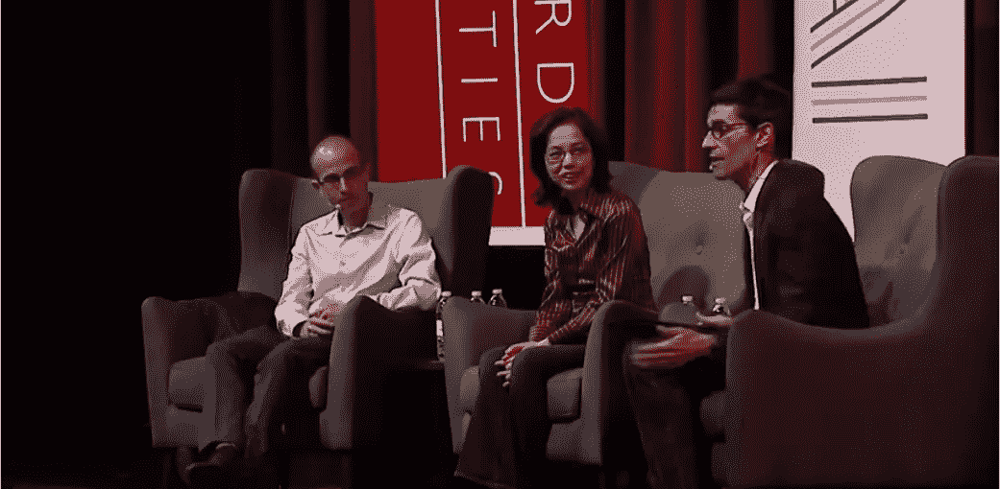

# 尤瓦尔·诺亚·哈拉里和费·李非谈人工智能:影响我们所有人的四个问题

> 原文：<https://towardsdatascience.com/yuval-noah-harari-and-fei-fei-li-on-ai-90d9a8686cc5?source=collection_archive---------5----------------------->

最近在斯坦福大学举行的一场对话中，两个人工智能巨头——[尤瓦尔·诺亚·哈拉里](https://www.ynharari.com/)和[费·李非](http://vision.stanford.edu/)之间产生的问题多于答案。《连线》杂志主编尼古拉斯·汤普森主持了这场 90 分钟的谈话，纪念礼堂坐满了 1705 个座位。

目的是讨论人工智能将如何影响我们的未来。

哈拉里是耶路撒冷希伯来大学的历史学教授，曾两次获得波隆斯基创造力和独创性奖，是国际畅销书《智人:人类简史》和《德乌斯人:明日简史》的作者

李是著名的人工智能研究员、工程师和计算机科学教授。作为当今人工智能领域最多产的学者之一，她在深度学习和计算机视觉方面的工作被世界各地的公司和研究小组所采用。她最为人所知的角色是创建了 ImageNet，这是一个拥有 1400 万张图像的手绘数据集，广泛用于计算机视觉应用。

他们触及了一些关于人工智能和技术的最重要的话题，包括我们是否还能相信人类的能动性；AI 时代的民主是什么样子；以及 AI 最终会黑掉还是增强人类。

李和哈拉里没有让我们陷入停滞不前的话题，而是让我们思考许多重要问题，这些问题体现了人工智能技术对个人的影响，包括自由和选择，以及人工智能对我们世界的法律、经济和政治体系的影响。

这四个相关的问题试图帮助理清人工智能对个人的影响:

*   **重新思考自由意志:** *如果你不能信任顾客，如果你不能信任投票人，如果你不能信任自己的感情，你信任谁？—尤瓦尔·诺亚·哈拉里*
*   **爱情与 AI 的极限:** *爱情是可黑客攻击的吗？—费-李非*
*   **将自我意识外包给 AI:** *生活在一个从算法中学习关于自己如此重要的东西的世界里，意味着什么？尤瓦尔·诺亚·哈拉里*
*   人工智能以人为中心: *我们能否以一种以人为中心的方式来重新构建人工智能和技术的教育、研究和对话？—费-李非*

像许多看到它的人一样，我带着一种紧迫感离开了演讲。这些是人工智能从业者、决策者和公众应该思考的尖锐问题。所有这些都是人工智能辩论的重要组成部分。

但是我们需要迅速行动。“工程师不会等的。而且就算工程师愿意等，工程师背后的投资人也不会等。所以，这意味着我们没有很多时间，”哈拉里警告说。

同意。

# **反思自由意志**

> **“如果你不能相信顾客，如果你不能相信投票者，如果你不能相信你的感觉，你相信谁？”—尤瓦尔·诺亚·哈拉里**

讨论跳到了自由意志和代理这一深刻而困难的话题，完全跳过了表面问题。

质疑自由意志有效性的争论初看起来像是一种无关的理论努力——完全超出了工程学科的范围。事实上，许多被讨论的挑战又回到了哲学家们争论了几千年的话题。

只是这一次，有了一个全新的角度:技术已经发展到了我们许多根深蒂固的信念受到挑战的地步，正如哈拉里指出的，“不是被哲学思想，而是被实用技术。”

十年来，哈拉里一直在批评自由意志和个人代理的核心概念。

他不是一个人。由于测量神经活动技术的进步，许多神经心理学实验已经对自由意志发起了新的攻击。

这导致许多顶级神经科学家怀疑我们决策的自由。

> “我们只是在大脑地图中处理信息，这些信息机械地引发了我们的行为。因此，我们认为我们有意识地决定和做出的决定，实际上只是一种幻觉，可以简化为我们大脑告诉我们要做的事情。”——[汉娜·克里奇洛](https://www.neuroscience.cam.ac.uk/directory/profile.php?hannahcritchlow)，普林斯顿杰出的神经科学家，《命运科学》的作者

但是，虽然科学仍在不断成熟，但我们的自由意志被操纵的后果——哈拉里称之为“黑客人类”——给我们的社会带来了巨大的风险。

一个组织可能会努力“创造一种算法，它比我更了解我自己，因此可以操纵我、增强我或取代我。”

这将是我们的挑战，不仅要决定这些操作、增强或替换应该是什么，而且首先要决定由谁来做。

我们可能想知道我们想如何选择人类增强的可能性。

“谁来决定什么是好的增强，什么是坏的增强？那么，如果这是一个非常深刻的伦理和哲学问题，哲学家们已经争论了几千年，你该如何决定增强什么呢？我们需要提升的优秀品质有哪些？”哈拉里问道。

对我们许多人来说，“回归传统的人文主义思想”是很自然的，这种思想优先考虑个人选择和自由。然而，他警告说:“当有了大规模黑人类的技术时，这些都不起作用。”

如果人类的能动性和自由意志的想法正在被争论，那就很难决定如何决定技术应该被允许做什么。这也影响到我们生活的各个方面——我们选择做什么，我们可能购买什么，我们可能去哪里，以及我们可能如何投票。现在还不清楚到底应该由谁来决定技术的范围。

由于生物技术(B)、计算能力(C)和数据分析(D)技术的共同发展，这种模糊性让我们直面一个重大问题。根据哈拉里的说法，这三样东西已经可以用来黑人类了(HH)。

对于我们当中有数学头脑的人来说，他将其总结为 B * C * D = HH。

借助现代技术，黑客攻击人类可能会成为一种非常现实的可能性。

“这是开启对话的时刻，开启对这些问题的研究，”李补充道。

如果操纵存在，政府、商业和个人自由的系统如何仍然合法？

# **爱与人工智能的极限**

> **“爱情可以被黑客攻击吗？”—费-李非**

如果人类可以被“入侵”,我们的行为和信仰可以被操纵，那么这种微妙控制的极限是什么？

我们可能会接受我们可能会在小事情中被操纵——当走进面包店时，谁不会突然渴望一个肉桂面包呢？—但我们控制行为的方式肯定是有限度的。

在这一点上，似乎没有人确切知道这些操纵的极限可能是什么。

然而，操纵的策略当然*是*众所周知的。罪犯和使用它们的骗子同样因其大胆而受到尊敬，也因其贪婪而受到媒体的唾骂，他们的故事在电影、文学和电视中被讲述。

总的来说，我们不相信自己容易被操纵。相反，我们认为那些被操纵的人是少数愚蠢的人。哈拉里总结道:“最容易被操纵的人是那些相信自由意志的人，因为他们认为自己不能被操纵。”

将爱情武器化作为一种潜在的操控手段不仅是可能的，而且是有据可查的。这个主题与浪漫骗局的悠久历史是一致的；我们很多人都听说过“异地恋者需要一大笔钱来应付一些小的紧急情况。”爱情骗局是所有类型中最“成功”的，去年美国人为此花费了 1 . 43 亿美元。

哥伦比亚心理学家 [Maria Konnikova](https://www.mariakonnikova.com/) 也是《信心游戏》的作者，她提醒我们操纵“首先是通过情感来完成的”这让我们处于一种脆弱的状态，因为“感觉，至少在那一刻，取代了思考。”

毕竟，操纵系统——不管是不是人工智能——不一定要经历爱才能操纵人类与他人联系和亲密的能力。哈拉里解释说:“操纵爱情和真正感受爱情是两码事。”。

在不降低人类爱的重要性的情况下，生物和神经化学成分已经被很好地研究过了。

考虑到我们每个人提供的信息量越来越大，我们对自身生物学的了解越来越深入，再加上分析大量数据的成本更低，这种类型的更昂贵的骗局的可能性不容忽视。这些骗局利用了孤独、孤立和渴望与他人联系等非常真实、非常人性化的情感。

我们都容易受到这种操纵。“我们想要相信他们告诉我们的，”Konnikova 提醒我们。

很少有人对数据科学和技术进步的极限有明确的看法。李是乐观的。“我确实想确保我们认识到，我们离那个目标非常、非常、非常远。这项技术还很不成熟。”然而，赌注越来越高，如果目前是这种情况，这种情况会持续多久？

正如李所评论的:“我认为你真的揭示了这场潜在危机的紧迫性、重要性和规模。但我认为，面对这种情况，我们需要采取行动。”

# **将自我意识外包给 AI**

> **“生活在这样一个世界里，你从一个算法中了解到关于你自己如此重要的事情，这意味着什么？”—尤瓦尔·诺亚·哈拉里**

几千年来，人类一直在外包我们大脑做的一些事情。写作让我们能够保持精确的记录，而不是依赖我们的记忆。导航从神话和星图发展到地图和 GPS。

但是有了人工智能，我们有了一个彻底的机会:如果自我意识是人类将外包给技术的事情之一，会怎么样？

哈拉里讲述了一个关于他自我发现之旅的个人故事，承认他直到二十多岁才意识到自己是同性恋。这一发现引发了一个发人深省的时刻，表明我们都在努力看清自己的盲点。“我 21 岁才知道自己是同性恋。我回头看那个时候，我不知道是 15 岁还是 17 岁，这应该是很明显的。”

哈拉里继续说道:“现在在 AI 中，即使是今天非常愚蠢的 AI，也不会错过它。”

这开启了一个非常有趣的新可能性:算法可能知道我们还不知道的事情吗？

在人工智能的历史上，这几十年来一直是一个诱人的想法。

> “我把我的钱押在一个赌注上，它说我们制造机器人的原因与我们制造其他种类的科学和艺术的原因相同，是为了获得巨大的满足感，了解一些我们以前不知道的关于我们自己的重要事情，让我们对自己的怀疑和猜测得到证实或被抛弃——简单地说，就是以一种新的方式看待我们自己。”著名人工智能历史学家、《会思考的机器》一书的作者帕米拉·麦科达克

甚至在今天，使用我们提供的数据，可能有可能诊断出无数不同的[病症](https://www.wired.com/story/social-networks-may-one-day-diagnose-disease-but-at-a-cost/)，从抑郁症到癌症，更早、更有意义地影响我们的生活。

除了我们的身体和精神健康之外，我们现在提供的数据还能让大规模分析揭示出什么，这是一种挑衅。毕竟，不管文化、世代和地位如何，人类经历的某些方面是不变的。

随着分析方法变得越来越先进，可用数据越来越多，我们可以学习哪些经验，与我们的朋友、邻居、生活在世界各地的人们分享，他们的生活与我们的生活几乎不同？

然而，仍然存在两个挑战。

给一个算法，即使是一个非常聪明的算法，一个给我们关于我们自己的信息的权限是有危险的。尤其是当它使质疑和验证变得困难的时候。

> “一旦你把某样东西装扮成一种算法或一点人工智能，它就会呈现出一种权威的姿态，让人很难反驳。”— [汉娜·弗莱](http://www.hannahfry.co.uk/)，受人尊敬的 UCL 数学家，《你好，世界》的作者。

如果一种算法预测我们患有癌症，我们可以进行测试，但如果它告诉我们一些更模糊的东西，比如说我们是否受欢迎，我们可能会倾向于认为这是真的，因为我们没有办法验证它。这反过来可能会导致我们做出不同的决定，因为我们错误地相信了一个潜在的错误算法。

Fry 指出，我们可能会相信算法所说的话，以至于它推翻了我们的个人判断。

她讲述了一车游客的故事,“他们试图开车涉水到达他们真正感兴趣的目的地。他们没有否决航行，必须获救。”

如果我们的自我认知被扭曲了，谁来拯救我们呢？

此外，使用数据与他人和我们自己的经历联系起来，与让算法深入了解我们的个人信息是另一回事，这些信息可能会与其他参与者而不是我们分享。

“如果算法不把信息分享给你，却把信息分享给广告主，会怎么样？还是与政府合作？”哈拉里疑惑道。

即使是现在，我们在社交媒体上的信息也被用来为我们提供“相关”广告，我们才刚刚开始发现是谁付钱让我们看这些广告。

“这是一个很好的例子，因为这已经发生了，”哈拉里说。

人工智能已经被用来预测我们是否会[辞职](https://www.cnbc.com/2019/04/03/ibm-ai-can-predict-with-95-percent-accuracy-which-employees-will-quit.html)或者[与我们的另一半](https://www.vox.com/the-goods/2019/1/2/18159111/amazon-facebook-big-data-breakup-prediction)分手。两者都是非常个人化的决定，我们很多人都不愿意让私人朋友知道，更不用说非个人的组织了。

李怀疑一个算法是否能够通过这种方式超越我们自己的自省。“我不太确定！”她说，这给了我们希望，趁还有时间，我们也许能够深思熟虑地应对其中一些挑战。

“人类从火开始创造的任何技术都是一把双刃剑。因此，它可以给生活、工作和社会带来改善，但它也可能带来危险，人工智能就有这些危险，”她提醒我们。

# **人类处于人工智能的中心**

> **“我们能否以一种以人为本的方式，重新构建人工智能和技术的教育、研究和对话？”—费-李非**

随着讨论贯穿于如此多的相关学科，李为我们提供了一个灵巧的，尽管是开放式的建议，以开始解决我们面临的许多问题:以人为中心的方式重新构建人工智能。

李在斯坦福大学带着一个伟大的目标开始了变革，这个目标是为所有组织提供一个功能模板，无论其规模和来源如何。

她建立了斯坦福以人为中心的人工智能研究所，该研究所将汇集来自许多不同领域的个人进行新的合作对话。

该协会有三个宗旨:

1.  深思熟虑我们希望人工智能是什么样的；
2.  鼓励多学科研究；和
3.  专注于人性的提升和发展。

“我们今天不一定会找到解决方案，但在下一章，我们可以让人文学家，哲学家，历史学家，政治学家，经济学家，伦理学家，法律学者，神经科学家，心理学家和更多其他学科参与人工智能的研究和发展，”李说。

这一建议源于研究人员和实践者在获得和保持公众信任、提供积极的用户体验以及用深思熟虑的政策建议取代人工智能中的恐惧传播方面面临的挑战。

在人工智能社区内定义明确的目标是朝着我们可以团结起来的中心迈出的重要一步，各个学科之间的交叉正在获得越来越多的牵引力。

“这正是为什么这是一个时刻，我们认为人工智能的新篇章需要由人文学家，社会科学家，商业领袖，民间社会，政府的交叉努力来书写，坐在同一张桌子上进行多边和合作的对话，”李强调。

但是我们来到了一个十字路口。

事实上，我们今天面临的许多伦理问题都是工程师决策的结果:“快速移动并打破东西”的风气最终导致了东西的真正打破。

在技术领域工作会让创造者看不到他们所创造的技术的效果。有无数无意的结果:大型在线零售商排挤小企业，改变我们城市的构成，仅举一例。

我们如何平衡创新的欲望和随之而来的风险？当公司在没有减速的情况下取得成功时，我们应该采取措施抑制它们的增长吗？

李对将伦理纳入软件学科持乐观态度。

“以人为中心的人工智能需要由下一代技术专家编写，他们上过像[斯坦福政治学教授]罗布[赖克]的[课](https://www.stanforddaily.com/2018/05/06/cs-ethics/)[计算机、伦理和公共政策]这样的课程，思考伦理含义和人类福祉。"

不管这个目标有多简单，人工智能社区的许多人可能会想，这是否也是最具挑战性的。

“作为技术人员，我们不可能独自完成这项工作，”李警告说。

我们如何说服在人工智能领域工作的高度技术化的人们，那些可能不想关心他们工作的社会影响等模糊主题的人，他们应该关心这些事情？此外，这应该是期望吗？我们是否需要对整个行业的每个角色都进行道德规范？

李就不那么肯定了。

“我们中的一些人甚至不应该这样做。伦理学家和哲学家应该参与进来，在这些问题上与我们合作。”

尽管在该行业工作的极少数有远见的人会忽视它的重要性，但它所要求的范式转变不应被低估。历史上，技术社区对任何非技术或与技术相关的主题都有很大的不屑。人工智能社区会尊重这些新观点的重要性吗？或者我们会对任何不懂反向传播的人睁一只眼闭一只眼吗？

当被问及哈拉里的作品是否在她的教学大纲中时，李甚至打趣道:“对不起，我的没有。我教的是硬核深度学习。他的书没有方程式。”

这场对话提出了一些重要的新问题，这些问题涉及人工智能在未来几十年可能会以何种方式影响我们个人，这是非常及时的。为了减少在没有很好地理解操纵可能性的限制的情况下“黑客攻击人类”的可能性，哈拉里敦促我们专注于自我意识:

“了解你自己是所有哲学书籍中最古老的建议。我们从苏格拉底、孔子和佛陀那里听说过:了解你自己。但是有一点不同，那就是现在你有了竞争…你在和这些大公司和政府竞争。如果他们比你更了解你自己，游戏就结束了。”

但正如李所建议的，合作是必要的。这项工作正在世界各地的许多组织中开始成形。

哈拉里和李之间的对话标志着人工智能中一种新型工作的开始。

“我们开启了人文主义者和技术专家之间的对话，我希望看到更多这样的对话，”她说。

我也是。

**关于作者:**

*Briana Brownell 是一名数据科学家，后来成为科技企业家、未来学家和创新者。目前，Briana 是 PureStrategy.ai 的创始人兼首席执行官，pure strategy . AI 是一家技术公司，旨在创建人工智能同事并将其部署到企业中，以便员工可以更快地做出数据驱动的决策。作为一名频繁的主题演讲人、专家和作家，她以让非专家也能接触到高度技术性的话题而闻名，同时也领导了一场关于人工智能背后的科学的深思熟虑的技术讨论。*

*更多请看* [*这里*](http://www.leopardless.com/)*[*这里*](https://linkedin.com/in/briana-brownell-08067921/) *和* [*这里*](http://www.purestrategy.ai/) *。**