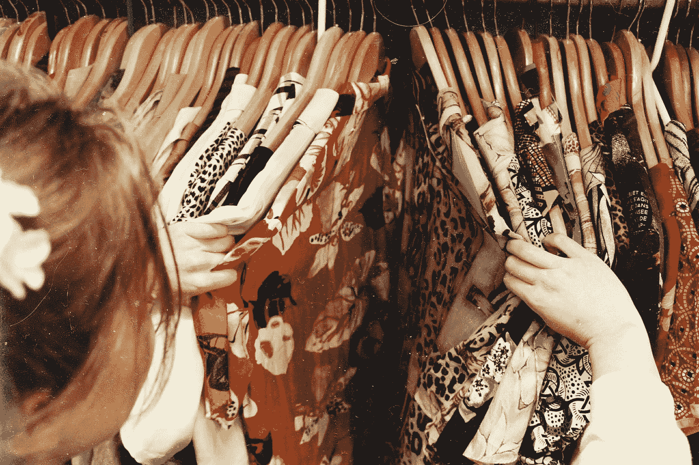
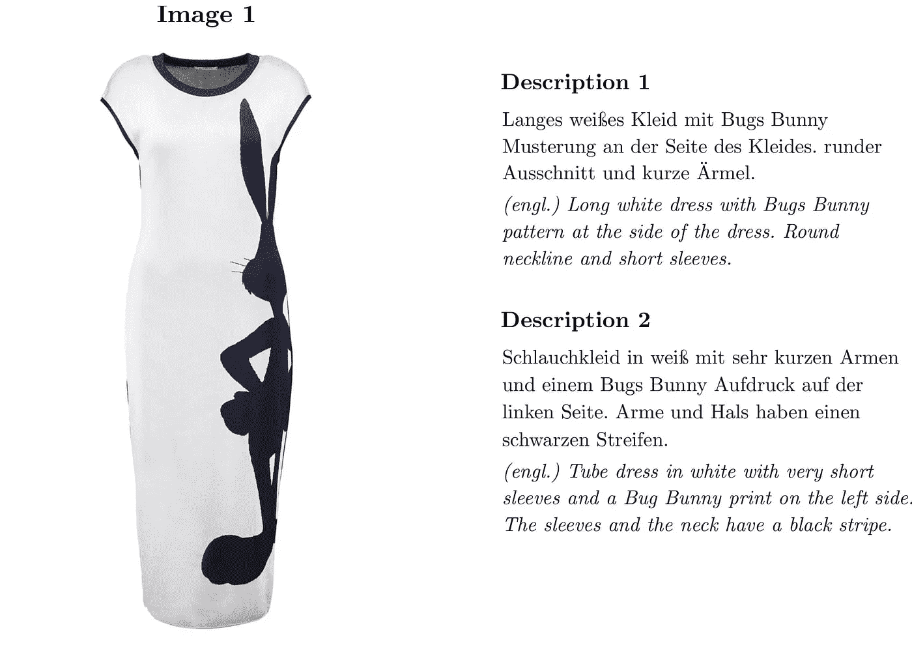
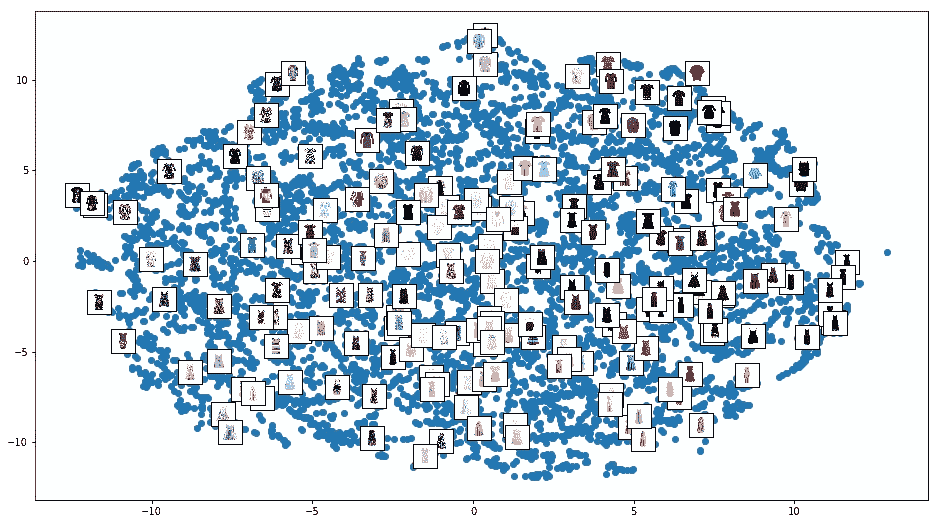
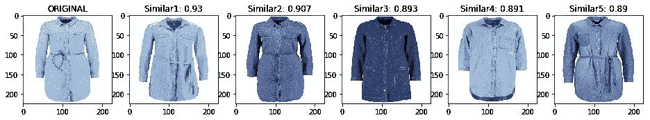
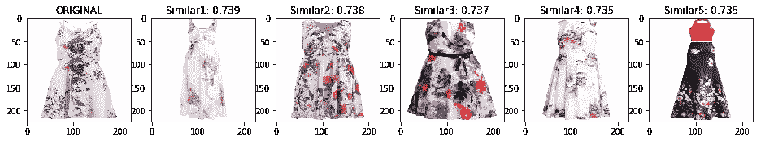
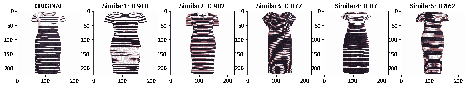
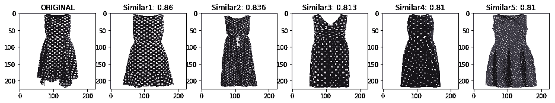
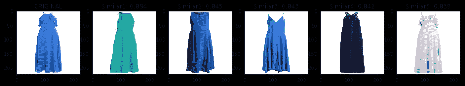
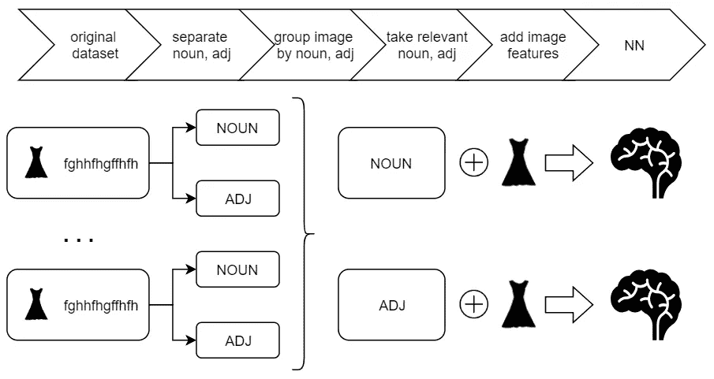
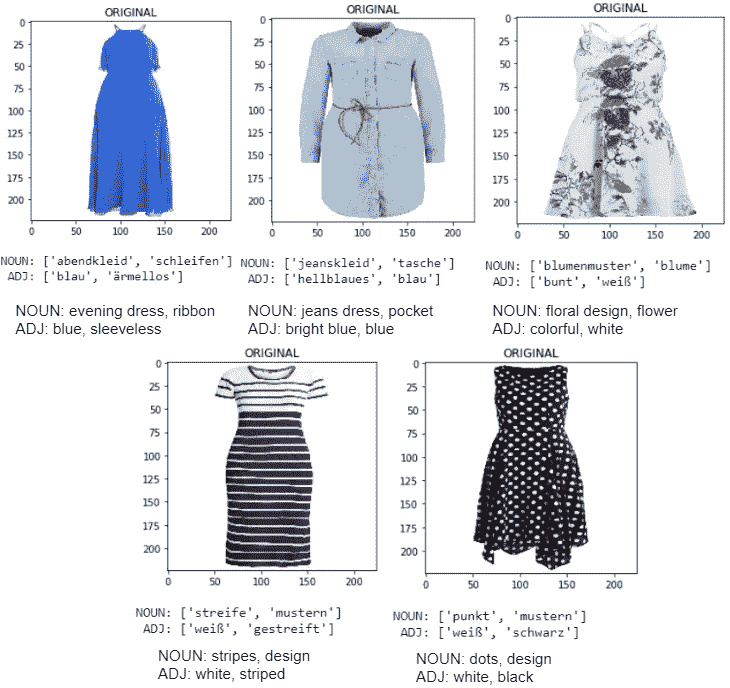

# Zalando 服装推荐和标签

> 原文：<https://towardsdatascience.com/zalando-dress-recomendation-and-tagging-f38e1cbfc4a9?source=collection_archive---------16----------------------->

## 利用图像和文字描述来建议和标记产品



Photo by [Becca McHaffie](https://unsplash.com/@beccamchaffie?utm_source=medium&utm_medium=referral) on [Unsplash](https://unsplash.com?utm_source=medium&utm_medium=referral)

在人工智能领域，计算机视觉技术被大量应用。一个很好的应用领域(我最喜欢的领域之一)是时装业。原始图像方面的资源可用性允许开发有趣的用例。Zalando 知道这一点(我建议看看他们的 [GitHub 知识库](https://github.com/zalandoresearch))并经常开发令人惊叹的 AI 解决方案，或发表 juicy ML 研究报告。

在 AI 社区中，Zalando 研究团队还因发布 Fashion-MNIST 而闻名，这是 Zalando 文章图像的数据集，旨在取代机器学习研究中的传统 MNIST 数据集。最近他们发布了另一个有趣的数据集:[](https://github.com/zalandoresearch/feidegger)**。由服装图像和相关文本描述组成的数据集。和前一个一样，Zalando 将这些数据捐赠给了研究社区，以试验各种文本图像任务，如字幕和图像检索。**

**在这篇文章中，我利用这些数据来构建:**

*   **基于图像相似度的**服装推荐系统**；**
*   **仅基于文本描述的**服装标签系统**。**

# **数据集**

> **该数据集本身由 8732 幅高分辨率图像组成，每幅图像都描绘了 Zalando 商店出售的一件白色背景的裙子。为每张图片提供了五个德语文本注释，每个注释都是由单独的用户生成的。下面的例子显示了一件衣服的 5 个描述中的 2 个(英文翻译仅用于说明，但不是数据集的一部分)。**

****

**source [Zalando](https://github.com/zalandoresearch/feidegger)**

**在开始时，数据集为每个单一描述存储相关图像(以 URL 格式):我们为单一服装加上条目。我们开始合并同一件衣服的描述，以方便操作图像并减少重复。**

```
data = pd.read_csv('./FEIDEGGER.csv').fillna(' ')
newdata = data.groupby('Image URL')['Description'].apply(lambda x: x.str.cat(sep=' ')).reset_index()
```

# **服装推荐系统**

**为了建立我们的服装推荐系统，我们利用了迁移学习。具体来说，我们利用预训练的 VGG16 从我们的服装图像中提取相关特征，并在其上建立相似性得分。**

```
vgg_model = vgg16.VGG16(weights='imagenet')
feat_extractor = Model(inputs=vgg_model.input, outputs=vgg_model.get_layer("fc2").output)
```

**我们在倒数第二层“切割”VGG，因此我们为每一幅图像获得一个维度为 1x4096 的向量。在此过程结束时，我们可以在 2D 空间中绘制我们的所有特征:**

****

**TSNE on VGG features**

**为了测试我们系统的良好性，我们保留了一部分衣服(大约 10%)。其余部分用于构建相似性得分矩阵。我们选择余弦相似度作为相似度得分。每次我们向系统传递一幅服装图像时，我们都会计算所有存储在“train”中的服装的相似度，然后选择最相似的(相似度得分最高的)。**

```
sim = cosine_similarity(train, test[test_id].reshape(1,-1))
```

**在这里，我报告一些例子，其中“原始”图像是来自测试集的服装图像。右边的服装是 5 件最相似的，指的是我们之前看过的“原始”服装。**

********************

**还不错！VGG 是非常强大的，做得非常好！**

# **服装标签系统**

**我们开发服装标签系统所遵循的方法不同于前面的服装相似性方法。这个场景也不同于传统的标签问题，在传统的标签问题中，我们有图像和单个单词形式的相关标签。这里我们只有服装的文字描述，我们必须从中提取信息。这有点棘手，因为我们必须分析人类写的自由文本。我们的想法是从描述中提取最重要的词，以便将它们用作图像的标签。**

**下图总结了我们的工作流程:**

****

**图像描述是用基本的德语写的……*Zum GLüCK spreche Ich wenig Deutsch*(希望我会说一点德语)，所以我决定用德语工作，如果有困难，请谷歌翻译。**

**我们的想法是开发两种不同的模型；一个是名词，另一个是形容词。为了进行这种分离，我们首先在原始数据集的图像描述上进行词性标注。**

```
tokenizer = nltk.tokenize.RegexpTokenizer(r'[a-zA-ZäöüßÄÖÜ]+')
nlp = spacy.load('de_core_news_sm')def clean(txt):
    text = tokenizer.tokenize(txt)
    text = nlp(" ".join(text))
    adj, noun = [], []
    for token in text:
        if token.pos_ == 'ADJ' and len(token)>2:
            adj.append(token.lemma_)
        elif token.pos_ in ['NOUN','PROPN'] and len(token)>2: 
            noun.append(token.lemma_)            
    return " ".join(adj).lower(), " ".join(noun).lower()adj, noun = zip(*map(clean,tqdm(data['Description'])))
```

**我们把所有的形容词组合起来后，指的是同一个意象(名词也是如此)。**

```
newdata = data.groupby(‘Image URL’)[‘adj_Description’].apply(lambda x: x.str.cat(sep=’ XXX ‘)).reset_index()
```

**在这一点上，为了提取每个图像的有意义的标签，我们应用 TFIDF 并基于这个分数获得最重要的形容词/名词(我们已经选择了 3 个最好的形容词/名词。如果没有找到单词，则返回一系列‘XXX’只是为了提高效率)。我还计算出一系列要排除的模糊形容词/名词。**

```
def tagging(comments, remove=None, n_word=3):

    comments = comments.split('XXX')
    try:
        counter = TfidfVectorizer(min_df=2, analyzer='word', stop_words=remove)
        counter.fit(comments)
        score = counter.transform(comments).toarray().sum(axis=0)
        word = counter.get_feature_names()
        vocab = pd.DataFrame({'w':word,'s':score}).sort_values('s').tail(n_word)['w'].values
        return  " ".join(list(vocab)+['xxx']*(n_word-len(vocab)))
    except:
        return  " ".join(['xxx']*n_word)
```

**对于每件衣服，我们最终最多有 3 个形容词和 3 个名词…我们已经准备好建立我们的模型了！**

**为了填充我们的模型，我们利用了以前使用的特征，这些特征是用 VGG 提取的。在我们的例子中，每件衣服最多出现 3 次，最多有 3 个不同的标签(指 3 个不同的形容词/名词)。我们使用的模型非常简单，具有相同的结构，如下所示:**

```
inp = Input(shape=(4096, ))
dense1 = Dense(256, activation='relu')(inp)
dense2 = Dense(128, activation='relu')(dense1)
drop = Dropout(0.5)(dense2)
dense3 = Dense(64, activation='relu')(drop)
out = Dense(y.shape[1], activation='softmax')(dense3)model = Model(inputs=inp, outputs=out)
model.compile(optimizer='adam', loss='categorical_crossentropy')
```

**来看看成果吧！**

****

**我们在以前的相同服装上测试我们的模型，并绘制出前两个概率最高的标签，用于形容词和名词(我也提供翻译)。成绩很棒！总的来说，我们的模特能够很好地描述图片中的服装。**

# **摘要**

**在这篇文章中，我们利用迁移学习直接开发了一个基于内容的推荐系统。在第二阶段，我们尝试标记服装，仅从文本描述中提取信息。取得的效果非常漂亮，易于观察，还能为你更新衣柜提供建议。**

**[**查看我的 GITHUB 回购**](https://github.com/cerlymarco/MEDIUM_NoteBook)**

**保持联系: [Linkedin](https://www.linkedin.com/in/marco-cerliani-b0bba714b/)**